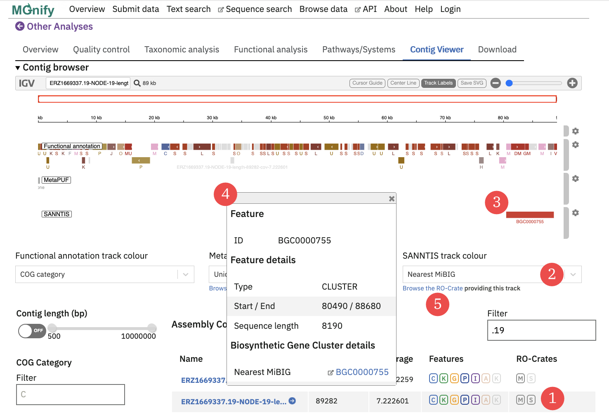

## Overview

The MGnify database and website include metagenome analyses generated by workflows other than [MGnify's standardised pipelines](analysis).
These additional analyses originate from workflows targetting specific subsets of data (for example, data from certain projects or biomes) as well as from tools that were released after the latest MGnify Pipeline version.

## Implementation within MGnify

MGnify currently supports additional analyses of [runs](glossary.md#run) and [assemblies](glossary.md#assembly), in the form of [GFF3](http://www.ensembl.org/info/website/upload/gff3.html) packaged into [RO-Crates](glossary.md#ro-crate) conforming to the [Workflow Run Crate profile](https://w3id.org/ro/wfrun/workflow/0.3).

RO-Crates are based around a JSON-LD schema file, which in the case of a Workflow Run Crate describes a workflow (e.g. a pipeline), a set of inputs, and a set of outputs.
In the context of MGnify, these outputs consist of a GFF3 file and the inputs include a run or assembly that has already been analysed by MGnify's standard pipelines.

## Finding additional analyses
RO-Crates containing additional analyses can be found tabulated on the detail pages of the run or assembly they correspond to.
There are also [API](api.md) endpoints for these: `https://www.ebi.ac.uk/metagenomics/api/v1/runs/<run-accession>/extra-annotations` and `https://www.ebi.ac.uk/metagenomics/api/v1/assemblies/<assembly-accession>/extra-annotations`.

RO-Crates in MGnify are packaged as ZIP files, which can be downloaded.
These crates can also be browsed directly on the MGnify website: the human-readable representation of the crate is displated.
Some crates include extra browsable information, like quality control reports.

### Browsing additional assembly analyses in the contig viewer
Where an additional analysis targets an assembly, the annotation tracks provided by the additional analysis are shown alongde the standard [MGnify Assembly Analysis](analysis.md) of that assembly.
This enables users to browse these additional analyses in the context of existing functional annotations.
For example, biosynthetic gene clusters predicted by [SanntiS](https://github.com/Finn-Lab/SanntiS) are shown alongside protein annotations from the standard pipeline.

(1) = the contigs list for the assembly, where the opaque `[S]` flag indicated that the `[S]ANNTIS` crate has annotations for that contig.
(2) = the annotation attributes (from the GFF file) can be used to colourise and label the track: here a BGC ID is shown for each gene cluster prediction
(3) = the annotation in the track can be clicked to open the details view
(4) = the details view for the annotation
(5) = the "Browse the RO-Crate" link opens a report containing the metadata of the additional analyses, including provenance information like a link to the workflow source code.
