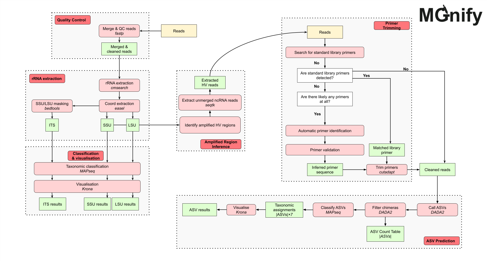

The MGnify amplicon analysis pipeline v6.1 ([GitHub repository](https://github.com/EBI-Metagenomics/amplicon-analysis-pipeline)) analyses [amplicon](../../glossary.md#amplicon) sequencing reads to provide taxonomic profiles from closed-reference databases. For supported [16S](../../glossary.md#16s-rrna-genes) and [18S](../../glossary.md#18s-rrna-genes) datasets, it also infers amplified regions, identifies and trims primers, calls [Amplicon Sequence Variants (ASVs)](../../glossary.md#amplicon-sequence-variant-asv), and assigns taxonomy to those ASVs.

## Results available on MGnify

For each analysed run, MGnify provides:

- Quality-control summaries.
- Taxonomic profiles and interactive visualisations.
- ASV sequences, abundances, and taxonomic assignments for supported 16S and 18S datasets.

ASV results are not produced for LSU or ITS datasets.

## Features

The amplicon analysis pipeline v6.1 has the following features:

- Read quality control
- rRNA sequence extraction using [Infernal/cmsearch](https://github.com/EddyRivasLab/infernal/tree/master)
- Automatic amplified region inference for 16S and 18S rRNA
- Automatic primer identification, trimming, and validation
- Amplicon Sequence Variant (ASV) calling using [DADA2](https://benjjneb.github.io/dada2/index.html)
- Taxonomic classification and visualisation of ASVs using [MAPseq](https://github.com/meringlab/MAPseq) and [Krona](https://github.com/marbl/Krona) to complement the existing closed-reference analysis
- Closed-reference-based taxonomic classification and visualisation of rRNA using [MAPseq](https://github.com/meringlab/MAPseq) and [Krona](https://github.com/marbl/Krona)
- Taxonomic reference databases ([SILVA](https://www.arb-silva.de/), [UNITE](https://unite.ut.ee/), [ITSoneDB](https://itsonedb.cloud.ba.infn.it), [PR2](https://pr2-database.org/), [Rfam](https://rfam.org/))

## Valid amplicons

At this stage, the only sequence amplicons that this pipeline is built for are:

| Amplicon | Closed-reference analysis | ASV analysis |
| :------: | :-----------------------: | :----------: |
|   16S    |             ✓             |      ✓       |
|   18S    |             ✓             |      ✓       |
|   LSU    |             ✓             |      ✗       |
|   ITS    |             ✓             |      ✗       |

## Technical and download reference

The following sections describe the pipeline implementation and its downloadable output files. You do not need to run Nextflow or use these files to view results on MGnify.

### Schema



### Tools

| Tool                                                                                            | Version | Purpose                                                |
| ----------------------------------------------------------------------------------------------- | ------- | ------------------------------------------------------ |
| [BBMap](https://sourceforge.net/projects/bbmap)                                                 | 39.18   | Standardise reads FASTQ files                          |
| [fastp](https://github.com/OpenGene/fastp)                                                      | 1.0.1   | Read quality control                                   |
| [SeqFu](https://github.com/telatin/seqfu2)                                                      | 1.20.3  | FASTQ sanity checking                                  |
| [seqtk](https://github.com/lh3/seqtk)                                                           | 1.4     | FASTQ file manipulation                                |
| [SeqKit](https://bioinf.shenwei.me/seqkit/)                                                     | 2.9.0   | FASTQ file manipulation                                |
| [easel](https://github.com/EddyRivasLab/easel)                                                  | 0.49    | FASTA file manipulation                                |
| [bedtools](https://bedtools.readthedocs.io/en/latest/)                                          | 2.30.0  | FASTA sequence masking                                 |
| [Infernal/cmsearch](https://github.com/EddyRivasLab/infernal/tree/master)                       | 1.1.5   | rRNA sequence searching                                |
| [cmsearch_tblout_deoverlap](https://github.com/nawrockie/cmsearch_tblout_deoverlap/tree/master) | 0.09    | Deoverlapping of cmsearch results                      |
| [MAPseq](https://github.com/meringlab/MAPseq)                                                   | 2.1.1b  | Reference-based taxonomic classification of rRNA       |
| [Krona](https://github.com/marbl/Krona)                                                         | 2.8.1   | Krona chart visualisation                              |
| [cutadapt](https://cutadapt.readthedocs.io/en/stable/)                                          | 4.6     | Primer trimming                                        |
| [R](https://www.r-project.org/)                                                                 | 4.3.3   | R programming language (runs DADA2)                    |
| [DADA2](https://benjjneb.github.io/dada2/index.html)                                            | 1.30.0  | ASV calling                                            |
| [MultiQC](https://github.com/MultiQC/MultiQC)                                                   | 1.24.1  | Result aggregation into HTML reports                   |
| [mgnify-pipelines-toolkit](https://github.com/EBI-Metagenomics/mgnify-pipelines-toolkit)        | 0.1.8   | Toolkit containing various in-house processing scripts |
| [PIMENTO](https://github.com/EBI-Metagenomics/PIMENTO)                                          | 1.0.2   | Primer inference toolkit used in the pipeline          |

### Reference databases

This pipeline uses five different reference databases. The files the pipeline uses are processed from the raw files available on each database's website, for use by MAPseq and cmsearch.

| Reference Database                            | Version | Purpose                               |
| --------------------------------------------- | ------- | ------------------------------------- |
| [SILVA](https://www.arb-silva.de/)            | 138.1   | 16S+18S+LSU rRNA database             |
| [PR2](https://pr2-database.org/)              | 5.0     | Protist-focused 18S+16S rRNA database |
| [UNITE](https://unite.ut.ee/)                 | 9.0     | ITS database                          |
| [ITSoneDB](https://itsonedb.cloud.ba.infn.it) | 1.141   | ITS database                          |
| [Rfam](https://rfam.org/)                     | 14.10   | rRNA covariance models                |

 
The preprocessed databases are generated with the [Microbiome Informatics reference-databases-preprocessing-pipeline](https://github.com/EBI-Metagenomics/reference-databases-preprocessing-pipeline).


### Output files

There are six general categories of results, which are separated into six different output directories by the pipeline, and each successful run/sample should have all six of these directories:

```bash
├── qc
├── sequence-categorisation
├── amplified-region-inference
├── primer-identification
├── asv
└── taxonomy-summary
```

As these results are per-run, many of the outputs use a run ID as a prefix. For the purposes of this documentation, we are using the run ID `ERR4334351`, which is a paired-end sequencing run. There are some slight differences in outputs when a run is single-end, which will be _emphasised in italics, and use the run ID `ERR1718805` instead_.

#### qc

The `qc` directory contains output files related to the quality control steps of the pipeline, from the sanity checking performed by `SeqFu`, to the quality filtering done by `fastp`. The structure of the `qc` directory contains five possible output files:

```bash
├── qc
    ├── ERR4334351.fastp.json
    ├── ERR4334351.merged.fastq.gz
    ├── ERR4334351_dada2_errors.txt
    ├── ERR4334351_dada2_stats.tsv
    ├── ERR4334351_multiqc_report.html
    ├── ERR4334351_seqfu.tsv
    └── ERR4334351_suffix_header_err.json
├── sequence-categorisation
├── amplified-region-inference
├── primer-identification
├── asv
└── taxonomy-summary
```

##### Result files

- **ERR4334351.fastp.json**: This `json` file contains summary output of the `fastp` run, including how many reads and/or bases were filtered for various reasons. This `json` file is also used later by `MultiQC` to generate its report files.
- **ERR4334351.merged.fastq.gz**: This compressed `fastq` file contains the cleaned and merged reads from the `fastp` run. _Note: if the run is single-end, this file won't exist._
- **ERR1718805.fastp.fastq.gz**: This compressed `fastq` file contains the cleaned reads from the `fastp` run. This file can be seen as the equivalent of the previous merged file for single-end runs.
- **ERR4334351_dada2_errors.txt**: This `txt` file contains the DADA2 error log, generated if the process fails. This can be used to help diagnose issues with your data (e.g. lack of valid ASV sequences) and causes of failure in the script. _Note: if the process succeeded, this file won't exist._
- **ERR4334351_dada2_stats.tsv**: This `tsv` file is used by `MultiQC` to generate its report files. It provides multiple data points to help determine the reliability of the analysis (usually limited by the quality of input data), in particular:
    - _read counts_ are reported at multiple stages, in particular after the filter, trim, de-replication, merge, and ASV computation steps. We recommend reconsidering the reliability of this analysis if less than 90% of the initial reads contain ASV sequences, as these spurious results may indicate low quality input raw reads.
    - _truncation points_ for forward and reverse paired-ends (if appropriate). DADA2 truncates all reads to the same length to keep error modeling consistent across positions and ensure sequences are directly comparable during variant inference. This avoids biases from variable read quality and prevents shorter reads from being misinterpreted as biological variants rather than sequencing artifacts. A detected truncation point too far ahead in the read may explain a lack of ASVs in the analysis. 
    - _chimeric reads_ are likely artifacts that do not mirror real biological sequences. We recommend reconsidering the reliability of this analysis if dada2_stats reports more than 25% of chimeric reads.
- **ERR4334351_multiqc_report.html**: This `html` file contains the `MultiQC` report for that run. It will combine outputs from three different tools into the report; `fastp`, `cutadapt`, and `DADA2`.
- **ERR4334351_seqfu.tsv**: This `tsv` file contains the output from the sanity checking performed by `SeqFu`. `SeqFu` makes a few checks of whether the given fastq files are correctly structured, and if this QC step fails, the contents of this file will indicate the reasons why. The contents of the tsv file are described in [seqfu's documentation](https://telatin.github.io/seqfu2/tools/check.html#output).
- **ERR4334351_suffix_header_err.json**: This `json` file contains the output from the sanity checking performed on the suffixes and headers of fastq files. It is expected that the fastq files ending with the suffix `_1` should contain the `/1` tag in the headers inside the file, and vice versa for the suffix `_2` and tag `/2`. _Note: if the run is single-end, the header check should be to have no suffix, but still contain the `/1` tag as is standard._

#### sequence-categorisation

The `sequence-categorisation` directory contains output files related to the extraction of rRNA reads using `Infernal/cmsearch` and the specific rRNA clans from the `Rfam` reference database. The structure of the `sequence-categorisation` directory contains three different categories of files:

```bash
├── qc
├── sequence-categorisation
    ├── ERR4334351.tblout.deoverlapped
    ├── ERR4334351_SSU.fasta
    ├── ERR4334351_SSU_rRNA_bacteria.RF00177.fa
    └── ERR4334351_SSU_rRNA_archaea.RF01959.fa
├── amplified-region-inference
├── primer-identification
├── asv
└── taxonomy-summary
```

The output files of this directory are dynamic depending on the output, as the names and number of files will be different depending on what the reads matched to. To be specific, it depends on the matched rRNA amplicon type, which is usually one of:

- SSU
- LSU
- ITS

And it also depends on which Rfam clan the reads matched to, which can be one (or more) of:

- Bacteria, with Rfam ID RF00177
- Archaea, with Rfam ID RF01959
- Eukarya, with Rfam ID RF01960

##### Output files

- **ERR4334351.tblout.deoverlapped**: This `tblout` file contains the deoverlapped output from running `Infernal/cmsearch`, which describes the matching reads, including matching coordinates, confidence scores, and matching Rfam clan ID.
- **ERR4334351_SSU.fasta**: This `fasta` file contains all of the matching sequences to a particular rRNA amplicon type, being in this case the SSU. As described previously, this file name would be different if a different amplicon was matched.
- **ERR4334351_SSU_rRNA_bacteria.RF00177.fa** This `fasta` file contains the matching sequences of both a particular amplicon **and** a particular Rfam clan, in being in this case the bacterial SSU. This run has a similar file for archaeal SSU, **ERR4334351_SSU_rRNA_archaea.RF01959.fa**, which is a common combination. While this is the third and final output type in the `sequence-categorisation` directory, as shown here you can have more than one file of this kind.

#### amplified-region-inference

The `amplified-region-inference` directory contains output files related to the inference of the amplified region. The structure of the `amplified-region-inference` directory contains two different categories of files:

```bash
├── qc
├── sequence-categorisation
├── amplified-region-inference
    ├── ERR4334351.16S.V3-V4.txt
    └── ERR4334351.tsv
├── primer-identification
├── asv
└── taxonomy-summary
```

The output files of this directory are also dynamic for similar reasons as `sequence-categorisation` - it depends on which, and how many, amplified regions were found. The pipeline allows for at most two amplified regions, which are made up of two parts:

- The gene: either 16S or 18S.
- The hypervariable region: any region from V1 to V9, and any logical pair of regions e.g. V3-V4.

##### Output files

- **ERR4334351.16S.V3-V4.txt**: This `txt` file contains the headers of reads that were found to match a particular amplified region, being in this case the V3-V4 region of the 16S gene. As described previously, the pipeline allows for at most two amplified regions, and therefore up to two files of this type, with the naming being dynamic.
- **ERR4334351.tsv**: This `tsv` file contains a summary of the output of the amplified region inference module. From zero to two regions, this file summarises the findings.

#### primer-identification

The `primer-identification` directory contains output files related to the automatic identification and trimming of primer sequences from reads, which is a crucial QC step for ASV calling. The structure of the `primer-identification` directory contains three different files:

```bash
├── qc
├── sequence-categorisation
├── amplified-region-inference
├── primer-identification
    ├── fwd_primers.fasta
    ├── rev_primers.fasta
    ├── ERR4334351.cutadapt.json
    └── ERR4334351_primer_validation.tsv
├── asv
└── taxonomy-summary
```

##### Output files

- **fwd_primers.fasta**: This `fasta` file contains the sequences of any forward (5'-3')identified primers that were then trimmed off using `cutadapt`.
- **rev_primers.fasta**: This `fasta` file contains the sequences of any reverse (3'-5') identified primers that were then trimmed off using `cutadapt`.
- **ERR4334351.cutadapt.json**: This `json` file contains the summary output of the `cutadapt` run, including which primers were trimmed off, how many bases were trimmed off in the process, etc. This `json` file is also used later by `MultiQC` to generate its report files.
- **ERR4334351_primer_validation.tsv**: This `tsv` file contains the summary output of the primer validation module. Any primers that were trimmed off will have successfully been validated as primers using `Infernal/cmsearch`, and this output file summarises these findings.

#### asv

The `asv` directory contains output files related to the calling of ASVs and their abundances, which is mainly performed by `DADA2`. The structure of the `asv` directory contains four different files and at least one subdirectory containing one extra file:

```bash
├── qc
├── sequence-categorisation
├── amplified-region-inference
├── primer-identification
├── asv
│   ├── ERR4334351_asv_seqs.fasta
│   ├── ERR4334351_DADA2-SILVA_asv_tax.tsv
│   ├── ERR4334351_DADA2-PR2_asv_tax.tsv
│   └── 16S-V3-V4
│       └── ERR4334351_16S-V3-V4_asv_read_counts.tsv
└── taxonomy-summary
```

The subdirectories are dynamic based on the inferred amplified region. As the pipeline allows for up to two different amplified regions, there are two potential scenarios and subdirectory output structures:

- One amplified region, which will give just one subdirectory as in the example above
- Two amplified regions, which will contain three subdirectories - one for each region, and a `concat` subdirectory that will contain the concatenation of both amplified regions

##### Output files

- **ERR4334351_asv_seqs.fasta**: This `fasta` file contains the sequences of the ASVs found by `DADA2`.
- **ERR4334351_DADA2-SILVA_asv_tax.tsv**: This `tsv` file contains the assigned taxonomy of every ASV, performed by `MAPseq`, using the SILVA reference database.
- **ERR4334351_DADA2-PR2_asv_tax.tsv**: This `tsv` file contains the assigned taxonomy of every ASV, performed by `MAPseq`, using the PR2 reference database.
- **16S-V3-V4/ERR4334351_16S-V3-V4_asv_read_counts.tsv**: This `tsv` file contains the read counts for each ASV, and is specific to the inferred amplified region. As described previously, the naming of this output is dynamic based on the amount and identity of the inferred amplified region(s).

#### taxonomy-summary

The `taxonomy-summary` directory contains output files summarising the various taxonomic assignment results using tools like `MAPseq` and `Krona`. The pipeline uses four different reference databases to assign taxonomy, and the outputs in `taxonomy-summary` are split based on the different reference databases:

- SILVA
- PR2
- UNITE
- ITSoneDB

However, there is added complexity in the output structure for two reasons:

- SILVA is actually split into two output directories: SILVA-SSU and SILVA-LSU.
- There are two kinds of taxonomic results for both SILVA-SSU and PR2: one for the hit matches and one for ASVs, with the latter being named as DADA2-SILVA and DADA2-PR2.

##### Output files - hit matches

```bash
├── qc
├── sequence-categorisation
├── amplified-region-inference
├── primer-identification
├── asv
└── taxonomy-summary
    ├── SILVA-SSU
    │   ├── ERR4334351.html
    │   ├── ERR4334351_SILVA-SSU.mseq
    │   ├── ERR4334351_SILVA-SSU.tsv
    │   └── ERR4334351_SILVA-SSU.txt
    ├── PR2
    │   ├── ERR4334351.html
    │   ├── ERR4334351_PR2.mseq
    │   ├── ERR4334351_PR2.tsv
    │   └── ERR4334351_PR2.txt
    ├── UNITE
    │   ├── ERR4334351.html
    │   ├── ERR4334351_UNITE.mseq
    │   ├── ERR4334351_UNITE.tsv
    │   └── ERR4334351_UNITE.txt
    └── ITSoneDB
        ├── ERR4334351.html
        ├── ERR4334351_ITSoneDB.mseq
        ├── ERR4334351_ITSoneDB.tsv
        └── ERR4334351_ITSoneDB.txt
```

All of the different possible subdirectories have the same four files. Taking PR2 as an example:

- **ERR4334351_PR2.mseq**: This `mseq` file contains the raw MAPseq output for every `Infernal/cmsearch` match, i.e. each match's taxonomic assignment.
- **ERR4334351_PR2.txt**: This `txt` file contains the Krona text input that is used to generate the Krona HTML file. It contains the distribution of the different taxonomic assignments.
- **ERR4334351.html**: This `html` file contains the Krona HTML file that interactively displays the distribution of the different taxonomic assignments.
- **ERR4334351_UNITE.tsv**: This `tsv` file contains the read count of every taxonomic assignment similar to the Krona txt file, but in a different easier-to-parse format.

##### Output files - ASVs

```bash
├── qc
├── sequence-categorisation
├── amplified-region-inference
├── primer-identification
├── asv
└── taxonomy-summary
    ├── DADA2-SILVA
    │   ├── ERR4334351_16S-V3-V4_DADA2-SILVA_asv_krona_counts.txt
    │   ├── ERR4334351_16S-V3-V4.html
    │   └── ERR4334351_DADA2-SILVA.mseq
    └── DADA2-PR2
        ├── ERR4334351_16S-V3-V4_DADA2-PR2_asv_krona_counts.txt
        ├── ERR4334351_16S-V3-V4.html
        └── ERR4334351_DADA2-PR2.mseq
```

The two different subdirectories have the same three categories of files, two of which are dynamic in naming. Using DADA2-PR2 as an example:

- **ERR4334351_DADA2-PR2.mseq**: This contains the raw MAPseq output for every ASV, i.e. each ASV's taxonomic assignment. This file is not dynamic.
- **ERR4334351_16S-V3-V4_DADA2-PR2_asv_krona_counts.txt**: This file contains the Krona text input that is used to generate the Krona HTML file for ASV results. This file is dynamic, as it will generate it on a per amplified region-basis. This means that in cases where there are two amplified regions, you will have three of these files - one for each reference database, and one for the concatenation of the two.
- **ERR4334351_16S-V3-V4.html**: This file contains the Krona HTML file that interactively displays the distribution of the different taxonomic assignments for ASV results. This file is dynamic in the exact same way as the Krona text input file, i.e. based on the inferred amplified region(s).

#### Primer validation summary

The pipeline infers primer presence and sequence using [PIMENTO](https://github.com/EBI-Metagenomics/PIMENTO/tree/dev). For any runs where a primer was detected, metadata about it will be aggregated into a top-level primer validation summary file (`primer_validation_summary.json`), including its sequence, region, and identification strategy. For example:

```json
[
  {
    "id": "SRR17062740",
    "primers": [
      {
        "name": "F_auto",
        "region": "V4",
        "strand": "fwd",
        "sequence": "ATTCCAGCTCCAATAG",
        "identification_strategy": "auto"
      },
      {
        "name": "R_auto",
        "region": "V4",
        "strand": "rev",
        "sequence": "GACTACGATGGTATNTAATC",
        "identification_strategy": "auto"
      }
    ]
  },
  {
    "id": "ERR4334351",
    "primers": [
      {
        "name": "341F",
        "region": "V3",
        "strand": "fwd",
        "sequence": "CCTACGGGNGGCWGCAG",
        "identification_strategy": "std"
      },
      {
        "name": "805R",
        "region": "V4",
        "strand": "rev",
        "sequence": "GACTACHVGGGTATCTAATCC",
        "identification_strategy": "std"
      }
    ]
  }
]
```

The value of the `identification_strategy` key can either be:

- `std` - Meaning the primer was matched to one of the standard library primers (more reliable)
- `auto` - Meaning the primer was automatically predicted (less reliable)

See the [amplicon analysis pipeline repository](https://github.com/EBI-Metagenomics/amplicon-analysis-pipeline) for detailed pipeline documentation.
