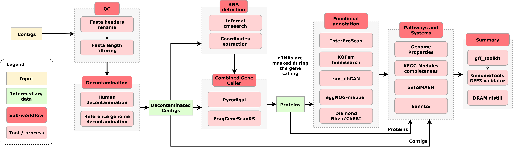

The MGnify v6.0 [assembly](../../glossary.md#assembly) analysis pipeline ([GitHub repository](https://github.com/EBI-Metagenomics/assembly-analysis-pipeline)) analyses assembled [metagenomic](../../glossary.md#metagenomic) and [metatranscriptomic](../../glossary.md#metatranscriptomic) datasets, providing functional, taxonomic, pathway, and systems annotation for assembled contigs. Additional analyses, including [VIRify](virify.md) and the [Mobilome annotation pipeline](mobilome.md), are run as separate pipelines on assemblies and are presented in the same web view. 

Users can request assembly of their own raw sequencing reads or publicly available datasets using the “Request analysis” section of the [MGnify home page](https://www.ebi.ac.uk/metagenomics/). User-owned raw reads, with host sequences removed, must be archived in ENA before an assembly request can be submitted. Alternatively, pre-assembled datasets, including those produced using other assembly algorithms, can be analysed.

## Results available on MGnify

For each analysed [assembly](../../glossary.md#assembly), MGnify displays and provides downloads for:

- Assembly quality-control summaries and the filtered contig sequences.
- Predicted coding sequences and extracted ribosomal and other non-coding RNA sequences.
- Contig-level taxonomic assignments and interactive Krona visualisations.
- Functional annotations for predicted proteins, including InterPro, eggNOG, Gene Ontology, KEGG Orthology, Rhea reactions, and run_dbCAN annotations.
- Pathway and systems annotations, including biosynthetic gene clusters, Genome Properties, KEGG modules, and DRAM summaries.
- An integrated GFF3 annotation summary combining most of the annotations generated by the pipeline.

## Features

The MGnify assembly analysis pipeline v6.0 provides the following key features:

- Assembly quality control, including optional decontamination of human, PhiX, and custom contaminant sequences
- CDS prediction with the [MGnify Combined Gene Caller](https://ebi-metagenomics.github.io/nf-modules/modules/ebi-metagenomics/combinedgenecaller/merge/)
- Taxonomic assignment of assembled contigs with [Contig Annotation Tool (CAT)](https://github.com/MGXlab/CAT_pack)
- Functional annotation with [InterProScan](https://www.ebi.ac.uk/interpro/interproscan.html), [eggNOG Mapper](https://eggnog-mapper.embl.de/), [GO Slims](http://www.geneontology.org/ontology/subsets/goslim_metagenomics.obo), [run_dbCAN](https://github.com/bcb-unl/run_dbcan), KEGG Orthologs, and [RHEA](https://www.rhea-db.org/)
- Biosynthetic gene-cluster annotation with [antiSMASH](https://antismash.secondarymetabolites.org/) and [SanntiS](https://github.com/Finn-Lab/SanntiS)
- KEGG module completeness analysis from KEGG Ortholog annotations
- Consolidation of generated annotations into a single GFF file

## Technical details and results reference

### Schema



### Tools

| Tool                                                                                              | Version              | Purpose                                                                                                                                           |
| ------------------------------------------------------------------------------------------------- | -------------------- | ------------------------------------------------------------------------------------------------------------------------------------------------- |
| [antiSMASH](https://antismash.secondarymetabolites.org/#!/start)                                  | 8.0.1                | Tool for the identification and annotation of secondary metabolite biosynthesis gene clusters                                                     |
| [boto3](https://github.com/boto/boto3)                                                            | 1.35.37              | AWS SDK for Python used to access EBI FIRE S3 storage for assembly file downloads                                                                 |
| [CAT_pack](https://github.com/MGXlab/CAT_pack)                                                    | 6.0                  | Taxonomic classification of the contigs in the assembly                                                                                           |
| [cmsearchtbloutdeoverlap](https://github.com/nawrockie/cmsearch_tblout_deoverlap/)                | 0.09                 | Deoverlapping of cmsearch results                                                                                                                 |
| [csvtk](http://bioinf.shenwei.me/csvtk)                                                           | 0.31.0               | A cross-platform, efficient, and practical CSV/TSV toolkit                                                                                        |
| [Combined Gene Caller - Merge](https://github.com/EBI-Metagenomics/mgnify-pipelines-toolkit)      | 1.4.12               | Combined gene caller merge script used to combine predictions of Pyrodigal and FragGeneScanRS (this tool is part of the mgnify-pipelines-toolkit) |
| [Diamond](https://github.com/bbuchfink/diamond)                                                   | 2.1.11               | Used to match predicted CDS against the CAT reference database for the taxonomic classification of the contigs                                    |
| [DRAM](https://github.com/WrightonLabCSU/DRAM)                                                    | 13.5                 | Summarizes annotations from multiple tools like KEGG, Pfam, and CAZy                                                                              |
| [easel](https://github.com/EddyRivasLab/easel)                                                    | 0.49                 | Extracts FASTA sequences by name from a cmsearch deoverlap result                                                                                 |
| [extractcoords](https://github.com/EBI-Metagenomics/mgnify-pipelines-toolkit)                     | 1.2.0                | Processes output from easel-sfetch to extract SSU and LSU sequences (this tool is part of the mgnify-pipelines-toolkit).                          |
| [FragGeneScanRs](https://github.com/unipept/FragGeneScanRs)                                       | 1.1.0                | CDS calling; this tool specializes in calling fragmented CDS                                                                                      |
| [generategaf](https://github.com/EBI-Metagenomics/mgnify-pipelines-toolkit)                       | 1.2.0                | Script that generates a GO Annotation File (GAF) from an InterProScan result TSV file (this tool is part of the mgnify-pipelines-toolkit).        |
| [Genome Properties](https://www.ebi.ac.uk/interpro/genomeproperties/)                             | 2.0                  | Uses protein signatures as evidence to determine the presence of each step within a property                                                      |
| [Infernal - cmscan](http://eddylab.org/infernal/)                                                 | 1.1.5                | RNA sequence searching                                                                                                                            |
| [InterProScan](https://www.ebi.ac.uk/interpro/download/InterProScan/)                             | 5.76-107.0           | Functionally characterizes nucleotide or protein sequences by scanning them against the InterPro database.                                        |
| [HMMER](http://hmmer.org/)                                                                        | 3.4                  | Used to annotate CDS with KO                                                                                                                      |
| [Krona](https://github.com/marbl/Krona/wiki/KronaTools)                                           | 2.8.1                | Krona chart visualisation                                                                                                                         |
| [kegg-pathways-completeness](https://github.com/EBI-Metagenomics/kegg-pathways-completeness-tool) | 1.3.0                | Computes the completeness of each KEGG pathway module based on KEGG orthologue (KO) annotations.                                                  |
| [MGnify pipelines toolkit](https://github.com/EBI-Metagenomics/mgnify-pipelines-toolkit)          | 1.2.0                | Collection of tools and scripts used in MGnify pipelines.                                                                                         |
| [minimap2](https://lh3.github.io/minimap2/)                                                       | 2.29-r1283           | A versatile pairwise aligner for genomic and spliced nucleotide sequences. Used in the assembly decontamination subworkflow                       |
| [MultiQC](http://multiqc.info/)                                                                   | 1.29                 | Tool to aggregate bioinformatic analysis results.                                                                                                 |
| [Owltools](https://github.com/owlcollab/owltools)                                                 | 2024-06-12T00:00:00Z | Tool utilized to map GO terms to GO-slims                                                                                                         |
| [Pyrodigal](https://pyrodigal.readthedocs.org/)                                                   | 3.6.3                | CDS calling                                                                                                                                       |
| [pigz](https://zlib.net/pigz/)                                                                    | 2.3.4                | A parallel implementation of gzip for modern multi-processor, multi-core systems                                                                  |
| [QUAST](http://quast.sourceforge.net/quast)                                                       | 5.2.0                | Tool used evaluates genome assemblies, it's part of the pipeline QC module.                                                                       |
| [run_dbCAN](https://github.com/bcb-unl/run_dbcan)                                                 | 5.1.2                | Annotation tool for the Carbohydrate-Active enZYmes Database (CAZy)                                                                               |
| [SeqKit](https://bioinf.shenwei.me/seqkit/)                                                       | 2.8.0                | Used to manipulate FASTA files                                                                                                                    |
| [SanntiS](https://github.com/Finn-Lab/SanntiS)                                                    | 0.9.4.1              | Tool used to identify biosynthetic gene clusters                                                                                                  |
| [tabix](http://www.htslib.org/doc/tabix.html)                                                     | 1.21                 | Generic indexer for TAB-delimited genome position files                                                                                           |
| [Genome Tools - gff3validator](https://genometools.org/tools/gt_gff3validator.html)               | 1.6.5                | Used to validate the analysis summary GFF file                                                                                                    |
| [jq](https://github.com/jqlang/jq)                                                                | 1.5                  | Used to concatenate the chunked antiSMASH json results                                                                                            |

### Reference databases

This pipeline uses several reference databases, you can find the list of them in the follow table. The databases marked with <sup>\*</sup> are downloaded and post-processed by the [Microbiome Informatics reference-databases-preprocessing-pipeline](https://github.com/EBI-Metagenomics/reference-databases-preprocessing-pipeline). Our team also stores ready to use version of these databases in EBI's FTP server.

| Reference Database                                                                                           | Version    | Purpose                                                                                          | Download                                                                                                                                                                                                               |
| ------------------------------------------------------------------------------------------------------------ | ---------- | ------------------------------------------------------------------------------------------------ | ---------------------------------------------------------------------------------------------------------------------------------------------------------------------------------------------------------------------- |
| [Rfam covariance models](https://rfam.org/)                                                                  | 15         | rRNA covariance models                                                                           | [ftp://ftp.ebi.ac.uk/pub/databases/Rfam/15.0/Rfam.cm.gz ](https://ftp.ebi.ac.uk/pub/databases/Rfam/15.0/Rfam.cm.gz)                                                                                                    |
| [Rfam clan info](https://rfam.org/)                                                                          | 15         | rRNA clan information                                                                            | [ftp://ftp.ebi.ac.uk/pub/databases/Rfam/15.0/Rfam.clanin](https://ftp.ebi.ac.uk/pub/databases/Rfam/15.0/Rfam.clanin)                                                                                                   |
| [InterProScan](https://www.ebi.ac.uk/interpro/download/InterProScan/)                                        | 5.73-104.0 | InterProScan reference database                                                                  | [ftp://ftp.ebi.ac.uk/pub/software/unix/iprscan/5/5.73-104.0/](http://ftp.ebi.ac.uk/pub/software/unix/iprscan/5/5.73-104.0/)                                                                                           |
| [eggNOG-mapper](https://github.com/eggnogdb/eggnog-mapper/wiki/eggNOG-mapper-v2.1.5-to-v2.1.12#requirements) | 5.0.2      | eggNOG-mapper annotation databases and Diamond                                                   | https://github.com/eggnogdb/eggnog-mapper/wiki/eggNOG-mapper-v2.1.5-to-v2.1.12#requirements                                                                                                                            |
| [antiSMASH](https://rfam.org/)                                                                               | 8.0.1      | The antiSMASH reference database                                                                 | https://docs.antismash.secondarymetabolites.org/install/#antismash-standalone-lite                                                                                                                                     |
| [KOFAM](https://www.genome.jp/tools/kofamkoala/)<sup>\*</sup>                                                | 2025-04    | KOfam - HMM profiles for KEGG/KO. Our reference generation pipeline generates the required files | https://github.com/EBI-Metagenomics/reference-databases-preprocessing-pipeline                                                                                                                                         |
| [GO Slims](https://geneontology.org/docs/go-subset-guide/)<sup>\*</sup>                                      | 20160705   | Metagenomics GO Slims                                                                            | [ftp://ftp.ebi.ac.uk/pub/databases/metagenomics/pipelines/tool-dbs/goslim/20160705/goslim_20160705.tar.gz](https://ftp.ebi.ac.uk/pub/databases/metagenomics/pipelines/tool-dbs/goslim/20160705/goslim_20160705.tar.gz) |
| [run_dbCAN](https://dbcan.readthedocs.io/en/latest/installation.html#build-database)                         | 4.1.4-V13  | Pre-built run_dbCAN reference database                                                           | [ftp://ftp.ebi.ac.uk/pub/databases/metagenomics/pipelines/tool-dbs/dbcan/dbcan_4.1.3_V12.tar.gz](http://ftp.ebi.ac.uk/pub/databases/metagenomics/pipelines/tool-dbs/dbcan/dbcan_4.1.3_V12.tar.gz)                      |
| [CAT_Pack](https://github.com/MGXlab/CAT_pack)                                                               | 2025_01    | CAT/BAT/RAT NCBI taxonomy pre-made reference database                                            | https://github.com/MGXlab/CAT_pack?tab=readme-ov-file#downloading-preconstructed-database-files                                                                                                                        |
| [DRAM](https://github.com/WrightonLabCSU/DRAM)                                                               | 1.3.0      | DRAM databases                                                                                   | https://github.com/WrightonLabCSU/DRAM/wiki#dram-setup                                                                                                                                                                 |

### Output files

#### qc

The `qc` directory contains output files related to the quality control steps of the pipeline, from the contig length filtering by [seqkit](https://bioinf.shenwei.me/seqkit), to the quality assessment done by [QUAST](https://github.com/ablab/quast). The structure of the `qc` directory contains three output files and one output directory.

```bash
├── qc
│   ├── ERZ12345_filtered_contigs.fasta.gz
│   ├── ERZ12345_filtered_contigs.fasta.gz.gzi
│   ├── ERZ12345_filtered_contigs.fasta.gz.fai
│   ├── ERZ12345_quast_stats.tsv.gz
│   ├── multiqc_report.html
│   ├── multiqc_data/
│   └── decontamination/
├── cds
├── taxonomy
├── rnas
├── functional-annotation
├── pathways-and-systems
└── annotation-summary
```

##### Output files

- **ERZ12345_filtered_contigs.fasta.gz**: This `FASTA` file contains the final processed contigs. Contigs shorter than 500 bases and those with a proportion of ambiguous bases higher than 10% are removed first. If decontamination is enabled, contigs aligning to the PhiX, human, or host reference genomes are also removed. It is bgzip-compressed to allow random access via the accompanying index files.
- **ERZ12345_filtered_contigs.fasta.gz.gzi**: This file is a compression index for the blockzip compressed filtered_contigs fasta file.
- **ERZ12345_filtered_contigs.fasta.gz.fai**: This file is a FASTA index for the blockzip compressed filtered_contigs fasta file.
- **ERZ12345_quast_stats.tsv.gz**: This compressed `tsv` file contains the QUAST summary output, giving an assessment of the quality of the contigs of this assembly.
- **multiqc_report.html**: This `html` file contains the `MultiQC` report for that assembly. It combines outputs from multiple tools, including `QUAST` (run both before and after quality control during assembly preprocessing), decontamination summary tables (if contaminated contigs were detected), and records of the software versions used by the pipeline.
- **multiqc_data/**: This `directory` contains the input files used by MultiQC to generate its report.
- **decontamination/**: This `directory` contains TSV files with details of contigs that were removed during decontamination steps (only created if contaminated contigs are found).

##### Decontamination output files

When the decontamination step is enabled and contaminated contigs are detected, TSV files are created in the `decontamination/` subdirectory. Each TSV file contains three columns: `sequence_id` (contig identifier), `query_coverage` (coverage of the alignment), and `identity` (percentage identity of the alignment). Contigs are classified as contaminated if they have query coverage ≥ min_qcov AND identity ≥ min_pid when aligned to the respective reference genome.

The following files may be created:

- **ERZ12345_aligned_to_human.tsv.gz**: Contigs identified as contaminated with human DNA.
- **ERZ12345_aligned_to_phix.tsv.gz**: Contigs identified as contaminated with PhiX DNA.
- **ERZ12345_aligned_to_contaminant.tsv.gz**: Contigs identified as contaminated with custom host/contaminant DNA.

These files are integrated into the MultiQC report as interactive tables under the "Decontamination Summary" section.

#### cds

The `cds` directory contains output files related to the combined gene caller subworkflow, which calls genes using both [Pyrodigal](https://github.com/althonos/pyrodigal/) and [FragGeneScanRs](https://github.com/unipept/FragGeneScanRs), which are Python interface to Prodigal and a Rust re-implementation of FragGeneScan, respectively. The identified genes are then merged, and the resulting outputs are saved in this directory in three different formats.

```bash
├── qc
├── cds
│   ├── ERZ12345_predicted_orf.ffn.gz
│   ├── ERZ12345_predicted_cds.faa.gz
│   └── ERZ12345_predicted_cds.gff.gz
├── taxonomy
├── rnas
├── functional-annotation
├── pathways-and-systems
└── annotation-summary
```

##### Output files

- **ERZ12345_predicted_orf.ffn.gz**: This `FASTA` file contains the nucleotide sequences of each predicted Open Reading Frame (ORF) by the combined gene caller, making up the collection of genes detected in the assembly.
- **ERZ12345_predicted_cds.faa.gz**: This `FASTA` file contains the amino acid sequences of each predicted ORF, making up the collection of proteins detected in the assembly.
- **ERZ12345_predicted_cds.gff.gz**: This `gff` file contains the Coding DNA Sequences regions in the GFF3 format.

#### taxonomy

The `taxonomy` directory contains output files from taxonomic assignment tools such as [CAT_pack](https://github.com/MGXlab/CAT_pack) and [cmsearch](http://eddylab.org/infernal/), as well as visualisations generated with [Krona](https://github.com/marbl/Krona/wiki/KronaTools).

```bash
├── qc
├── cds
├── taxonomy
│   ├── ERZ12345_contigs_taxonomy.tsv.gz
│   ├── ERZ12345.krona.txt.gz
│   ├── ERZ12345.html
├── rnas
├── functional-annotation
├── pathways-and-systems
└── annotation-summary
```

##### Output files

- **ERZ12345_contigs_taxonomy.tsv.gz**: This `tsv` file contains the output from [CAT_pack](https://github.com/MGXlab/CAT_pack) that describes taxonomy assignments to contigs in the assembly.
- **ERZ12345.krona.txt.gz**: This compressed `txt` file contains the Krona text input that is used to generate the Krona HTML file. It contains the distribution of the different taxonomic assignments from the [CAT_pack](https://github.com/MGXlab/CAT_pack) output.
- **ERZ12345.html**: This `html` file contains the Krona HTML file that interactively displays the distribution of the different taxonomic assignments from [CAT_pack](https://github.com/MGXlab/CAT_pack).

#### rnas

The `rnas` directory contains FASTA files produced by `EXTRACTCOORDS`, including SSU, LSU, bacterial, archaeal, eukaryotic, 5S, 5.8S, and other ncRNA sequences. Each file is optional and is only created when the corresponding RNA category is detected.

```bash
├── qc
├── cds
├── taxonomy
├── rnas
│   ├── ERZ12345_SSU.fasta.gz
│   ├── ERZ12345_LSU.fasta.gz
│   ├── ERZ12345_*rRNA_bacteria*.fasta.gz
│   ├── ERZ12345_*rRNA_archaea*.fasta.gz
│   ├── ERZ12345_*rRNA_eukarya*.fasta.gz
│   ├── ERZ12345_*5S.fasta.gz
│   ├── ERZ12345_*5_8S.fasta.gz
│   └── ERZ12345_*other_ncRNA.fasta.gz
├── functional-annotation
├── pathways-and-systems
└── annotation-summary
```

##### Output files

- **ERZ12345_SSU.fasta.gz**: This `fasta` file contains all sequences from the assembly's contigs that matched the `SSU` (Small Subunit) rRNA marker gene. This file may be absent if no marker genes of this type were detected in the assembly.
- **ERZ12345_LSU.fasta.gz**: This `fasta` file contains sequences matching the `LSU` (Large Subunit) rRNA marker gene. This file may be absent if no marker genes of this type were detected in the assembly.
- **`*rRNA_bacteria*.fasta.gz`**: This `fasta` file contains extracted bacterial rRNA sequences. It may be absent if no bacterial rRNA sequences were detected in the assembly.
- **`*rRNA_archaea*.fasta.gz`**: This `fasta` file contains extracted archaeal rRNA sequences. It may be absent if no archaeal rRNA sequences were detected in the assembly.
- **`*rRNA_eukarya*.fasta.gz`**: This `fasta` file contains extracted eukaryotic rRNA sequences. It may be absent if no eukaryotic rRNA sequences were detected in the assembly.
- **`*5S.fasta.gz`**: This `fasta` file contains extracted 5S rRNA sequences. It may be absent if no 5S rRNA sequences were detected in the assembly.
- **`*5_8S.fasta.gz`**: This `fasta` file contains extracted 5.8S rRNA sequences. It may be absent if no 5.8S rRNA sequences were detected in the assembly.
- **`*other_ncRNA.fasta.gz`**: This `fasta` file contains extracted non-coding RNA sequences that do not belong to the categories above. It may be absent if no matching ncRNA sequences were detected in the assembly.

These sequences should be interpreted with caution: rRNA genes can be difficult to assemble, for example because of repeats and their high copy number. Their presence, absence, or apparent taxonomic signal should therefore not be used alone to draw definitive conclusions about the assembly or its organisms.

#### functional-annotation

The `functional-annotation` directory contains seven subdirectories of results, one for each functional annotation tool used in the pipeline. Specifically, the functional annotations in this directory are assigned on a per-protein basis, and range from tools like [InterProScan](https://github.com/ebi-pf-team/interproscan) to [run_dbCAN](https://github.com/bcb-unl/run_dbcan).

```bash
├── qc
├── cds
├── taxonomy
├── rnas
├── functional-annotation
│   ├── interpro
│   │   ├── ERZ12345_interproscan.tsv.gz
│   │   ├── ERZ12345_interpro_summary.tsv.gz
│   │   └── ERZ12345_interpro_summary.tsv.gz.gzi
│   ├── pfam
│   │   ├── ERZ12345_pfam_summary.tsv.gz
│   │   └── ERZ12345_pfam_summary.tsv.gz.gzi
│   ├── go
│   │   ├── ERZ12345_go_summary.tsv.gz
│   │   ├── ERZ12345_go_summary.tsv.gz.gzi
│   │   ├── ERZ12345_goslim_summary.tsv.gz
│   │   └── ERZ12345_goslim_summary.tsv.gz.gzi
│   ├── eggnog
│   │   ├── ERZ12345_emapper_seed_orthologs.tsv.gz
│   │   └── ERZ12345_emapper_annotations.tsv.gz
│   ├── kegg
│   │   ├── ERZ12345_ko_summary.tsv.gz
│   │   └── ERZ12345_ko_summary.tsv.gz.gzi
│   ├── rhea-reactions
│   │   ├── ERZ12345_proteins2rhea.tsv.gz
│   │   └── ERZ12345_proteins2rhea.tsv.gz.gzi
│   └── dbcan
│       ├── ERZ12345_dbcan_cgc.gff.gz
│       ├── ERZ12345_dbcan_standard_out.tsv.gz
│       ├── ERZ12345_dbcan_overview.tsv.gz
│       ├── ERZ12345_dbcan_sub_hmm.tsv.gz
│       └── ERZ12345_dbcan_substrates.tsv.gz
├── pathways-and-systems
└── annotation-summary
```

##### Output files - interproscan

This subdirectory contains the output generated by running [InterProScan](https://github.com/ebi-pf-team/interproscan) on the protein sequences of the assembly.

- **ERZ12345_interproscan.tsv.gz**: This `tsv` file contains the detailed results from [InterProScan](https://github.com/ebi-pf-team/interproscan), including the InterPro identifiers, descriptions of the functional domains or protein families detected, and the specific proteins from the assembly that match each signature. Each entry links a protein to its associated functional features, such as protein families, motifs, domains, pathway annotations, and Gene Ontology (GO) terms.
  In this pipeline, InterProScan is run with `--iprlookup --goterms --pathways`, so the TSV output includes the following columns:

  1. Protein accession
  2. Sequence MD5 digest
  3. Sequence length
  4. Analysis. In this pipeline the values come from the configured InterProScan applications: `TIGRFAM`, `SFLD`, `SUPERFAMILY`, `GENE3D`, `HAMAP`, `COILS`, `CDD`, `PRINTS`, `PIRSF`, `PROSITEPROFILES`, `PROSITEPATTERNS`, `PFAM`, `MOBIDBLITE`, and `SMART`. `SIGNALP` is also included when `params.interpro_licensed_software` is enabled.
  5. Signature accession
  6. Signature description
  7. Start location
  8. Stop location
  9. Score, which is the e-value or score reported by the member database method
  10. Status, indicating the match status
  11. Date, indicating the date of the run
  12. InterPro annotations accession
  13. InterPro annotations description
  14. GO annotations with their source(s)
  15. Pathway annotations

  Further details are available in the [InterProScan TSV output format documentation](https://interproscan-docs.readthedocs.io/en/v5/OutputFormats.html#tab-separated-values-format-tsv).

- **ERZ12345_interpro_summary.tsv.gz**: This `tsv` file provides a summary of the count of different InterPro signatures that were detected across all proteins in the assembly. The summary includes the total number of proteins annotated with each InterPro signature, offering a high-level overview of the functional diversity present in the assembly.
- **ERZ12345_interpro_summary.tsv.gz.gzi**: This file is an index for the InterPro count summary file.

##### Output files - pfam

This subdirectory contains summaries of Pfam domain matches extracted from the [InterProScan](https://github.com/ebi-pf-team/interproscan) results.

- **ERZ12345_pfam_summary.tsv.gz**: This `tsv` file contains a summary of the counts of the different Pfam signatures identified across all proteins in the assembly. Each entry represents a specific Pfam family or domain, with associated counts indicating how many proteins in the assembly match the signature.
- **ERZ12345_pfam_summary.tsv.gz.gzi**: This file is an index for the Pfam count summary file.

##### Output files - go

This subdirectory contains output files summarising Gene Ontology (GO) annotations extracted from the InterProScan results. In addition to the full set of GO terms, the annotations are also mapped to the metagenomics GO-slim subset ([see here](https://geneontology.org/docs/go-subset-guide/)) to provide a more concise and domain-specific overview.

- **ERZ12345_go_summary.tsv.gz**: This `tsv` file contains summary counts of the full set of GO terms assigned to proteins in the assembly.
- **ERZ12345_go_summary.tsv.gz.gzi**: This file is an index for the GO summary count file.
- **ERZ12345_goslim_summary.tsv.gz**: This `tsv` file contains summary counts of the GO-slim terms (a simplified subset of GO terms) assigned to proteins in the assembly.
- **ERZ12345_goslim_summary.tsv.gz.gzi**: This file is an index for the GO-slim summary count file.

##### Output files - eggnog-mapper

This subdirectory contains the output of running [EggNOG-mapper](https://github.com/eggnogdb/eggnog-mapper) on the protein sequences from the assembly.

- **ERZ12345_emapper_seed_orthologs.tsv.gz**: This `tsv` file lists the seed orthologs identified for each protein during the [EggNOG-mapper](https://github.com/eggnogdb/eggnog-mapper) run.
- **ERZ12345_emapper_annotations.tsv.gz**: This `tsv` file contains the functional annotations assigned to the proteins by [EggNOG-mapper](https://github.com/eggnogdb/eggnog-mapper) using the seed orthologs.

##### Output files - kegg

This subdirectory contains the results of identifying KEGG Orthologs (KOs) in the assembly’s proteins using [hmmsearch](https://github.com/EddyRivasLab/hmmer), with their occurrences summarised in a count table.

- **ERZ12345_ko_summary.tsv.gz**: This `tsv` file listing the counts of each KO detected in the assembly.
- **ERZ12345_ko_summary.tsv.gz.gzi**: This file is an index for the KO summary count file.

##### Output files - rhea-reactions

This subdirectory contains results from running [DIAMOND](https://github.com/bbuchfink/diamond) to match the assembly’s proteins against a UniRef90 database with Rhea reactions and corresponding ChEBI compounds assigned.

- **ERZ12345_proteins2rhea.tsv.gz**: This `tsv` file listing the Rhea reaction IDs and corresponding ChEBI compounds assigned to the proteins in the assembly based on their matches to UniRef90 database.
- **ERZ12345_proteins2rhea.tsv.gz.gzi**: This file is an index for the Proteins2Rhea output.

##### Output files - dbcan

This subdirectory contains the output of running [run_dbCAN](https://github.com/bcb-unl/run_dbcan) on the assembly proteins, generating annotations for CAZymes and CAZyme Gene Clusters (CGC).

- **ERZ12345_dbcan_cgc.gff.gz**: This `gff` file is annotated with functional genes for CGCFinder and visualization tools.
- **ERZ12345_dbcan_standard_out.tsv.gz**: This `tsv` file lists all identified CGCs and their components.
- **ERZ12345_dbcan_overview.tsv.gz**: This `tsv` file contains a summary of identified CAZymes.
- **ERZ12345_dbcan_sub_hmm.tsv.gz**: This `tsv` file contains the detailed sub-HMMER results.
- **ERZ12345_dbcan_substrates.tsv.gz**: This `tsv` file contains the substrate prediction results for CGCs.

#### pathways-and-systems

The `pathways-and-systems` directory contains five subdirectories of results, one for each pathway/system annotation tool used by the pipeline. The results range from KEGG pathways, to Biosynthetic Gene Clusters (BGCs) detected by [antiSMASH](https://github.com/antismash/antismash) and [SanntiS](https://github.com/Finn-Lab/SanntiS). Just like the functional annotations, most of these annotations are on a per-protein basis.

```bash
├── qc
├── cds
├── taxonomy
├── rnas
├── functional-annotation
├── pathways-and-systems
│   ├── antismash
│   │   ├── ERZ12345_antismash.gbk.gz
│   │   ├── ERZ12345_antismash.gff.gz
│   │   ├── ERZ12345_merged.json
│   │   └── ERZ12345_antismash_summary.tsv.gz
│   │   └── ERZ12345_antismash_summary.tsv.gz.gzi
│   ├── sanntis
│   │   ├── ERZ12345_sanntis.gff.gz
│   │   ├── ERZ12345_sanntis_summary.tsv.gz
│   │   └── ERZ12345_sanntis_summary.tsv.gz.gzi
│   ├── genome-properties
│   │   ├── ERZ12345_gp.json.gz
│   │   ├── ERZ12345_gp.tsv.gz
│   │   └── ERZ12345_gp.txt.gz
│   ├── kegg-modules
│   │   ├── ERZ12345_kegg_modules_per_contigs.tsv.gz
│   │   ├── ERZ12345_kegg_modules_per_contigs.tsv.gz.gzi
│   │   ├── ERZ12345_kegg_modules_summary.tsv.gz
│   │   └── ERZ12345_kegg_modules_summary.tsv.gz.gzi
│   └── dram-distill
│       ├── ERZ12345_dram.tsv.gz
│       ├── ERZ12345_dram.html.gz
│       ├── ERZ12345_genome_stats.tsv.gz
│       └── ERZ12345_metabolism_summary.xlsx.gz
└── annotation-summary
```

##### Output files - antismash

This subdirectory contains the results of running [antiSMASH](https://github.com/antismash/antismash) on the assembly’s proteins, including annotations for detected BGCs in various formats.

- **ERZ12345_antismash.gbk.gz**: A GenBank format file containing antiSMASH annotations.
- **ERZ12345_antismash.gff.gz**: A GFF3 format file containing antiSMASH annotations.
- **ERZ12345_merged.json**: A JSON file containing antiSMASH annotations.
- **ERZ12345_antismash_summary.tsv.gz**: This `tsv` file listing the counts of each antiSMASH entry detected in the assembly.
- **ERZ12345_antismash_summary.tsv.gz.gzi**: This is the index of the antiSMASH summary `tsv`

##### Output files - sanntis

This subdirectory contains the outputs of running [SanntiS](https://github.com/Finn-Lab/SanntiS) on the proteins of the assembly, also describing the detected BGCs using this new machine learning-based tool.

- **ERZ12345_sanntis.gff.gz**: This `gff` file contains the different SanntiS annotations in the GFF3 format. The GFF3 specification can be found in the [tool repo](https://github.com/Finn-Lab/SanntiS?tab=readme-ov-file#ouput)
- **ERZ12345_sanntis_summary.tsv.gz**: This `tsv` file listing the counts of each SanntiS entry detected in the assembly.
- **ERZ12345_sanntis_summary.tsv.gz.gzi**: This is the index of the SanntiS summary `tsv`

##### Output files - genome-properties

This subdirectory contains the outputs of running [Genome Properties](https://github.com/EBI-Metagenomics/genome-properties) on the proteins of the assembly. Genome properties is an annotation system whereby functional attributes can be assigned to a assembly, based on the presence of a defined set of protein signatures within that assembly. The results are available in three different formats.

- **ERZ12345_gp.json.gz**: A JSON format file containing Genome Properties annotations
- **ERZ12345_gp.tsv.gz**: A `tsv` file containing Genome Properties annotations in a tab-separated format.
- **ERZ12345_gp.txt.gz**: A plain text file containing the Genome Properties annotations.

##### Output files - kegg-modules

This subdirectory contains results from evaluating which KEGG modules and pathways are represented in the assembly based on the presence of KEGG Orthologs (KOs). For each module, a completeness score is calculated depending on how many required KOs are detected using the [kegg-pathways-completeness-tool](https://github.com/EBI-Metagenomics/kegg-pathways-completeness-tool).

- **ERZ12345_kegg_modules_per_contigs.tsv.gz**: This `tsv` file contains the different KEGG modules and their completeness, including the contig they were found on.
- **ERZ12345_kegg_modules_per_contigs.tsv.gz.gzi**: This file is an index for the per-contig KEGG modules file.
- **ERZ12345_kegg_modules_summary.tsv.gz**: This `tsv` file contains a summary of the KEGG modules and their completeness for the whole assembly, not on a per-contig basis.
- **ERZ12345_kegg_modules_summary.tsv.gz.gzi**: This file is an index for the summary KEGG modules file.

##### Output files - dram-distill

This subdirectory contains the outputs of running [DRAM-distill](https://github.com/WrightonLabCSU/DRAM) on the KO hits per contig, the InterProScan and run_dbCan. DRAM generates summary reports and visualisations for the annotations on a per-assembly basis, and outputs four different files.

- **ERZ12345_dram.tsv.gz**: This `tsv` file contains the product of https://github.com/WrightonLabCSU/DRAM for the assembly, including functions that were detected.
- **ERZ12345_dram.html.gz**: This `html` file contains a heatmap visualisation of the detected functions by https://github.com/WrightonLabCSU/DRAM.
- **ERZ12345_genome_stats.tsv.gz**: This `tsv` file contains the genome statistics summary generated by DRAM.
- **ERZ12345_metabolism_summary.xlsx.gz**: This Excel file contains the metabolism summary generated by DRAM.

#### annotation-summary

The `annotation-summary` directory contains a single GFF file that summarises the annotations generated by the pipeline, integrating functional annotation per protein and other genomic features.
This file is compressed and indexed with both a bgzip index and a tabix index (`.gff.gz`, `.gff.gz.gzi`, `.gff.gz.csi` files respectively).

```bash
├── qc
├── cds
├── taxonomy
├── rnas
├── functional-annotation
├── pathways-and-systems
└── annotation-summary
    ├── ERZ12345_annotation_summary.gff.gz
    ├── ERZ12345_annotation_summary.gff.gz.gzi
    └── ERZ12345_annotation_summary.gff.gz.csi
```

##### Output files

- **ERZ12345_annotation_summary.gff.gz**: This `gff` file contains an expansive and large summary of most of the functional annotations each protein has into a single GFF3 format file.
- **ERZ12345_gff_validation_errors.log**: **If** [the GFF file is not valid](https://genometools.org/tools/gt_gff3validator.html), then a log file is created with the validation errors.


See the [assembly analysis pipeline repository](https://github.com/EBI-Metagenomics/assembly-analysis-pipeline) for detailed pipeline documentation.
