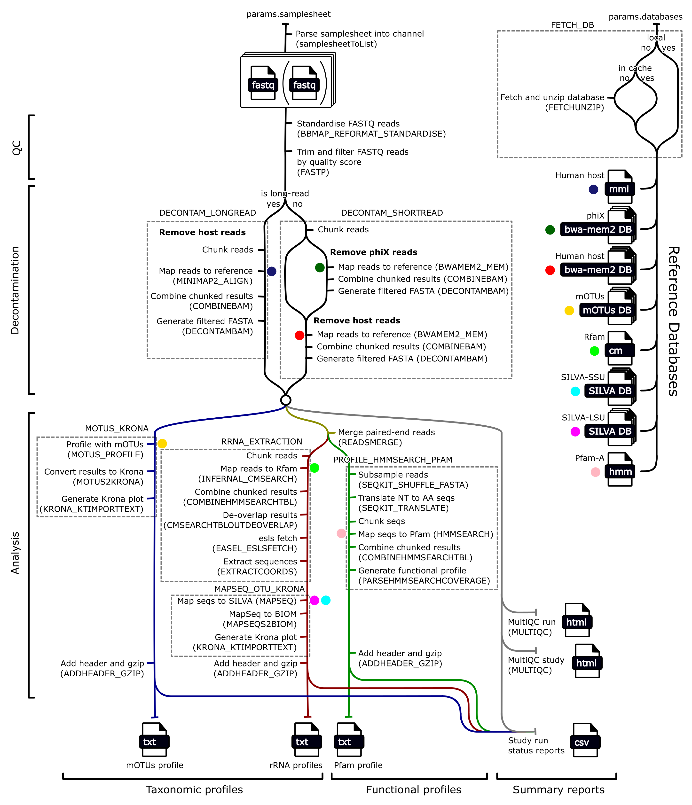

The MGnify v6.0 raw-reads analysis pipeline ([GitHub repository](https://github.com/EBI-Metagenomics/raw-reads-analysis-pipeline)) analyses whole genome sequencing (WGS) reads, profiling their taxonomy and functions. It is designed to handle both short (paired- and single-end) and long reads, taking raw reads rather than assembled contigs or genomes as input.

## Results available on MGnify

For each analysed [run](../../glossary.md#run), MGnify displays and provides downloads for:

- Quality-control and decontamination summaries.
- Taxonomic profiles from mOTUs3, SILVA SSU, and SILVA LSU, with interactive Krona visualisations where available.
- Pfam-A functional profiles, including read-count tables and mapping statistics.

Study-level pages aggregate quality-control and analysis-status information across runs where multiple runs are available.

## Features

The raw reads analysis pipeline v6.0 provides the following key features:

- Whole-genome sequencing (WGS) read analysis for short paired-end and single-end reads, as well as long reads from Oxford Nanopore and PacBio platforms
- Read quality control using [BBMap](https://sourceforge.net/projects/bbmap) for paired-end standardisation and [fastp](https://github.com/OpenGene/fastp) for trimming, filtering, and paired-end read merging
- Host and phiX decontamination using [bwa-mem2](https://github.com/bwa-mem2/bwa-mem2) for short reads and [minimap2](https://github.com/lh3/minimap2) for long reads
- rRNA-based taxonomic profiling with [Infernal](https://github.com/EddyRivasLab/infernal), [MAPseq](https://github.com/jfmrod/MAPseq), and [SILVA](https://www.arb-silva.de/) reference databases
- Marker-gene taxonomic profiling with [mOTUs](https://motu-tool.org/)
- Optional functional profiling by mapping reads to [Pfam-A](https://www.ebi.ac.uk/interpro/entry/pfam) Hidden Markov Models with [HMMER](https://github.com/EddyRivasLab/hmmer)
- Chunked processing and optional subsampling for efficient analysis of large datasets
- Quality-control, decontamination, and run-status summaries through [MultiQC](https://github.com/MultiQC/MultiQC), with interactive taxonomic visualisations generated by [Krona](https://github.com/marbl/Krona)

## Technical and download reference

The following sections describe the pipeline implementation and its downloadable output files. You do not need to run Nextflow or use these files to view results on MGnify.

### Schema



### Tools

| Tool                                                 | Version  | Purpose                                                                                 |
| ---------------------------------------------------- | -------- | --------------------------------------------------------------------------------------- |
| [BBMap](https://sourceforge.net/projects/bbmap)      | 35.85    | Standardise paired-end fastq files                                                      |
| [fastp](https://github.com/OpenGene/fastp)           | 0.24.0   | Quality control reads, and merging paired-end reads                                     |
| [seqtk](https://github.com/lh3/seqtk)                | 1.3-r106 | Converting FASTQ to FASTA                                                               |
| [seqkit](https://github.com/shenwei356/seqkit)       | 2.9.0    | Translating nucleotide to amino acid sequences, and randomly subsampling sequence files |
| [bwa-mem2](https://github.com/bwa-mem2/bwa-mem2)     | 2.2.1    | Map short reads to decontamination reference genomes                                    |
| [minimap2](https://github.com/lh3/minimap2)          | 2.3.0    | Map long reads to decontamination reference genomes                                     |
| [samtools](https://github.com/samtools/samtools)     | 1.21     | Filter fasta/fastq files for decontamination, and generate summary statistics           |
| [Infernal](https://github.com/EddyRivasLab/infernal) | 1.1.5    | Mapping reads to rRNA covariance models using `cmsearch`                                |
| [easel](https://github.com/EddyRivasLab/easel)       | 0.49     | Extracting sequences from cmsearch mapping                                              |
| [MAPseq](https://github.com/jfmrod/MAPseq)           | 2.1.1b   | Mapping rRNA reads to a reference database                                              |
| [Krona](https://github.com/marbl/Krona)              | 2.8.1    | Generate interactive taxonomic profiles                                                 |
| [mOTUs](https://github.com/motu-tool/mOTUs)          | 3.0.3    | Generate taxonomic profile                                                              |
| [HMMer](https://github.com/EddyRivasLab/hmmer)       | 3.4      | Map reads to hidden markov models (HMMs) (i.e. Pfam-A) using `hmmsearch`                |
| [MultiQC](https://github.com/MultiQC/MultiQC)        | 1.27     | Generating reports containing QC and decontamination information                        |
| [Nextflow](https://www.nextflow.io/)                 | 24.10.2  | Running the pipeline                                                                    |
| [Python](https://www.python.org/)                    | 3.11.8   | Generating functional profiles                                                          |
| [cmsearch_tblout_deoverlap](https://github.com/nawrockie/cmsearch_tblout_deoverlap)      | v0.09   | Resolve reads mapping to multiple locations of rRNA covariance model                                                                                  |
| [mgnify-pipelines-toolkit](https://github.com/EBI-Metagenomics/mgnify-pipelines-toolkit) | 1.0.4   | Contains `mapseq2biom` for converting MAPseq output to a BIOM taxonomic profile, and provides a known environment for executing various other commands |

### Reference databases


| Reference Database                                                    | Version    | Purpose                                                                                    |
| ---------------------------------------------------------------------- | ---------- | ------------------------------------------------------------------------------------------ |
| [mOTUs](https://motu-tool.org/)                                        | 3.0.3      | Database for mOTUs tools                                                                   |
| [Rfam](https://rfam.org/)                                              | 15.0       | Ribosomal covariance models                                                                |
| [Pfam](https://www.ebi.ac.uk/interpro/entry/pfam)                      | 38.0       | Protein hidden markov models (HMMs)                                                        |
| [SILVA](https://www.arb-silva.de/)                                     | 138.1      | LSU and SSU 16S database with taxonomy                                                     |
| [hg38](https://www.ncbi.nlm.nih.gov/datasets/genome/GCF_000001405.40/) | GRCh38.p14 | Human host reference genome for decontaminations                                           |
| [phiX](https://www.ncbi.nlm.nih.gov/nuccore/9626372)                   | phiX174    | DNA sometimes introduced by Illumina sequencing platforms to be removed in decontamination |

### Output files

There are three categories of output files, each with its own directory. Each successful run should have all three directories:

```
├── qc
├── taxonomy-summary
└── function-summary
```

Since these results are per-run, many of the output files use the run ID as a prefix. For the purposes of this documentation we will use the run ID `ERZ12345`.

#### `qc`

The `qc` directory contains output files related to the quality control (QC) and decontamination steps of the pipeline. A `fastp` report is generated for QC and after decontamination, and these are combined in a `multiqc` report. The `fastp` reports are `json` files containing a summary of the `fastp` run, including the number of reads and/or bases that were filtered for various reasons.

```
qc
├── ERZ12345_qc.json
├── ERZ12345_decontamination.json
└── ERZ12345_multiqc_report.html
```

#### `taxonomy-summary`

The `taxonomy-summary` directory contains files related to taxonomic profiling of the run. It contains three subdirectories each corresponding to a taxonomic profiling method:
* **`motus`**: generated by mOTUs3
* **`silva-lsu`**: generated by `Infernal cmsearch` extraction of rRNA sequences followed by `MAPseq` mapping to a `SILVA` rRNA LSU reference database.
* **`silva-ssu`** similar to above but mapped to a rRNA SSU (i.e. 16S) reference database

Each subdirectory contains:
1. a standardised text file reporting read counts of each taxa
2. an interactive Krona plot

Output files:
* **`ERZ12345_motus.txt.gz`**: This text file contains a tab-separated table of read counts for each taxa detected, at various taxonomic levels. It is also the Krona text input that is used to generate the Krona HTML file.
* **`ERZ12345_motus.html`**: This `html` file contains the Krona HTML file that interactively displays the distribution of the different taxonomic assignments.
* **`ERZ12345_silva-lsu.txt.gz`**: This text file contains a tab-separated table of read counts for each taxa detected, at various taxonomic levels. It is also the Krona text input that is used to generate the Krona HTML file.
* **`ERZ12345_silva-lsu.html`**: This `html` file contains the Krona HTML file that interactively displays the distribution of the different taxonomic assignments.
* **`ERZ12345_silva-ssu.txt.gz`**: This text file contains a tab-separated table of read counts for each taxa detected, at various taxonomic levels. It is also the Krona text input that is used to generate the Krona HTML file.
* **`ERZ12345_silva-ssu.html`**: This `html` file contains the Krona HTML file that interactively displays the distribution of the different taxonomic assignments.

```
taxonomy-summary
├── motus
│   ├── ERZ12345_motus.txt.gz
│   └── ERZ12345_motus.html
├── silva-lsu
│   ├── ERZ12345_silva-lsu.txt.gz
│   └── ERZ12345_silva-lsu.html
└── silva-ssu
    ├── ERZ12345_silva-ssu.txt.gz
    └── ERZ12345_silva-ssu.html
```

#### `function-summary`

The `function-summary` directory contains files related to functional profiling of the run. It contains one subdirectory, `Pfam-A`, corresponding to the one functional profiling method implemented based on `hmmsearch` mapping to the `Pfam-A` reference database.

Output files:
*	**`ERZ12345_pfam.txt.gz`**: This text file contains a tab-separated table of read counts for each detected Pfam-A profile (or “function”).
*	**`ERZ12345_pfam.stats.json`**: This `json` file summarises the number of reads mapped to Pfam, the number of Pfam models with hits, and the total number of hits across all Pfam models.

```
function-summary
└── pfam
    ├── ERZ12345_pfam.txt.gz
    └── ERZ12345_pfam.stats.json
```


See the [raw-reads analysis pipeline repository](https://github.com/EBI-Metagenomics/raw-reads-analysis-pipeline) for detailed pipeline documentation.
