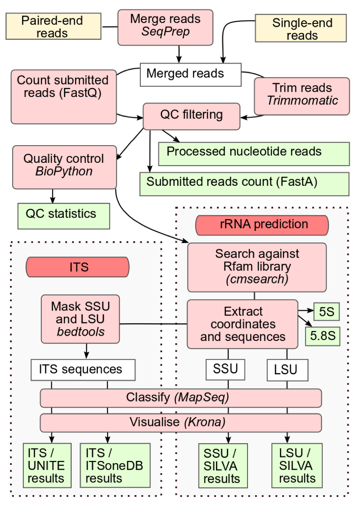
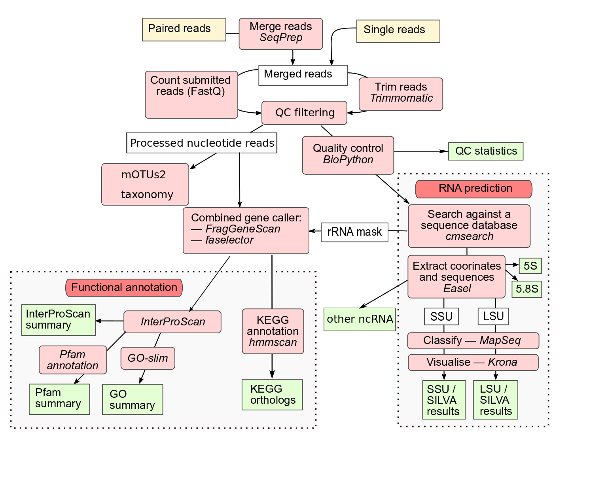
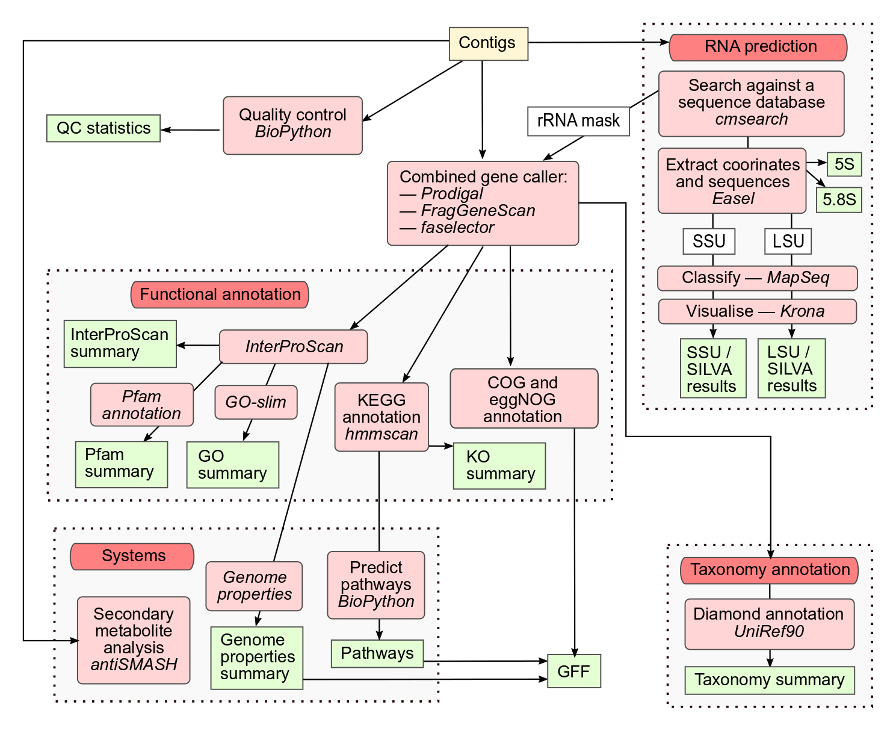

## Overview

The latest MGnify analysis service (version 6.0) offers specialised workflows for three different data types: [amplicon](glossary.md#amplicon), raw [metagenomic](glossary.md#metagenomic)/[metatranscriptomic](glossary.md#metatranscriptomic) reads, and [assembly](glossary.md#assembly). Each workflow is written in [Nextflow](https://www.nextflow.io) (Di Tommaso et al., Nature Biotechnology 35, 316–319, 2017, [doi:10.1038/nbt.3820](https://doi.org/10.1038/nbt.3820)).

For assembled datasets, the assembly analysis pipeline is complemented by [VIRify](#virify) for viral sequence detection and the [Mobilome annotation pipeline](#mobilome-annotation-pipeline) for mobile genetic element prediction, both accessible in the same web view.

## Amplicon analysis pipeline

The MGnify v6.0 amplicon analysis pipeline ([GitHub repository](https://github.com/EBI-Metagenomics/amplicon-analysis-pipeline)) represents a complete refactoring and enhancement of the previous v5.0 pipeline, replacing CWL with Nextflow as the workflow management system and adding significant new functionality.

### Tools and Databases Used

The amplicon analysis pipeline v6.0 uses the following tools and databases:

| Tool/Database | Version | Purpose |
|---|---|---|
| [fastp](https://github.com/OpenGene/fastp) | 1.0.1 | Read quality control |
| [SeqFu](https://github.com/telatin/seqfu2) | 1.20.3 | FASTQ sanity checking |
| [seqtk](https://github.com/lh3/seqtk) | 1.4 | FASTQ file manipulation |
| [SeqKit](https://bioinf.shenwei.me/seqkit/) | 2.9.0 | FASTQ file manipulation |
| [easel](https://github.com/EddyRivasLab/easel) | 0.49 | FASTA file manipulation |
| [bedtools](https://bedtools.readthedocs.io) | 2.30.0 | FASTA sequence masking |
| [Infernal/cmsearch](https://github.com/EddyRivasLab/infernal) | 1.1.5 | rRNA sequence searching |
| [cmsearch_tblout_deoverlap](https://github.com/nawrockie/cmsearch_tblout_deoverlap) | 0.09 | Deoverlapping of cmsearch results |
| [MAPseq](https://github.com/meringlab/MAPseq) | 2.1.1b | Reference-based taxonomic classification of rRNA |
| [Krona](https://github.com/marbl/Krona) | 2.8.1 | Krona chart visualisation |
| [cutadapt](https://cutadapt.readthedocs.io) | 4.6 | Primer trimming |
| [R](https://www.r-project.org) | 4.3.3 | R programming language (runs DADA2) |
| [DADA2](https://benjjneb.github.io/dada2/index.html) | 1.30.0 | ASV calling |
| [MultiQC](https://github.com/MultiQC/MultiQC) | 1.24.1 | Result aggregation into HTML reports |
| [mgnify-pipelines-toolkit](https://github.com/EBI-Metagenomics/mgnify-pipelines-toolkit) | 0.1.8 | Toolkit containing various in-house processing scripts |
| [PIMENTO](https://github.com/EBI-Metagenomics/PIMENTO) | 1.0.2 | Primer inference toolkit |

### Reference Databases

The pipeline uses the following reference databases:

| Reference Database | Version | Purpose |
|---|---|---|
| [SILVA](https://www.arb-silva.de) | 138.1 | 16S+18S+LSU rRNA database |
| [PR2](https://pr2-database.org) | 5.0 | Protist-focused 18S+16S rRNA database |
| [UNITE](https://unite.ut.ee) | 9.0 | ITS database |
| [ITSoneDB](https://itsonedb.cloud.ba.infn.it) | 1.141 | ITS database |
| [Rfam](https://rfam.org) | 14.10 | rRNA covariance models |

### Pipeline Features

The v6.0 amplicon analysis pipeline includes the following key features:

- Refactored Workflow: Complete migration from CWL to Nextflow for improved pipeline management
- Simplified Quality Control: Uses fastp instead of the previous Trimmomatic/Biopython combination
- Automatic Amplified Region Inference: Automatically identifies amplified regions for 16S and 18S rRNA using PIMENTO
- Automatic Primer Identification and Trimming: Uses cutadapt for primer handling, with validation via Infernal
- ASV Calling: Added Amplicon Sequence Variant (ASV) calling using DADA2
- Enhanced Taxonomic Classification: Closed-reference and ASV taxonomy assignment using MAPseq and Krona visualization
- Expanded Reference Databases: Added PR2 database alongside updated SILVA, UNITE, ITSoneDB, and Rfam

### Supported Amplicons

The pipeline supports the following amplicon types:

| Amplicon | Closed-reference analysis | ASV analysis |
|---|---|---|
| 16S | ✓ | ✓ |
| 18S | ✓ | ✓ |
| LSU | ✓ | ✗ |
| ITS | ✓ | ✗ |

### Pipeline Workflow

1. Quality Control: Reads undergo quality filtering using fastp and sanity checking with SeqFu
2. Amplified Region Inference: Automatic identification of amplified regions using PIMENTO
3. Primer Identification and Trimming: Automatic primer detection and removal using cutadapt
4. rRNA Sequence Extraction: Identification of rRNA sequences using Infernal/cmsearch with Rfam models
5. Closed-reference Taxonomic Classification: Taxonomy assignment using MAPseq with SILVA, PR2, UNITE, and ITSoneDB databases
6. ASV Calling: Amplicon Sequence Variant identification using DADA2
7. ASV Taxonomic Classification: Taxonomy assignment for ASVs using MAPseq against SILVA and PR2
8. Visualization: Interactive taxonomic visualization using Krona
9. Result Aggregation: Comprehensive reporting with MultiQC

### Output Structure

The pipeline generates outputs per run in six main directories:

- `qc/`: Quality control reports (fastp JSON, MultiQC HTML), filtered reads (merged FASTQ for paired-end), and SeqFu sanity check results. Runs that fail QC are excluded from downstream analysis.
- `sequence-categorisation/`: rRNA extraction results including the deoverlapped cmsearch output (`.tblout.deoverlapped`), per-type FASTA files (SSU, LSU, ITS), and domain-specific FASTA files (Bacteria RF00177, Archaea RF01959, Eukarya RF01960).
- `amplified-region-inference/`: Per-region read header lists and a summary TSV of detected amplified regions. Up to two regions are supported (e.g. 16S V3-V4 and 18S V4).
- `primer-identification/`: Identified forward and reverse primer sequences (FASTA), cutadapt trimming statistics (JSON), and primer validation results (TSV).
- `asv/`: ASV sequences (FASTA), DADA2 QC statistics, per-region read count tables, and taxonomic assignments against DADA2-SILVA and DADA2-PR2. Subdirectories are created per inferred amplified region; a `concat/` subdirectory is added when two regions are detected.
- `taxonomy-summary/`: Closed-reference taxonomic results — raw MAPseq output (`.mseq`), Krona input (`.txt`), interactive Krona chart (`.html`), and read counts (`.tsv`) — for SILVA-SSU, SILVA-LSU, PR2, UNITE, and ITSoneDB. ASV-based results are in `DADA2-SILVA/` and `DADA2-PR2/` subdirectories.

Study-level outputs include a `study_multiqc_report.html`, `qc_passed_runs.csv` (with status `all_results` or `no_asvs`), `qc_failed_runs.csv` (with failure reason), and a `primer_validation_summary.json` aggregating primer metadata across all runs.

For a complete description of all output files, see the [MGnify v6 amplicon pipeline output documentation](https://github.com/EBI-Metagenomics/amplicon-analysis-pipeline/blob/main/OUTPUTS_DESCRIPTION.md).

{#fig-amplicon-pipeline-v5}

> Note: This diagram shows the v5.0 amplicon pipeline. The v6.0 pipeline has been completely redesigned with new tools and workflows as described above. An updated diagram for v6.0 will be added in a future update.

## Raw reads analysis pipeline (v6.0)

The MGnify v6.0 raw reads analysis pipeline ([GitHub repository](https://github.com/EBI-Metagenomics/raw-reads-analysis-pipeline)) analyses whole genome sequencing (WGS) reads, profiling their taxonomy and functions. It is designed to handle both short (paired- and single-end) and long reads, taking raw reads (not assembled contigs or genomes) as input.

### Tools and Databases Used

The raw reads analysis pipeline v6.0 uses the following tools and databases:

| Tool/Database | Version | Purpose |
|---|---|---|
| [bbmap](https://sourceforge.net/projects/bbmap) | 35.85 | Standardise paired-end fastq files |
| [fastp](https://github.com/OpenGene/fastp) | 0.24.0 | Quality control reads, and merging paired-end reads |
| [seqtk](https://github.com/lh3/seqtk) | 1.3-r106 | Converting fastq to fasta |
| [seqkit](https://github.com/shenwei356/seqkit) | 2.9.0 | Translating nucleotide to amino acid sequences |
| [bwa-mem2](https://github.com/bwa-mem2/bwa-mem2) | 2.2.1 | Map short reads to decontamination reference genomes |
| [minimap2](https://github.com/lh3/minimap2) | 2.3.0 | Map long reads to decontamination reference genomes |
| [samtools](https://github.com/samtools/samtools) | 1.21 | Filter fasta/fastq files for decontamination |
| [infernal](https://github.com/EddyRivasLab/infernal) | 1.1.5 | Mapping reads to rRNA covariance models using cmsearch |
| [easel](https://github.com/EddyRivasLab/easel) | 0.49 | Extracting sequences from cmsearch mapping |
| [mapseq](https://github.com/jfmrod/MAPseq) | 2.1.1b | Mapping rRNA reads to a reference database |
| [Krona](https://github.com/marbl/Krona) | 2.8.1 | Generate interactive taxonomic profiles |
| [mOTUs](https://github.com/motu-tool/mOTUs) | 3.0.3 | Generate taxonomic profile |
| [HMMer](https://github.com/EddyRivasLab/hmmer) | 3.4 | Map reads to hidden markov models (HMMs) |
| [MultiQC](https://github.com/MultiQC/MultiQC) | 1.27 | Generating reports containing QC and decontamination info |
| [Python](https://www.python.org) | 3.11.8 | Generating functional profiles |
| [cmsearch_tblout_deoverlap](https://github.com/nawrockie/cmsearch_tblout_deoverlap) | 0.09 | Resolve reads mapping to multiple locations |
| [mgnify-pipelines-toolkit](https://github.com/EBI-Metagenomics/mgnify-pipelines-toolkit) | 1.0.4 | Contains mapseq2biom for converting mapseq output |

### Reference Databases

The pipeline uses the following reference databases:

| Reference Database | Version | Purpose |
|---|---|---|
| [mOTUs](https://motu-tool.org) | 3.0.3 | Database for mOTUs tools |
| [Rfam](https://rfam.org) | 15.0 | rRNA covariance models |
| [SILVA](https://www.arb-silva.de) | 138.1 | LSU and SSU rRNA database with taxonomy |
| [Pfam-A](https://www.ebi.ac.uk/interpro/entry/pfam) | 38.0 | Protein family hidden markov models |
| [hg38](https://www.ncbi.nlm.nih.gov/datasets/genome/GCF_000001405.40/) | GRCh38.p14 | Human reference genome for host decontamination |
| [phiX](https://www.ncbi.nlm.nih.gov/nuccore/9626372) | phiX174 | PhiX control sequence removed during decontamination (Illumina only) |

### Pipeline Features

The v6.0 raw reads analysis pipeline includes the following key features:

- Nextflow Workflow: Implemented in Nextflow for improved pipeline management
- Comprehensive Quality Control: Uses fastp for read quality filtering and BBMap for paired-end standardisation
- Long Read Support: Handles both short (Illumina) and long reads (Oxford Nanopore, PacBio) with platform-appropriate tools
- Decontamination: Removes host (human by default) and phiX contamination using bwa-mem2 (short reads) and minimap2 (long reads)
- Dual Taxonomic Profiling: Combines rRNA-based (SILVA) and marker gene (mOTUs) approaches
- Functional Profiling: Maps reads directly to Pfam-A hidden markov models using HMMer, with optional subsampling for large datasets
- Automated Database Management: Automatic download and caching of reference databases
- Chunking: Efficient processing of large datasets through chunking of reads for cmsearch and hmmsearch steps

### Pipeline Workflow

1. Database Management: Automatic checking, downloading, and caching of reference databases
2. Quality Control: Standardization with BBMap and filtering with fastp
3. Decontamination: Removal of host and phiX reads using bwa-mem2 (short reads) or minimap2 (long reads)
4. Read Merging: Merging of paired-end reads for profiling steps
5. Taxonomic Profiling:
   - rRNA-based: Infernal cmsearch for rRNA extraction, followed by MAPseq mapping to SILVA SSU and LSU databases
   - Marker gene: mOTUs for comprehensive taxonomic classification
6. Functional Profiling: HMMer hmmsearch for mapping reads to Pfam-A HMMs
7. Result Generation: MultiQC reports and interactive Krona visualizations

### Output Structure

The pipeline generates outputs per run in three main directories:

- `qc/`: Initial QC report from fastp (`_qc.fastp.json`), decontamination report from fastp (`_decontamination.fastp.json`), and a per-run MultiQC HTML report.
- `taxonomy-summary/`: Taxonomic profiles from three methods, each with a gzip-compressed counts table and an interactive Krona HTML chart:
  - `motus/`: mOTUs3 marker gene-based taxonomic profile
  - `silva-ssu/`: SILVA SSU rRNA-based taxonomic profile
  - `silva-lsu/`: SILVA LSU rRNA-based taxonomic profile
- `function-summary/pfam/`: Pfam-A functional profile as a gzip-compressed tab-separated read counts table (`_pfam.txt.gz`) and a mapping statistics JSON (`_pfam.stats.json`).

Study-level outputs include a `study_multiqc_report.html`, `qc_passed_runs.csv`, and `qc_failed_runs.csv`.

For a complete description of all output files, see the [MGnify v6 raw reads pipeline output documentation](https://github.com/EBI-Metagenomics/raw-reads-analysis-pipeline/blob/master/docs/output.md).

{#fig-raw-pipeline-v5}

> Note: An updated diagram for v6.0 will be added in a future update.

## Assembly analysis pipeline (v6.0)

The MGnify v6.0 assembly analysis pipeline ([GitHub repository](https://github.com/EBI-Metagenomics/assembly-analysis-pipeline)) represents a complete redesign of the assembly annotation workflow, offering enhanced functionality and improved performance. The pipeline accepts pre-assembled metagenomic datasets and provides comprehensive functional and taxonomic annotation.

### Tools and Databases Used

The assembly analysis pipeline v6.0 uses the following tools and databases:

| Tool/Database | Version | Purpose |
|---|---|---|
| [antiSMASH](https://antismash.secondarymetabolites.org) | 8.0.1 | Secondary metabolite biosynthetic gene cluster annotation |
| [CAT_pack](https://github.com/MGXlab/CAT_pack) | 6.0 | Taxonomic classification of contigs |
| [Combined Gene Caller - Merge](https://ebi-metagenomics.github.io/nf-modules/modules/ebi-metagenomics/combinedgenecaller/merge/) | 1.4.12 | Combined gene caller merge script |
| [DIAMOND](https://github.com/bbuchfink/diamond) | 2.1.11 | Protein sequence-based taxonomic analysis |
| [DRAM](https://github.com/WrightonLabCSU/DRAM) | 13.5 | Summarizes annotations from multiple tools |
| [eggNOG-mapper](https://eggnog-mapper.embl.de) | 5.0.2 | Protein function annotation |
| [FragGeneScanRs](https://github.com/unipept/FragGeneScanRs) | 1.1.0 | Protein coding sequence prediction |
| [HMMER](https://github.com/EddyRivasLab/hmmer) | 3.4 | KEGG Ortholog prediction |
| [Infernal - cmscan](https://github.com/EddyRivasLab/infernal) | 1.1.5 | RNA sequence searching |
| [InterProScan](https://www.ebi.ac.uk/interpro/interproscan.html) | 5.76-107.0 | Protein function annotation |
| [KOfam](https://www.genome.jp/kegg/ko.html) | 2025-04 | KEGG Ortholog prediction |
| [KEGG pathways completeness](https://github.com/EBI-Metagenomics/kegg-pathways-completeness-tool) | 1.3.0 | Computes KEGG pathway module completeness |
| [Krona](https://github.com/marbl/Krona) | 2.8.1 | Visualisation of taxonomic analyses |
| [Pyrodigal](https://pyrodigal.readthedocs.org) | 3.6.3 | Protein coding sequence prediction |
| [QUAST](http://quast.sourceforge.net/quast) | 5.2.0 | Assembly quality assessment |
| [RHEA](https://www.rhea-db.org) | N/A | Protein reaction assignments |
| [run_dbCAN](https://github.com/bcb-unl/run_dbcan) | 5.1.2 | Carbohydrate-active enzyme annotation |
| [SanntiS](https://github.com/Finn-Lab/SanntiS) | 0.9.4.1 | Biosynthetic gene cluster identification |
| [SeqKit](https://bioinf.shenwei.me/seqkit/) | 2.8.0 | FASTA file manipulation |
| [UniRef90](https://www.uniprot.org/help/uniref) | 2025_01 | Protein sequence-based taxonomic analysis |

### Reference Databases

The assembly analysis pipeline v6.0 uses the following reference databases:

| Reference Database | Version | Purpose |
|---|---|---|
| [Rfam](https://rfam.org) | 15 | rRNA covariance models |
| [InterProScan databases](https://www.ebi.ac.uk/interpro) | 5.73-104.0 | Protein domain and family annotation |
| [eggNOG](https://eggnog5.embl.de) | 5.0.2 | Clusters of orthologous groups |
| [KOfam](https://www.genome.jp/kegg/ko.html) | 2025-04 | KEGG ortholog HMM profiles |
| [GO Slims](http://geneontology.org/docs/go-subset-guide/) | 20160705 | Gene ontology mapping |
| [dbCAN](https://bcb.unl.edu/dbCAN2/) | V13 | CAZy carbohydrate-active enzyme database |
| [CAT_Pack taxonomy](https://github.com/MGXlab/CAT_pack) | 2025_01 | NCBI taxonomy reference for contig classification |
| [DRAM databases](https://github.com/WrightonLabCSU/DRAM) | 1.3.0 | Metabolic annotation databases |

### Pipeline Features

- Assembly Quality Control: The pipeline performs quality control on assembled contigs, including optional decontamination to remove human, PhiX, and custom contaminant sequences using [minimap2](https://lh3.github.io/minimap2/). Quality assessment is performed using [QUAST](http://quast.sourceforge.net/quast).

- CDS Prediction: Protein coding sequences are predicted using the [MGnify Combined Gene Caller](https://ebi-metagenomics.github.io/nf-modules/modules/ebi-metagenomics/combinedgenecaller/merge/), which combines predictions from [Pyrodigal](https://pyrodigal.readthedocs.org/) and [FragGeneScanRs](https://github.com/unipept/FragGeneScanRs).

- Taxonomic Assignment: Contigs undergo taxonomic classification using [CAT_pack](https://github.com/MGXlab/CAT_pack), which uses DIAMOND to match predicted CDS against reference databases. Additionally, rRNA sequences are identified using [Infernal](http://eddylab.org/infernal/) with Rfam covariance models.

- Functional Annotation:
  - [InterProScan](https://www.ebi.ac.uk/interpro/interproscan.html) identifies protein domains, families, and functional sites
  - [eggNOG-mapper](https://eggnog-mapper.embl.de/) assigns clusters of orthologous groups (COGs) annotations and functional descriptions
  - [run_dbCAN](https://github.com/bcb-unl/run_dbcan) annotates carbohydrate-active enzymes
  - [KEGG Orthologs](https://www.genome.jp/kegg/ko.html) are assigned using HMMER
  - [RHEA](https://www.rhea-db.org/) reactions are assigned to proteins
  - Gene Ontology (GO) terms are extracted and mapped to metagenomics GO Slims

- Biosynthetic Gene Cluster Annotation: The pipeline uses both [antiSMASH](https://antismash.secondarymetabolites.org/) and [SanntiS](https://github.com/Finn-Lab/SanntiS) to identify and annotate biosynthetic gene clusters associated with secondary metabolite production.

- Pathway and System Analysis:
  - KEGG pathway completeness is computed using the [kegg-pathways-completeness-tool](https://github.com/EBI-Metagenomics/kegg-pathways-completeness-tool)
  - [Genome Properties](https://www.ebi.ac.uk/interpro/genomeproperties/) provides inference of higher-level pathways and systems
  - [DRAM](https://github.com/WrightonLabCSU/DRAM) generates comprehensive metabolic summaries and visualizations

- Consolidated Annotation: All annotations are aggregated into a single consolidated GFF file for easy integration with genome browsers and other tools.

### Pipeline Workflow

1. Input and Quality Control: The pipeline accepts assembly FASTA files and performs initial quality control, filtering contigs shorter than 500 bases and those with high N-base content.

2. Decontamination (Optional): Contigs can be screened against reference genomes to remove potential contaminants.

3. Gene Prediction: The combined gene caller identifies protein-coding sequences in the assembled contigs.

4. Taxonomic Annotation: Contigs are classified taxonomically using CAT_pack, and rRNA sequences are identified for additional taxonomic validation.

5. Functional Annotation: Predicted proteins undergo comprehensive functional annotation using multiple tools.

6. Biosynthetic Gene Cluster Detection: Both antiSMASH and SanntiS are used to identify potential secondary metabolite production pathways.

7. Pathway Analysis: KEGG modules completeness is calculated, and Genome Properties are inferred.

8. DRAM Integration: DRAM provides metabolic summaries and visualizations.

9. Output Generation: All annotations are consolidated into standardized output formats.

### Output Structure

The pipeline generates outputs per assembly in six main directories:

- `qc/`: Filtered contigs (FASTA), QUAST assembly statistics, and MultiQC reports. A `decontamination/` subdirectory is present if contamination is detected, containing TSV files listing removed contigs (human, PhiX, or custom).
- `cds/`: Predicted coding sequences in nucleotide (FFN), amino acid (FAA), and GFF3 annotation formats.
- `taxonomy/`: CAT_pack taxonomic assignments, Krona visualisation files, and rRNA marker gene sequences (SSU and LSU FASTA files where detected).
- `functional-annotation/`: Subdirectories for InterProScan, Pfam, Gene Ontology, eggNOG-mapper, KEGG, RHEA reactions, and dbCAN results — each containing summary count tables and detailed annotation files.
- `pathways-and-systems/`: Biosynthetic gene cluster predictions from antiSMASH and SanntiS, Genome Properties results, KEGG module completeness assessments, and DRAM metabolism summaries (including HTML visualizations and Excel exports).
- `annotation-summary/`: A consolidated GFF3 file integrating all functional annotations with indices for efficient querying.

Study-level outputs include `analysed_assemblies.csv`, `qc_failed_assemblies.csv`, a `multiqc/` directory, a `dram-distill/` directory for aggregated metabolism data, and `downstream_samplesheets/` containing configuration files for running VIRify and the Mobilome annotation pipeline.

For a complete description of all output files, see the [MGnify v6 assembly pipeline output documentation](https://github.com/EBI-Metagenomics/assembly-analysis-pipeline/blob/main/docs/output.md).

{#fig-assembly-pipeline-v5}

> Note: This diagram shows the v5.0 assembly pipeline. The v6.0 pipeline has been completely redesigned with new tools and workflows as described above. An updated diagram for v6.0 will be added in a future update.

## VIRify

[VIRify](https://github.com/EBI-Metagenomics/emg-viral-pipeline) is run on assembled contigs after the assembly analysis pipeline and is accessible in the same web view. It is a Nextflow-based workflow for detecting, annotating, and taxonomically classifying viral sequences in metagenomic and metatranscriptomic assemblies. Taxonomy assignment uses a curated collection of viral orthologous protein domains (ViPhOGs).

### Tools Used

| Tool | Purpose |
|---|---|
| [VirSorter2](https://github.com/jiarong/VirSorter2) | Viral contig prediction |
| [VirFinder](https://github.com/jessieren/VirFinder) | Viral contig prediction |
| [PPR-Meta](https://github.com/zhenchengfang/PPR-Meta) | Viral contig prediction |
| [Prodigal](https://github.com/hyattpd/Prodigal) | Protein coding sequence prediction on viral contigs |
| [HMMER](https://github.com/EddyRivasLab/hmmer) | ViPhOG domain matching for taxonomy assignment |
| [CheckV](https://bitbucket.org/berkeleylab/checkv) | Viral sequence quality assessment |

### Pipeline Workflow

1. Viral contig prediction using VirSorter2, VirFinder, and PPR-Meta
2. Protein calling on predicted viral contigs using Prodigal
3. HMM-based annotation using ViPhOG protein domain profiles
4. Taxonomic classification based on ViPhOG matches
5. Quality evaluation using CheckV
6. Visualization using Krona and Sankey plots

### Output Structure

- Annotated viral contigs in FASTA format
- GFF files with sequence ontology-compliant annotations
- Taxonomic assignments
- Krona and Sankey interactive visualizations
- Quality metrics from CheckV

For full documentation, see the [VIRify GitHub repository](https://github.com/EBI-Metagenomics/emg-viral-pipeline).

## Mobilome annotation pipeline

The [Mobilome annotation pipeline](https://github.com/EBI-Metagenomics/mobilome-annotation-pipeline) is run after VIRify as part of the assembly analysis bundle. It predicts and annotates mobile genetic elements (MGEs) — including plasmids, phages, insertion sequences, and integrative conjugative elements — in prokaryotic genomes and metagenomes, outputting results in GFF3 format. VIRify results can optionally be incorporated into the mobilome annotation.

### Tools Used

| Tool | Version | Purpose |
|---|---|---|
| [geNomad](https://github.com/apcamargo/genomad) | 1.11.1 | Plasmid and phage prediction |
| [ICEfinder](https://bioinfo-mml.sjtu.edu.cn/ICEfinder/) | 2.0 | Integrative conjugative element detection |
| [IntegronFinder2](https://github.com/gem-pasteur/Integron_Finder) | 2.0.6 | Integron identification |
| [ISEScan](https://github.com/xiezhq/ISEScan) | 1.7.3 | Insertion sequence detection |
| [Prodigal](https://github.com/hyattpd/Prodigal) | 2.6.3 | CDS annotation |

### Reference Databases

| Reference Database | Version | Purpose |
|---|---|---|
| geNomad database | 1.9 | Reference database for plasmid and phage prediction |
| ICEfinder2 databases | N/A | MacSyFinder models, HMM models, and UniProt reference sequences |

### Pipeline Workflow

1. Preprocessing: Contig filtering and gene prediction via Prodigal
2. Prediction: Concurrent execution of geNomad, ICEfinder2, IntegronFinder2, and ISEScan, plus compositional outlier detection for contigs >100 kb
3. Integration: Results parsing and optional incorporation of VIRify output; fragments <500 bp and elements lacking genes are filtered out
4. Postprocessing: GFF validation and output compression

### Output Structure

- `mobilome.gff.gz`: Integrated MGE annotations in GFF3 format
- `mobilome.fasta`: Sequence records for all predicted mobile genetic elements
- Subdirectories containing individual tool results and preprocessing intermediates

For full documentation, see the [Mobilome annotation pipeline GitHub repository](https://github.com/EBI-Metagenomics/mobilome-annotation-pipeline).
