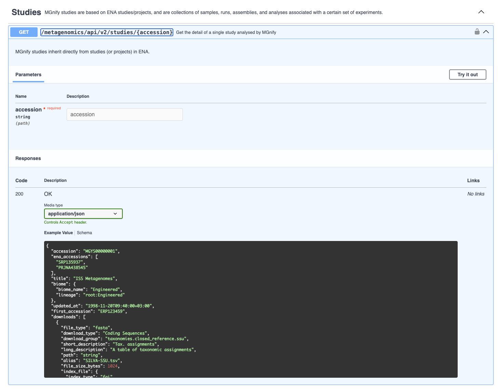

With the rapid expansion in the number of datasets deposited in MGnify, it has become increasingly important to provide programmatic
access to the data for cross-database complex queries.

## API Overview

### Current version

Current API version is **v2**.

::: {.callout-warning}

### API v1 Deprecation

The API v1 was deprecated in June 2026. It will be turned off no earlier than September 1st 2026, but will serve frozen data that does not include MGnify V6 analyses.
:::


### Base URL

The base address to the API is [https://www.ebi.ac.uk/metagenomics/api/v2/](https://www.ebi.ac.uk/metagenomics/api/v2/).

Browsing the API root (i.e. going to [`/api/v2`](https://www.ebi.ac.uk/metagenomics/api/v2/) in a web browser) shows a human-readable, browsable, interactive documentation page for the API.
This is the easiest way to explore it.

To programatically explore it, e.g. to help instruct a large-language model to use it, an OpenAPI JSON is provided:

```bash
curl -X GET "https://www.ebi.ac.uk/metagenomics/api/v2/openapi.json"
```

There are several easy-to-use top-levels resources, such as
[studies](glossary.md#study), [samples](glossary.md#sample), [runs](glossary.md#run), [biomes](glossary.md#biome), and [analyses](glossary.md#analysis+result). For example
[https://www.ebi.ac.uk/metagenomics/api/v2/studies](https://www.ebi.ac.uk/metagenomics/api/v2/studies) retrieves a list
of all studies, while [https://www.ebi.ac.uk/metagenomics/api/v2/studies/MGYS00010397](https://www.ebi.ac.uk/metagenomics/api/v2/studies/MGYS00010397)
retrieves a single study, with the accession `MGYS00010397`. The samples contained
within this study can be retrieved using the relationship URL:
[https://www.ebi.ac.uk/metagenomics/api/v2/studies/MGYS00010397/samples/](https://www.ebi.ac.uk/metagenomics/api/v2/studies/MGYS00010397/samples/).

### HTTP methods

The API provides mostly read-only access to all resources, that means only HTTP GET
method can be used with exception of the authentication endpoint and some search endpoints that accept a query sequence.

### Responses

Responses to list endpoints (like `/studies/`, `/genomes/` etc) return data following a schema like:
```json
  "count": 10,
  "items": [...]
```

The same is true of detail -> list relationship endpoints (like `/studies/MGYS00010397/samples/` for example).

Responses to a detail endpoint (like `/studies/MGYS00010397`, `/analyses/MGYA01020362` etc) return data following a schema appropriate for the data type, e.g. for analysis:
```json
{
  "experiment_type": "Metatranscriptomic",
  "study_accession": "MGYS000000001",
  "accession": "MGYA000000001",
  ...
}
```

The schema of a detail endpoint often includes more fields than when the same object appears in a list.
For examples, an analysis's `downloads` field is not shown in `/analyses/` but is in `/analyses/MGYA01020362`.

The schema for all responses is available from the [Open API spec](https://www.ebi.ac.uk/metagenomics/api/v2/openapi.json), and this is also shown - often with example data - in the browsable API.



### Pagination

As some queries can result in a large response, the API supports pagination,
using a page number and size of results per page as query parameters. Request
that return multiple items is paginated to 20 items by default, and can be
increased up to 100:

```bash
curl -X GET "https://www.ebi.ac.uk/metagenomics/api/v2/studies?page_size=100"
```

The `"count"` given at the top-level of a list endpoint's JSON response, combined with the `page_size` requested, allows you to compute how many pages need to be requested.
For each page, use a `?page=x` query parameter, e.g.:

```bash
curl -X GET "https://www.ebi.ac.uk/metagenomics/api/v2/studies/?page=2&page_size=100"
```

This pagination can be interated.

### Parameters

In APIv2, there are very few query parameters for filtering lists: instead the API returns fast responses for entire lists which can be easily filtered downstream.
A limited number of search filters are supported, though, for very common queries. 
For example to search studies by their title including the words `space station`:

```bash
curl -X GET "https://www.ebi.ac.uk/metagenomics/api/v2/studies/?search=space+station"
```

or genomes with taxa including `Rickettsiales`:

```bash
curl -X GET "https://www.ebi.ac.uk/metagenomics/api/v2/genomes/?search=Rickettsiales"
```

### Links
Some endpoints in the API schema include "Links", which are not URLs, but rather other endpoint in the API (or "operations") that get related data.
These are part of the Open API specification, and are mostly useful to programmatic clients like large-language models.
For example, they specify how one can retrieve the genome-catalogue mentioned in the detail endpoint response from a genome.

### Errors

There are three possible types of client errors on API calls:


* 400 Bad requests, usually a bad query parameter.

* 401 Unauthorized, usually trying to access private analyses with the wrong credentials.

* 404 Not found, usually a broken link or a dataset that has been suppressed.

* 403 Authentication failed.

## Examples

### Download all taxonomy files from a metagenomic analyses (MGYA)
This example uses common command-line tools [curl](https://curl.se/) and [jq](https://jqlang.org/)
```bash
curl "https://www.ebi.ac.uk/metagenomics/api/v2/analyses/MGYA01020362" | jq '.downloads[] | select(.download_group | startswith("taxonomies.")) | .url' | xargs -n1 curl -O
```

### Access MGnify from Python

We have a Python client, MGnipy, designed to streamline access to the APIv2 from Python.

Documentation for MGnipy can be found at [mgnipy.mgnify.org/](https://mgnipy.mgnify.org/).


