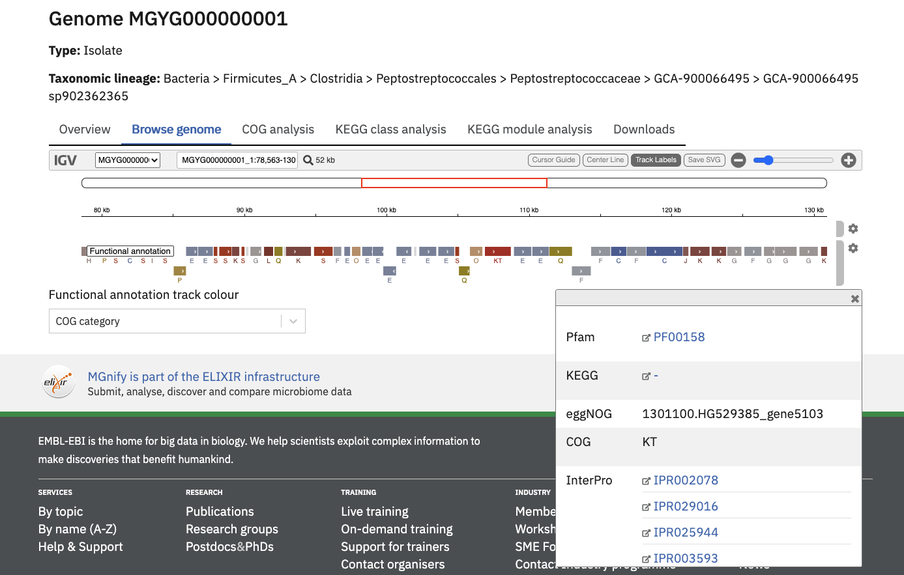

## Genome Catalogues

MGnify Genomes (accessed from the ‘Genomes’ tab of the ‘Browse data’ area in the menu bar)
provides a detailed interactive view of prokaryotic genomes and their functional annotations.

MGnify displays genomes in biome-specific Catalogues.

The latest version of each Catalogue is shown on the website,
whilst older versions can be downloaded from our [FTP server](http://ftp.ebi.ac.uk/pub/databases/metagenomics/mgnify_genomes/).

{#fig-genome-catalogues-list}

## Generating genome catalogues

There are two processes that have been put in place to generate a genome catalogue. A new catalogue (v1.0 of any
catalogue) is generated using [MGnify genome analysis pipeline](https://github.com/EBI-Metagenomics/genomes-pipeline).
Pipeline structure and tool descriptions are included in the
[README file](https://github.com/EBI-Metagenomics/genomes-pipeline/blob/master/README.md) in the repository.

The process to produce updated versions of the catalogues is described below.

### Updating an existing catalogue

New genomes (MAGs or isolates) are added to an existing catalogue following the steps outlined in @fig-genome-update-pipeline. To be added
to a catalogue, a genome must be available in [INSDC](https://www.insdc.org/).

{#fig-genome-update-pipeline}

Briefly, the new genomes undergo QC filtration: quality score (QS) is calculated for each genome as
`% completeness - 5 \* % contamination`; genomes with QS < 50 or contamination > 5% are removed. The genomes are then
dereplicated at 99.9% similarity to remove strain redundancy and compared to the previous version of the genome
catalogue using [Mash](https://github.com/marbl/Mash) to determine whether each genome represents a novel species,
a novel strain or a strain that already exists in the catalogue. The category under which a new genome falls is based on
the distance between the new genome and the most similar genome in the existing catalog: > 0.05 = new species,
0.001 - 0.05 = new strain, < 0.001 = strain already exists.

If the strain already exists, the genome is discarded. Genomes classified as novel species are dereplicated at 95%
similarity to identify genomes that belong to the same species cluster and undergo two more quality control steps:
genomes are screened with [GUNC](https://github.com/grp-bork/gunc) to remove possible chimeras and contigs are screened
for human contamination using [BLAST](https://blast.ncbi.nlm.nih.gov/Blast.cgi). Genomes that represent a novel
strain become the new species representative for their respective cluster if any of the following conditions is true:

* the new genome is an isolate while the current species representative is a MAG;

* the new genome is a MAG and it’s quality score (`completeness - 5 \* contamination`) is 10% higher than that of the current species representative;

* the new genome and the current representative are isolates and the quality score of the new genome is 10% higher than that of the current species representative.

If none of the above conditions is true, the new strain is added to the species cluster but does not replace the existing
species representative.

The tools used to annotate the new genomes and to update the pan-genomes for each species containing multiple conspecific
genomes to which new genomes have been added are listed in the README files associated with each catalog on the
[FTP server](http://ftp.ebi.ac.uk/pub/databases/metagenomics/mgnify_genomes/).

## Searching across catalogues

There are three ways to search for species across all of the catalogues.

### By accession or taxonomy

{#fig-genome-all-genomes}

The Browse > Genomes > All Genomes tab lists genomes from all catalogues. The genome accessions and taxonomic lineages are indexed for full-text search.
This is helpful to find a specific genome where the biome is irrelevant, or to find the set of biomes (catalogues) which a certain taxonomic classification is present in.

### By gene fragment

The ‘Gene search’ tab is a [COmpact Bitsliced Signature index (COBS)](https://arxiv.org/abs/1905.09624) based search engine.
COBS queries short sequence fragments against the species representatives of some or all genome catalogues.

One or more catalogues can be selected to search against. By default, your query is compared to all current catalogues.

The table of results provides the user with direct links to the matching genomes.
Match statistics are shown as a count and percentage of kmers found.
A score of 100% means that all of the [31-length kmers](https://en.wikipedia.org/wiki/K-mer) in the query were found in the indexed Genome.

The minimum kmer proportion is set at a default of 0.4 and can be increased or decreased within a range of 0.1-1 with the available toggle.

{#fig-genome-search-cobs}

### By whole genome /  MAG

The ‘MAG search’ tab is a [Sourmash](https://sourmash.readthedocs.io/en/latest/) based search engine.
Sourmash queries complete MAGs for similarity against the species representatives of some or all genome catalogues.

One or more catalogues can be selected to search against. By default, your query is compared to all current catalogues.

The query genome must be a nucleotide sequence file.

Use the browse button to upload either a single FastA file, or multiple files by holding [ctrl] or [shift] while clicking in the file explorer.
Alternatively you can select a whole directory of files using the directory mode (select this option below the Browse button).
In this mode, the tool will process all FastA files in the selected directory, however it will not descend into subdirectories.
Files are not uploaded onto MGnify servers.
Rather, Sourmash generates a signature of your file(s) in your browser, and compares this signature against our MAG catalogue on the server.
Successful searches create a CSV result file for each signature submitted.
These are compiled into a TGZ allowing you to fetch all your results in one click.
These result files are only stored in our servers for 30 days, so please be sure to download them before they expire.

{#fig-genome-search-sourmash}

## Browsing a catalogue

Clicking on a Catalogue ID in the list on the [MGnify website](https://www.ebi.ac.uk/metagenomics/browse#genomes) allows you to browse the
catalogue’s contents.

The “Genome list” tab contains a catalogue of non-redundant isolate and metagenome assembled genomes ([MAGs](glossary.md#mags)).
Each accession is a species representative of a cluster of genomes.
To constitute a cluster: genomes with completeness greater than 50%, contamination less than 5% and average quality score (completeness - 5\*contamination) greater than 50 - calculated with [CheckM, v.1.0.11](https://genome.cshlp.org/content/25/7/1043?ijkey=a446ec2b6e540d598d39c9253e0fdfbdab52b2f4&keytype2=tf_ipsecsha) are clustered with [dRep v2.2.4](https://www.nature.com/articles/ismej2017126) using an average nucleotide identity (ANI) cutoff of  ≥95% and an aligned fraction (AF) of ≥30% .
The species representative for each cluster is the best quality genome judged by completeness, contamination and the assembly N50 values.
Isolate genomes are prioritised over MAGs for a species representative.

{#fig-genomes-list}

The ‘Taxonomy tree’ is a subset of the GTDB taxonomy which can be viewed interactively.
Genomes from the catalogue can be found in the tree by taxonomic lineage.
Each orange coloured genome accession links to further statistics and functional annotation data.

{#fig-genome-tax-tree}

The ‘Protein catalogue’ is clusters of all the predicted coding sequences in the genome catalogue.
Separate catalogues are generated at different amino acid identity levels (100%, 95%, 90% and 50%).
Data for the Protein catalogue are available at the linked FTP server location.

### Searching a catalogue

There are single-catalogue versions of the COBS and Sourmash searches available on the ‘Search by gene’ and ‘Search by MAG’ tabs, respectively.
These searches work exactly the same as the cross-catalogue searches described above, except that they always search against only one catalogue.

## Genome detail

View a specific Genome by clicking it in the Genome List, or a search result.

The page header details the genome type and a full GTDB lineage assigned with [GTDB-tk](https://academic.oup.com/bioinformatics/advance-article/doi/10.1093/bioinformatics/btz848/5626182). The ‘Overview’ tab contains statistics about the genome. Type of genome (isolate or MAG), length, percentage completeness and contamination, the number of contigs, number of genomes represented by the species cluster, total number of proteins, N50 and GC content are shown here.

[Infernal](http://europepmc.org/abstract/MED/24008419) is used to screen for the presence of ribosomal RNAs against [Rfam](http://europepmc.org/articles/PMC4383904) covariance models for 5S, 16S and 23S rRNA. Transfer RNAs are identified with [tRNAScan-SE](https://academic.oup.com/nar/article/25/5/955/5133591). These figures are presented in the Genome RNA
coverage section, as the percentage coverage for each rRNA type and a count of total tRNA and ncRNAs.

[pCDS](glossary.md#predicted-coding-sequence-pcds) are inferred with [Prokka](https://academic.oup.com/bioinformatics/article/30/14/2068/2390517) which uses [Prodigal](https://bmcbioinformatics.biomedcentral.com/articles/10.1186/1471-2105-11-119) . [eggNOG-mapper tool](https://www.biorxiv.org/content/10.1101/076331v1.full) assigns [KEGG](glossary.md#kegg) and [COG](glossary.md#cog) annotations against the pCDS. InterProScan performs protein annotations with 5 member databases. The proportion of predicted proteins with an [InterPro](glossary.md#interpro) or eggNOG annotation are given as a coverage percentage. COG and KEGG annotations are visualised in their respective tabs with the top 10 hits in an interactive bar graph.

Additionally, the geographic origin of each genome, and links to ENA accessions can be found towards the bottom of this page.

### Genome annotation browser

All genome annotations can be viewed interactively in the ‘Browse genome’ tab to browse all assigned functional annotations in more detail.

The “Functional annotation track colour” dropdown menu can be used to pick an annotation type of interest.
Once selected, the annotation region will be coloured (and labelled, depending on the annotation type).

{#fig-genome-browser}

## Pan-genome

Genome accessions with more than 1 genome in a species cluster have additional pan-genome analyses. [Roary v3.12.0](https://academic.oup.com/bioinformatics/article/31/22/3691/240757) performs an iterative clustering of predicted genes with greater than 90% amino acid identity (AAI) for all genomes in the species cluster, to infer a core genome. Further BLASTp steps identify groups of homologous genes pertaining to the accessory genomes. The overview page has an extra ‘Pan-genome statistics’ block. Figures for pan-genome size - a ratio of the total core and accessory genes versus the total number of genes in the species representative, pan-genome core size and pan-genome accessory size can be found here. [eggNOG-mapper tool](https://www.biorxiv.org/content/10.1101/076331v1.full)  and InterProScan annotations are performed as above. The COG and KEGG visualisations have an extra bar in the plot representing the pan-genome analysis.

The ‘Downloads’ tab comprises summary files for all described analyses.

{#fig-genome-overview}

A set of assemblies, annotations, [pan-genome](glossary.md#pan-genome) results and protein catalogues are available in our [FTP server](http://ftp.ebi.ac.uk/pub/databases/metagenomics/mgnify_genomes/).
