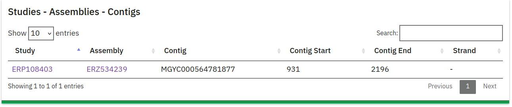
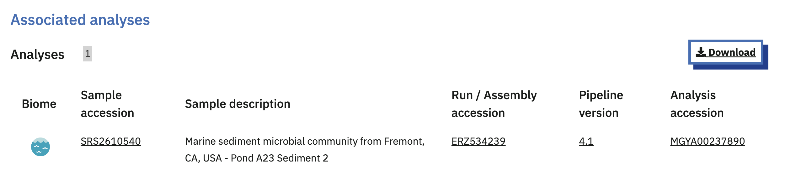

## MGnify proteins and the contigs they originate from

The proteins of the MGnify Protein Database are originally called from assembled contigs. There are multiple reasons to pair up a protein of interest with the genomic neighbourhood it's transcribed in, such as the use of its encoding nucleotide sequence for protein expression experiments, or for investigating the potential existence of operons. This guide describes the different avenues for retrieving the contig sequences for MGnify proteins.

::: {.callout-warning}
The current process for retrieving contig sequences for MGYPs is not ideal due to missing links between our different data models. We are currently exploring new methods to simplify this process in the near future.
:::

## How to extract the contig sequence of an MGYP

The way to extract the contig sequence for an MGYP depends on the version of the MGnify analysis pipelines a MGYP originates from:

- For v5.0 analyses, a MGnify API call can be made (~60% of cases)
- For anything below v5.0, processed contig files will need to be downloaded and parsed for contigs of interest (~40% of cases)

For both methods, two pieces of information are necessary:

- The MGYA accession of a MGnify Analysis for the assembly that the MGYP originates from.
- The name of one of the specific contigs the MGYP is located on.

With both of these, the specific contig sequence of interest can be extracted from its respective assembly.

The easiest way to retrieve these two inputs changes depending on whether the MGYP of interest is a cluster representative or not.  We'll start with the easier case where your MGYP is a cluster representative.

### Your MGYP is a cluster representative

#### Getting the MGYA and contig name

If you used the [MGnify Sequence Search](/src/docs/mgnify-proteins-sequence-search.html), your matched MGYPs would be cluster representatives. Every cluster representative has its own detail page, which you can access by searching for its accession in the [MGnify Proteins Portal](/src/docs/mgnify-proteins-web.html#organization-of-the-protein-detail-page), for example [MGYP000261684433](https://www.ebi.ac.uk/metagenomics/proteins/MGYP000261684433/).

Scrolling down the page to the `Studies - Assemblies - Contigs` section, you can find two useful pieces of information. 


First, clicking on the Assembly (in this case `ERZ534239`) will take you to a page describing the assembly, including the analyses that were performed on it in the `Associated analyses` section; this is how you can retrieve an MGYA accession (in this case `MGYA00237890`). That's the first piece of information we need to get the contig sequence.


From the `Studies - Assemblies - Contigs` section, you can also take note of the first contig accession (in this case `MGYC000564781877`), as we can use it to retrieve a contig name. The next step entails downloading the different `mgy_contig_map_$.tsv.gz` files from the [FTP server](https://ftp.ebi.ac.uk/pub/databases/metagenomics/peptide_database/current_release/). These files contain two columns; the first column contains the MGYC for a contig, and the second the contig name. It might be necessary to search all the contig map files to find the specific MGYC you want to look for. Running this `zgrep` command in the directory that you downloaded the contig map files to performs a search in all the files - there should only be one match.

```{bash}
zgrep 'MGYC000564781877' mgy_contig_map_*.tsv.gz
```

In this case, the resulting contig name is `ENA-OSOD01046483-OSOD01046483.1-marine-metagenome-genome-assembly--contig:-NODE-46483-length-2198-cov-1.824140`

#### Performing the API call to retrieve the contig sequence

Now that we have both the MGYA accession and the contig name of interest, we can perform this API call to retrieve the contig sequence:

```{bash}
curl -s 'https://www.ebi.ac.uk/metagenomics/api/v1/analyses/$MGYAXXXXXX/contigs/$contig_name'
```

For the example we've been working with so far, the query would look like this:
```{bash}
curl -s 'https://www.ebi.ac.uk/metagenomics/api/v1/analyses/MGYA00237890/contigs/ENA-OSOD01046483-OSOD01046483.1-marine-metagenome-genome-assembly--contig:-NODE-46483-length-2198-cov-1.824140'
```

Unfortunately, this analysis is not from a v5.0 pipeline run, so a contig will not be found with this method. If it were, the output of the previous command would be something like this:

>\>ERZ2641806.86530-NODE-86530-length-1467-cov-4.165722
>GGTTGCAGGCACTCAGCATATCATCGTTATTATAAATAAAGTTAGACAGATTTA....

#### Downloading the processed contigs file and extracting the sequence

The processed contigs file you need to download is located in the download section of the MGYA analysis page that we could open earlier in the Associated analyses section of the assembly, which for our example is [here](https://www.ebi.ac.uk/metagenomics/analyses/MGYA00237890#download). You can then download the `Processed contigs` FASTA file by pressing the `Download` button.

Once you have the file (which in this case is called `ERZ534239_FASTA.fasta.gz`), you can run the following `zgrep` command to retrieve the specific contig sequence of interest:

```{bash}
zgrep -A 1 'ENA-OSOD01046483-OSOD01046483.1-marine-metagenome-genome-assembly--contig:-NODE-46483-length-2198-cov-1.824140' ERZ534239_FASTA.fasta.gz
```

Which will output something like this:

>\>ENA-OSOD01046483-OSOD01046483.1-marine-metagenome-genome-assembly--contig:-NODE-46483-length-2198-cov-1.824140
>CGGTGTTCCCAAAACGAGGTCGCCGAGGCGATGCGCGAGGCGGGCGCCGACGC....

### Your MGYP is not a cluster representative

#### Getting the MGYA and contig name

If your MGYP is not a cluster representative, you will need to parse a few more of database flat files from the [FTP server](https://ftp.ebi.ac.uk/pub/databases/metagenomics/peptide_database/current_release/). Specifically, you will first need to download the `mgy_seq_metadata_*.tsv.gz` files, similarly to the `mgy_contig_map_*.tsv.gz` files. Searching for the MGYP accession in these files with `zgrep` will reveal the MGYC contig accession:

```{bash}
zgrep 'MGYP000261684433' mgy_seq_metadata_*.tsv.gz
```

The output of this command will look like this:

>ERZ534239.MGYC000564781877:931-2196:-1:partial

You can then grab the ERZ and MGYC accessions and follow the instructions for if your MGYP is a [cluster representative](/src/docs/mgnify-proteins-contig-sequences.html#getting-the-mgya-and-contig-name), i.e. go to `https://www.ebi.ac.uk/metagenomics/assemblies/ERZ534239` to get the MGYA, and search for `MGYC000564781877` on the contig maps to get the contig name.

