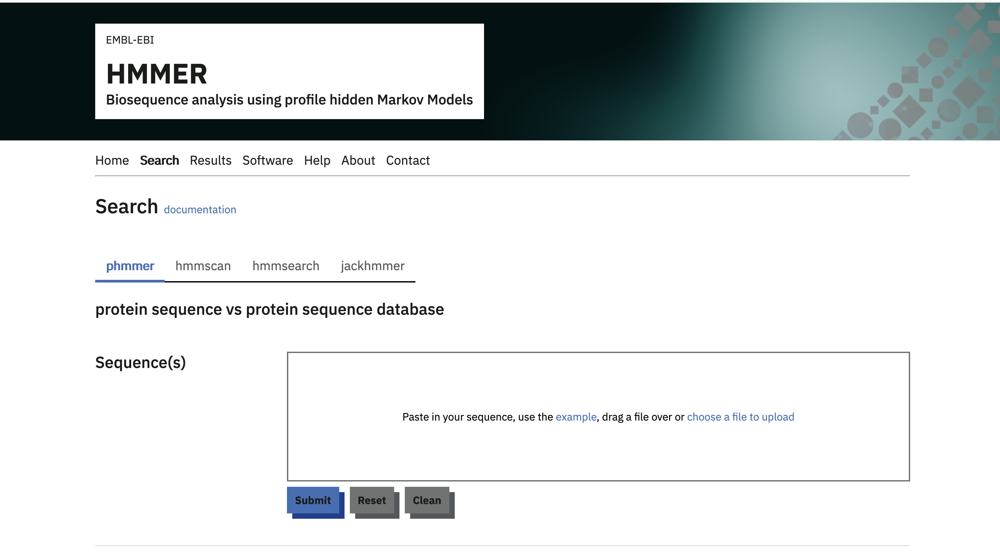
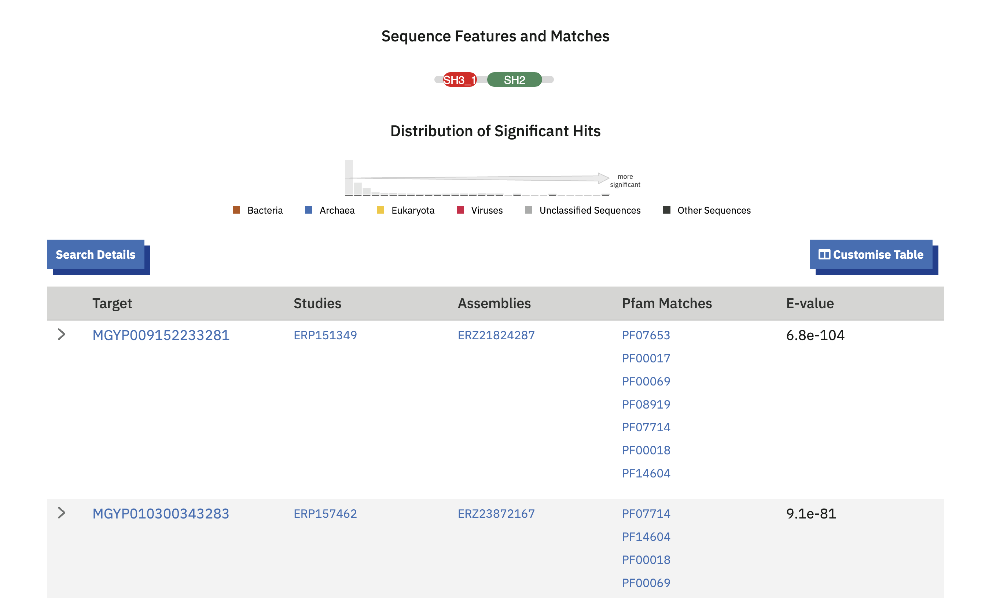
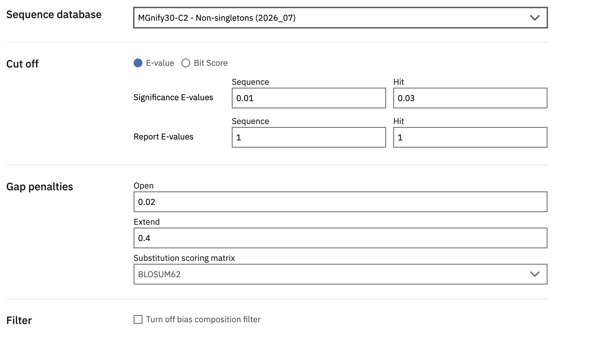
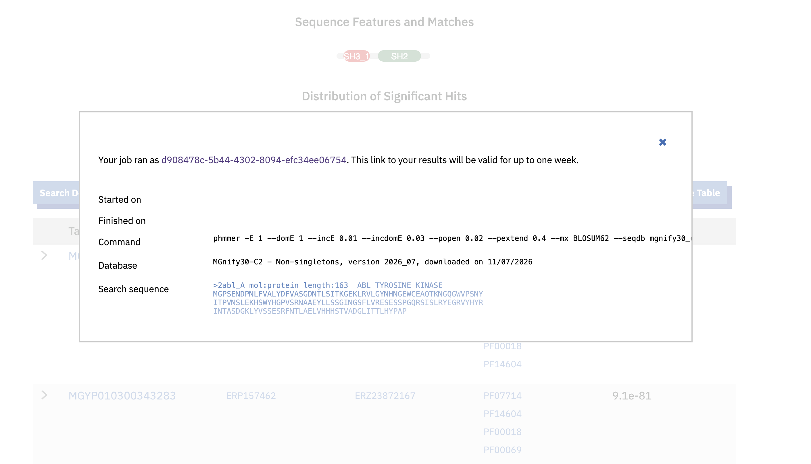

MGnify protein sequence searches are provided by the EMBL-EBI HMMER web [HMMER web](https://www.ebi.ac.uk/Tools/hmmer/search/phmmer){.vf-link .external target="_blank" rel="noopener noreferrer"}
service. Use `phmmer` to search a protein query sequence in the MGnify Proteins Database.

[Open HMMER](https://www.ebi.ac.uk/Tools/hmmer/search/phmmer){.btn .btn-primary target="_blank" rel="noopener noreferrer"}

{#fig-hmmer-mgnify30-search}

## Running a search

1. Paste a FASTA-formatted amino acid sequence into the **Protein sequence**
   field, or upload a sequence file.
2. Under **Sequence database**, choose one of the MGnify30 databases described
   below. The link above preselects **MGnify30-C2**.
3. Optionally adjust the cut-offs and other advanced settings.
4. Select **Submit** to start the search.
5. 
`phmmer` returns sequences with statistically significant similarity to the
query. Results are ordered by significance and include the target protein
accessions, alignments, scores and E-values.

Note: With the increasing size of MGnify Proteins, downstream tools like [HMMER Web](https://www.ebi.ac.uk/Tools/hmmer/search/phmmer?database=mgnify30_c2) require subsets which are significantly reduced in size. To that end, the "MGnify30" clustering set was created.

{#fig-hmmer-mgnify30-results}

## Choosing a MGnify30 database

MGnify30 contains representative sequences from MGnify protein clusters formed
at 30% sequence identity. HMMER provides three subsets for different search
goals:

{#fig-hmmer-mgnify30-database}

### Non-singletons (MGnify30-C2)
The non-singletons subset was created by extracting clusters that have **at least two members**, thereby excluding a majority of the representatives. This subset contains **128,674,267 cluster representatives**.

### Larger non-singletons (MGnify30-C5-FL)
The larger non-singletons subset was created by extracting clusters that have **at least five members, including at least one member that is predicted to be a full-length sequence**. This subset therefore reduces the space even further, and guarantees at least one full-length sequence for increased confidence. This subset contains **20,911,652  cluster representatives**.

### Pfam-poor non-singletons (MGnify30-C5-PPfam)
The Pfam-poor non-singletons subset was created by extracting clusters that have **at least five members, and where at least 90% of the cluster members do not have a Pfam accession**. This subset similarly reduces the space significantly, and contains clusters for which function is relatively unknown. This subset contains **18,155,509  cluster representatives**.

See the HMMER documentation for the current list and definitions of
[target databases](https://hmmer-web-docs.readthedocs.io/en/development/databases.html).

## Recording and interpreting results

The target databases are updated periodically. Open **Search Details** above the
HMMER results table to find the target database name, release date and other
search settings. Record these details with the query sequence when a search
needs to be reproduced or reported.

{#fig-hmmer-mgnify30-search-details}

HMMER's [results documentation](https://hmmer-web-docs.readthedocs.io/en/latest/results.html)
explains the results table, domain graphics, alignments, scores and E-values.

## Downloading MGnify protein data

MGnify protein releases and supporting files are also available from the
[MGnify FTP server](https://ftp.ebi.ac.uk/pub/databases/metagenomics/peptide_database/).
For questions or feedback, please [contact the MGnify team](https://www.ebi.ac.uk/support/metagenomics).
