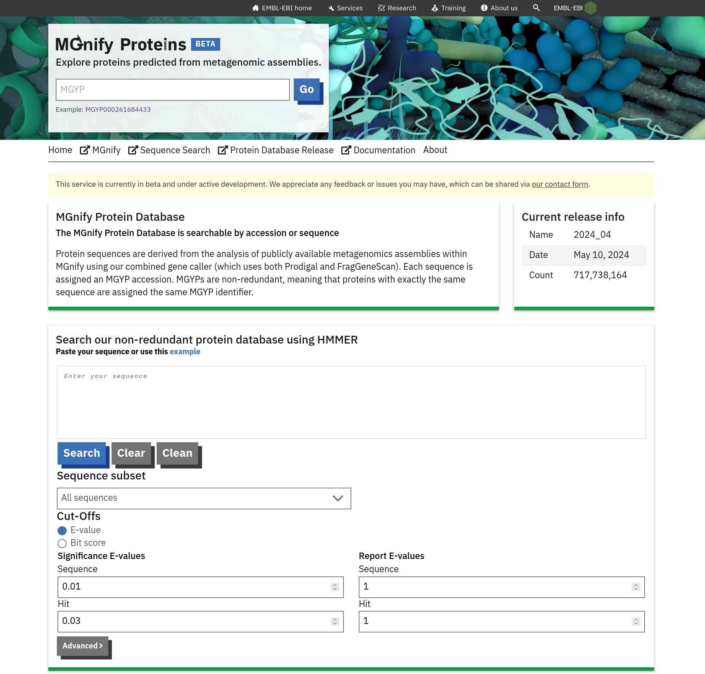
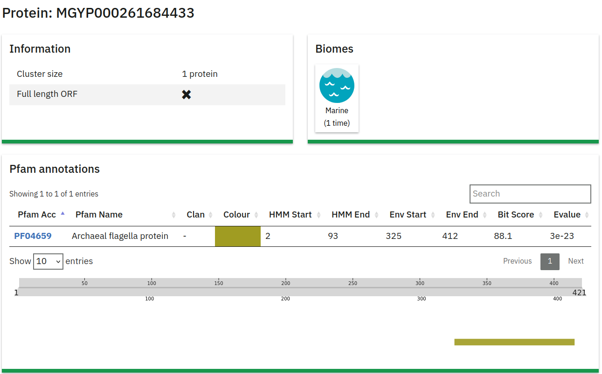
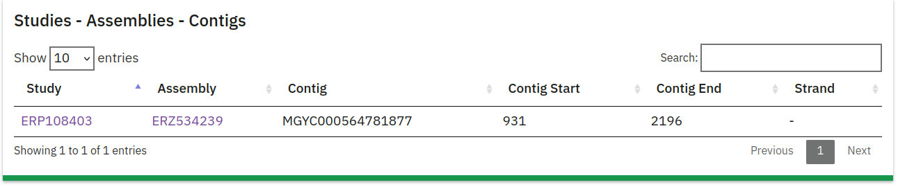
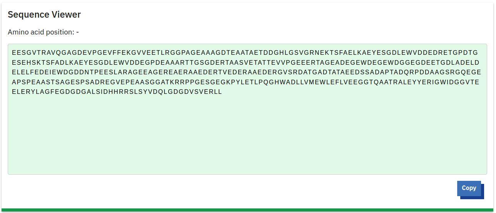

# MGnify Proteins Portal

The MGnify Proteins portal provides detailed information for protein cluster representatives derived from metagenomic assemblies. Due to the size of the database, detailed pages are generated exclusively for cluster representatives, rather than for each individual protein sequence. 

## Sequence Search

The MGnify Proteins portal features a search form that allows users to submit queries to the [Sequence Search](mgnify-proteins-sequence-search.md). Search queries are processed by the search service, and the results link back to the protein detail page within the portal.

## Organization of the Protein Detail Page

Each cluster representative from the Protein Database has a dedicated detail page. This page contains metadata about the protein and, if available, its 3D structure as predicted by the [ESM Metagenomics Atlas](https://esmatlas.com/).

### Protein Information

This section at the top of the page provides essential details about the protein:

- **Protein Accession**: The unique identifier for the protein (e.g., MGYP000261684433).
- **Cluster Size**: Indicates the number of proteins in the cluster (e.g., 1 protein).
- **Full-Length ORF**: Specifies whether the sequence represents a full-length open reading frame (ORF). A checkmark indicates a full-length ORF, while an 'X' denotes a fragment.
- **Biome**: Displays the biome from which the protein was derived (e.g., "Marine").
- **Pfam Annotations**: A table displaying Pfam domains identified within the protein.

## 3D Structure

This section displays a 3D structure of the protein, predicted by the [ESM Metagenomics Atlas](https://esmatlas.com/) using the ESMFold model:

- **3D Structure Visualization**: A graphic representation of the protein structure generated from the amino acid sequence.
- **More Information**: A link below the visualization directs users to additional details about the [ESM Metagenomics Atlas](https://esmatlas.com/).

## Assemblies Information

This table lists the assemblies from which the protein sequence was derived:

- **Study**: The study ID associated with the assembly.
- **Assembly ID**: The specific ID for the assembly.
- **Contig**: The contig within the assembly where the protein sequence is located.
- **Contig Start/End**: Coordinates indicating the start and end positions of the protein on the contig.
- **Strand**: Indicates whether the protein is on the positive or negative DNA strand.

## Amino Acid Sequence Viewer

This section provides a detailed view of the amino acid sequence for the protein.

