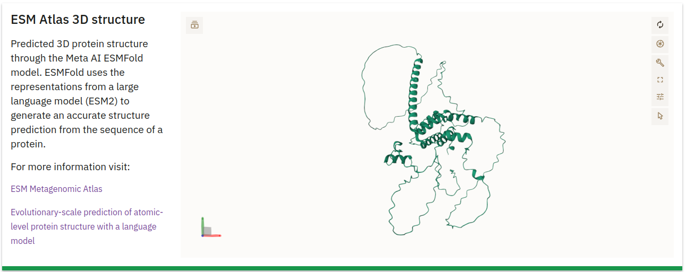

# MGnify Proteins Portal

The MGnify Proteins portal provides detailed information for protein cluster representatives derived from metagenomic assemblies. Due to the size of the database, detailed pages are generated exclusively for cluster representatives, rather than for each individual protein sequence. 

## Sequence Search

The MGnify Proteins portal features a search form that allows users to submit queries to the [Sequence Search](mgnify-proteins-sequence-search.md). Search queries are processed by the search service, and the results link back to the protein detail page within the portal.

## Organization of the Protein Detail Page

Each cluster representative from the [Protein Database](mgnify-proteins.md) has a dedicated detail page. This page includes metadata about the protein and, when available, its 3D structure as predicted by the [ESM Metagenomics Atlas](https://esmatlas.com/) team. Not all clusters have a predicted structure, as the release cycles of MGnify Proteins and the ESM Atlas are independent. The MGnify team is not involved in the protein structure predictions; instead the MGnify Proteins portal links to the ESM Atlas service, which is generously provided for the community by the ESM Atlas team.

### Protein Information

This section at the top of the page provides essential details about the protein:

- **Protein Accession**: The unique identifier for the protein (e.g., MGYP000261684433).
- **Cluster Size**: Indicates the number of proteins in the cluster (e.g., 1 protein).
- **Full-Length ORF**: Specifies whether the sequence represents a full-length open reading frame (ORF). A checkmark indicates a full-length ORF, while an 'X' denotes a fragment.
- **Biome**: Displays the [biome(s)](glossary.md#biome) from which samples were sequenced that this protein was derived from (e.g., "Marine").
- **Pfam Annotations**: A table displaying [Pfam](https://www.ebi.ac.uk/interpro/entry/pfam/) domains identified within the protein.

## 3D Structure

This section displays a 3D structure of the protein, predicted by the [ESM Metagenomics Atlas](https://esmatlas.com/) team using [ESMFold](https://www.science.org/doi/10.1126/science.ade2574):

- **3D Structure Visualization**: A graphic representation of the protein structure generated from the amino acid sequence.
- **More Information**: A link below the visualization directs users to additional details about the [ESM Metagenomics Atlas](https://esmatlas.com/).

## Assemblies Information

This table lists the assemblies from which the protein sequence was derived:

- **Study**: The [Study](glossary.md#study) ID associated with the [assembly](glossary.md#assembly).
- **Assembly ID**: The specific ID for the [assembly](glossary.md#assembly).
- **Contig**: The contig within the assembly where the protein sequence is located.
- **Contig Start/End**: Coordinates indicating the start and end positions of the protein on the contig.
- **Strand**: Indicates whether the protein is on the positive or negative DNA strand.

## Amino Acid Sequence Viewer

This section provides a detailed view of the amino acid sequence for the protein.

