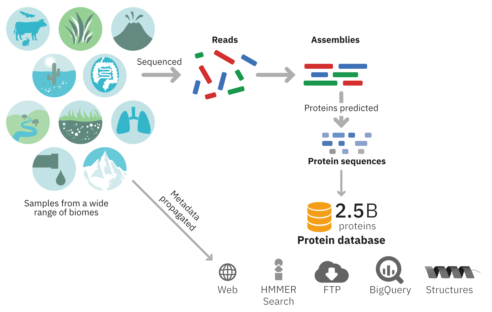

# MGnify Proteins Resource

## Introduction

The MGnify Protein Database comprises sequences predicted from [assemblies](glossary.md#assembly) generated from publicly available [metagenomic](glossary.md#metagenomic) datasets. Since its initial release in August 2017, which comprised just under 50 million sequences, it has grown to over 2.4 billion sequences. All sequences have stable accessions, prefixed with MGYP, such as [MGYP000261684433](https://www.ebi.ac.uk/metagenomics/proteins/MGYP000261684433/). Due to the dataset's size, sequences are clustered at 90% identity using [MMSeq2/Linclust](https://github.com/soedinglab/MMseqs2). Despite clustering, the sequences still capture the biological complexity inherent in metagenomic data.

The dataset is accessible via several platforms:

- **FTP Server**: Available for download from our [FTP server](http://ftp.ebi.ac.uk/pub/databases/metagenomics/peptide_database/).
- **HMMER Sequence Search Webservice**: Accessible through our [Sequence Search service](mgnify-proteins-sequence-search.md).
- **MGnify Proteins Portal**: Explore the data on the [MGnify Proteins web portal](mgnify-proteins-web.md).
- **Google Cloud Public Dataset**: Available as a [Big Query public dataset](mgnify-proteins-big-query.qmd) on [Google Cloud](https://cloud.google.com/).

## License

The data is available for both academic and commercial use under a [CC0 1.0 Universal License](http://creativecommons.org/licenses/by/4.0/legalcode).

If you make use of the MGnify Protein Database, please cite the following paper:

* Richardson, L., Allen, B., Baldi, G., Beracochea, M., Bileschi, M. L., Burdett, T., Burgin, J., Caballero-Pérez, J., Cochrane, G., Colwell, L. J., Curtis, T., Escobar-Zepeda, A., Gurbich, T. A., Kale, V., Korobeynikov, A., Raj, S., Rogers, A. B., Sakharova, E., Sanchez, S., Wilkinson, D. J., Finn, R. D. MGnify: the microbiome sequence data analysis resource in 2023. *Nucleic Acids Research* (2023). [https://doi.org/10.1093/nar/gkac1080](https://doi.org/10.1093/nar/gkac1080)
