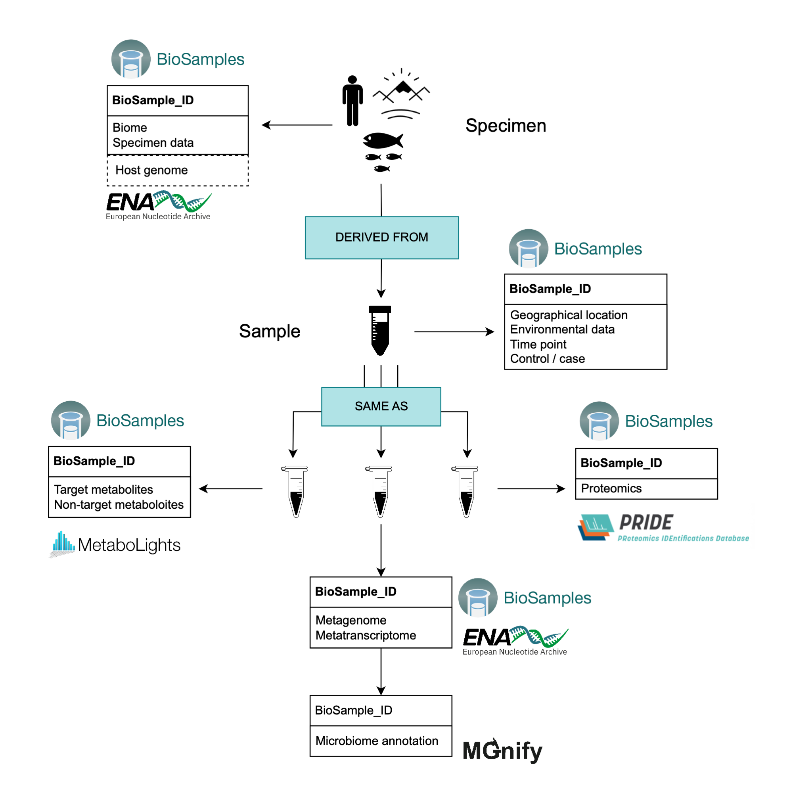

## Introduction

EMBL-EBI public repositories provide freely accessible resources for archiving, sharing, and disseminating a wide range of biological data to support research and discovery in the life sciences. Multi-omics data linked between databases are a valuable resource to enable comprehensive and integrated analyses, uncovering complex relationships between genomics, transcriptomics, epigenomics, and other omics layers. Currently, the main method of linking data across databases is via a publication where accession IDs are explicitly reported.

While the variety of submission interfaces for the various archive resources may seem daunting to new users, fundamentally they often facilitate the submission of all data types, their associated metadata and the connectivity of different multi-omic data. However, the lack of correctly connected datasets suggests that improved user interface design and training would aid the organisation and submission of multi-omic data. With a view to achieving this, a Multi-Omics Working Group has been established within EMBL-EBI, where members of the main repositories are working towards integrated solutions to this. 

As an interim solution, we have created this documentation aimed at users with multi-omic data that includes nucleotide sequencing of microbial communities (either amplicon, metagenomics or metatranscriptomics). This type of data can be submitted to the ENA and then analysed by MGnify.  

## How to connect multi-omics data submitted to EMBL-EBI repositories

According to the [EMBL-EBI submissions homepage](https://www.ebi.ac.uk/submission/), multi-omics data (excluding human data requiring controlled access) should be submitted to the [BioSamples repository](https://www.ebi.ac.uk/biosamples/). This repository is specialised in flexibly storing descriptions and metadata. 

Submission to BioSamples, however, will not generate a study/project ID. For this reason, we recommend submitting the nucleotide sequencing data to the ENA first. This way, a study/project ID is created, and the ENA sample ID (prefixed `SAME`), along with its corresponding metadata submitted to the ENA, is mirrored automatically on the BioSamples repository. A link to the ENA record from the BioSamples record is automatically generated at the bottom of the BioSamples page, from where raw-reads and assemblies (when available) can be located. When such nucleotide datasets are then ingested and analysed in MGnify, the metadata (including the BioSamples IDs) is inherited from ENA and thus the data remains linked.

Where further omics-data will be submitted to other repositories (e.g. [MetaboLights](https://www.ebi.ac.uk/metabolights/) or [PRIDE](https://www.ebi.ac.uk/pride/)), the samples relating to those omics-data can be registered on BioSamples manually to obtain BioSamples IDs. These BioSamples IDs can then be included in the submission to the other repositories, following the corresponding guidelines. The Project IDs generated by the other repositories during submission (e.g. MTBLS and PXD accessions for MetaboLights and PRIDE respectively) can then be added to the BioSamples attributes table, or ideally external references, in a second step. 

When multiple samples belong to the same project, the BioSamples documentation recommends adding the name of the project to the `Project` field of the `Attribute` table to make the samples collectively searchable.

A useful feature of the BioSamples repository is that samples generated from the same specimen can be linked by declaring relationships between BioSamples IDs. This way, the user can link the specimen metadata with the sample(s) derived from it. A simplified example is depicted in (@multiomics_schema). In reality, the relationships across samples are highly dependent on the experimental design of each particular project. It is therefore advisable to build the planning of your sample relationships into the process of designing your project and experiments. Other relationships between samples in [BioSamples are supported](https://www.ebi.ac.uk/biosamples/docs/guides/relationships), such as “same as” or “has member” relationships. You should use the available relationships to best represent your dataset, while trying to keep the overall sample organisation as simple as possible.

{#multiomics_schema}

## A case use example: HoloFood project

The HoloFood project adopts a 'hologenomic' approach to enhance the efficiency of food production systems. This approach focuses on comprehending the biomolecular and physiological processes influenced by integrating feed additives and innovative sustainable feeds in farm animals. Holofood leverages various cutting-edge technologies to explore the intricate interactions between animals and their respective gut microbiomes on multiple molecular levels. Samples and data generated by the HoloFood project can be accessed through the [Holofood Data Portal](https://www.holofooddata.org/).

Multi-omics data generated from both animal host and microbiome, along with physiochemical and physiological data, have been deposited into the BioSamples database and other relevant repositories. To avoid multiple levels of nested relationships, the authors opt for assigning a BioSamples ID to each animal and linking it to the corresponding biological samples through ‘DERIVED FROM’ relationships. For instance, animal [`SAMEA112905287`](https://www.ebi.ac.uk/biosamples/samples/SAMEA112905287) has 8 derived samples with external links to other repositories when relevant (see (@SAMEA112905287_example)). Examples of samples with “derived from” relationships to animal `SAMEA112905287` are host genomics (linked to the ENA), metagenomic assembly (linked to the ENA), and metabolomic (linked to MetaboLights). Other animal samples can also have associated transcriptomics (ENA), metatranscriptomics (ENA), inflammatory markers (stored in BioSamples), or histological data (stored in BioSamples).

[Figure 2. Example of an animal sample having multiple derived samples associated with it](images/multiomics/SAMEA112905287_example.png){#SAMEA112905287_example .tall-figure fig-align="left"}

The ENA and BioSamples databases are connected by the `SAME` (or interchangeably `SAMN`/`SAMD` depending on the original deposition resource) sample accession IDs, as BioSamples accessions can be used as primary or secondary identifiers in ENA. Microbiome annotation data in MGnify inherits ENA metadata, connecting the BioSamples ID automatically under the ‘sample_biosample’ field in the metadata table. For the rest of the databases (MetaboLights in this particular example), `SAME` IDs per sample and animal were used to populate the metadata tables under the ‘Comment[BioSamples accession]’ and ‘Factor Value[Animal ID]’ fields respectively during the data submission.

[Figure 3. An extract of the samples table displayed in MetaboLights for Holofood chicken data (accession [MTBLS6988](https://www.ebi.ac.uk/metabolights/editor/MTBLS6988/descriptors))](images/multiomics/metabolights_example.png){#metabolights_example}
