## Sections of the MGnify website

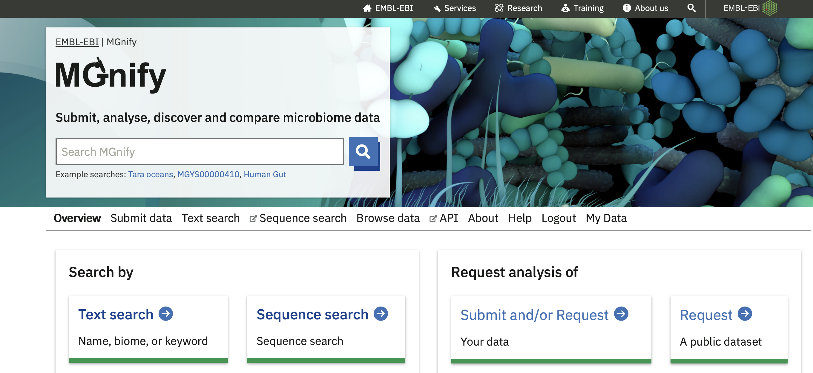

### [Text Search](https://www.ebi.ac.uk/metagenomics/search)

MGnify’s [Studies](glossary.md#Study), [Samples](glossary.md#Sample), and [Analyses](glossary.md#Analysis%20result)
are indexed so that they can be searched for by name, description, accession, [biome](glossary.md#Biome) and more.
This is the quickest way to get started finding [metagenomics](glossary.md#Metagenomic)-derived data.

### [Browse Data](https://www.ebi.ac.uk/metagenomics/browse)

The [Browse Data](https://www.ebi.ac.uk/metagenomics/browse) section of the MGnify website provides searchable
listings of the core datasets.

See the following section for full details.

### [Submit or request data](https://www.ebi.ac.uk/metagenomics/submit), and [My Data](https://www.ebi.ac.uk/metagenomics/mydata)

You can submit your own metagenomic data for analysis using our [pipeline](glossary.md#Pipeline),
or ask us to analyse an existing public dataset.

If you submit private data, once it is analysed you’ll find it by logging into the [My Data](https://www.ebi.ac.uk/metagenomics/mydata) section.

For more information, see [the dataflow section](dataflow.md).

### [API](https://www.ebi.ac.uk/metagenomics/api/latest/)

The API is the basis of programmatic access to MGnify’s database.

For more information, see [the API section](api.md).

## Organisation and access of data on the MGnify website

The [“Browse data”](https://www.ebi.ac.uk/metagenomics/browse) section of the MGnify website provides searchable
listings of the core datasets.

The data types in MGnify are linked to those in the [European Nucleotide Archive](https://www.ebi.ac.uk/ena).
The ENA’s documentation includes a listing of
[ENA data domains](https://ena-docs.readthedocs.io/en/latest/retrieval/general-guide.html#viewing-and-exploring-ena-records).

In MGnify, datasets are listed in tables (which can also be downloaded, or queried programmatically using
[the API](restapi)).
There is a detail page available for most data types, accessed by clicking it in the table
(e.g. on its ID, accession, name, or a view button).

### [Super Studies](https://www.ebi.ac.uk/metagenomics/browse#super-studies)

Super Studies are collections of Studies that together represent the output of major metagenomic research efforts or
consortia. Clicking a Super Study’s title in the table reveals a listing of all of its associated Studies.

### [Studies](https://www.ebi.ac.uk/metagenomics/browse#studies)

Studies within MGnify are directly related to Studies/Projects in ENA.
To appear in MGnify, an ENA Study is submitted for analysis by the MGnify [pipeline](glossary.md#Pipeline).

They represent a collection of data generated by a research project, including any Publications produced,
any Samples collected and sequenced, and the MGnify analyses run on them.

MGnify Studies are accessioned with an MGYS number.

### [Samples](https://www.ebi.ac.uk/metagenomics/browse#samples)

Samples within MGnify are pulled directly from ENA.
They represent (the genetic sequencing of) a single real-world specimen from a particular [biome](glossary.md#Biome).
Samples have accessions assigned by the source database, e.g. prefixed ERS by ENA.

The sequencing [runs](glossary.md#Run), [assemblies](glossary.md#Assembly) and [analyses](glossary.md#Analysis%20result) can be explored
for each sample, by clicking the sample in the Browse Samples list.
More details about the information available are provided throughout this documentation.

### [Publications](https://www.ebi.ac.uk/metagenomics/browse#publications)

Publications within MGnify are linked Europe PubMed Central ([Europe PMC](https://europepmc.org)).
They represent the literature output of metagenomic projects.
In MGnify, Publications are associated with Studies.
In the Publications list, click the PubMed ID (PMID) to visit the Europe PMC page for the publication,
or click “View details” to explore the related MGnify data for it.
This includes the MGnify Studies associated with the Publication, as well as additional Metadata
(see Metadata section below).

### [Genomes](https://www.ebi.ac.uk/metagenomics/browse#genomes)

Genomes within MGnify are metagenomic-assembled genomes ([MAGs](glossary.md#MAGs)) organised into biome-specific catalogues
(in some cases alongside a small number of isolate genomes).
There is a separate page of [documentation for the Genomes resource](genome-viewer).

## Viewing metadata for MGnify Samples, Studies, Publications

### Sample metadata from ENA

The detail page for a [Sample](glossary.md#Sample) in MGnify shows
[metadata sourced from ENA](https://ena-docs.readthedocs.io/en/latest/submit/general-guide/metadata.html).

Biome and Location metadata are visualised, and other user-provided metadata are listed.

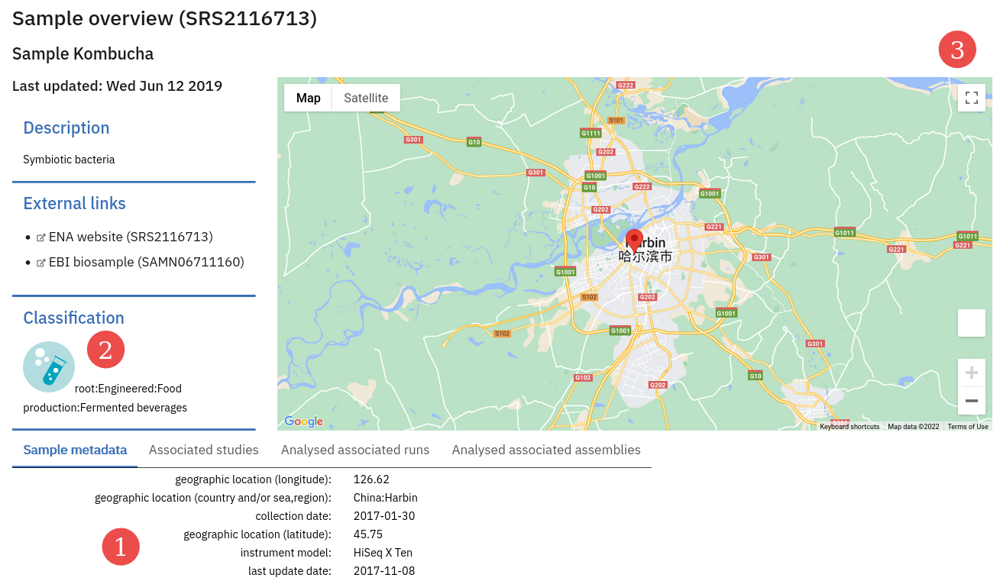
(1) = a list of ENA-provided metadata.
(2) = the Biome is highlighted.
(3) = the sample location is mapped.

### Sample metadata from [BioSamples](https://www.ebi.ac.uk/biosamples/)

The [Sample](glossary.md#Sample) detail pages also show a link to an entry in the
[EBI BioSamples](https://www.ebi.ac.uk/biosamples/) database, where further metadata may be found.

### Sample metadata from the Elixir Contextual Data Clearing House

Some [Samples](glossary.md#Sample) have additional metadata from [Elixir’s Contextual Data Clearing House](https://elixir-europe.org/internal-projects/commissioned-services/establishment-data-clearinghouse).

These metadata take the form of curations: either adding additional sample metadata beyond that stored in the ENA submission,
or sometimes correcting existing metadata.

Like the Sample metadata from ENA, they’re shown as a list of Key:Value pairs.

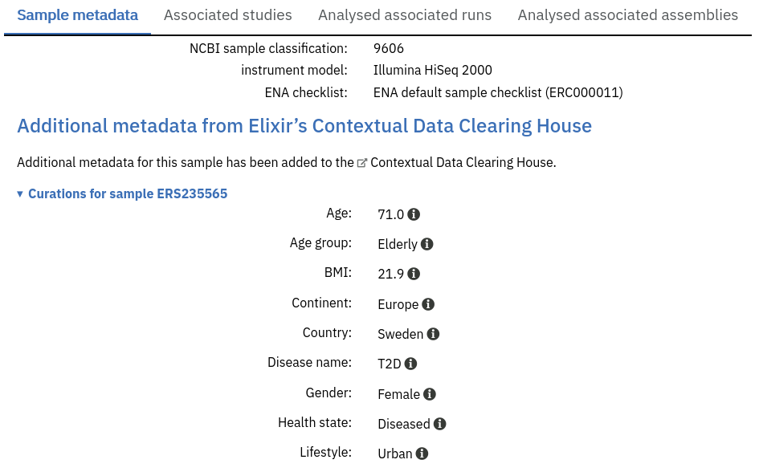
    

### Additional metadata from text-mining on Publications

MGnify present additional metadata that may be relevant to a [Study](glossary.md#Study) or [Sample](glossary.md#Sample) using automated text-mining on
Publications, provided by [Europe PMC](https://europepmc.org/Annotations).
MGnify fetches any Metagenomics-relevant annotations
(provided by [EMERALD](https://gtr.ukri.org/projects?ref=BB%2FS009043%2F1)).
These annotations can surface additional metadata that was not attached to samples when they were deposited in ENA,
but that was mentioned in the publications describing them.

These can be explored within MGnify on a Publication page, or in the list of Publications on a Study page.

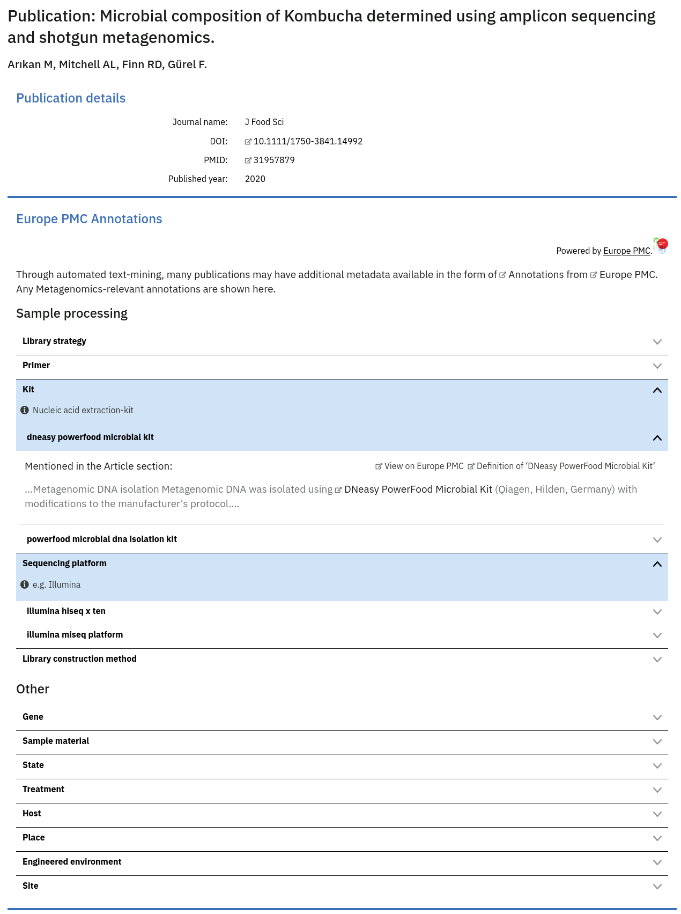

It is impossible to automatically and confidently determine which sample(s) a particular publication annotation may
refer to. However, on the [Sample](glossary.md#Sample) pages within MGnify the existence of any potential additional metadata from
associated [studies’](glossary.md#Study) publications is highlighted beneath the main metadata listing.

Most open-access publications listed on the MGnify website will have some annotations. The release cycle for annotating
newly added publications is every 3 months.

## Content of the ‘Associated runs’ table on project page

This table lists all [samples](glossary.md#Sample) and [runs](glossary.md#Run) associated with a project as well as the experiment type ([Amplicon](glossary.md#Amplicon), [Assembly](glossary.md#Assembly), [Metabarcoding](glossary.md#Metabarcoding), [Metagenomic](glossary.md#Metagenomic) or [Metatranscriptomic](glossary.md#Metatranscriptomic)), sequencing instrument model and pipeline version for each individual run.
In addition, the last field displays links to analysis results.

## Finding quality control information about runs on the MGnify website

Quality control (QC) analysis of runs within projects on the [MGnify website](https://www.ebi.ac.uk/metagenomics/) can be accessed by selecting the ‘Quality control’ tab found toward the top of any run page (see @fig-qc below).

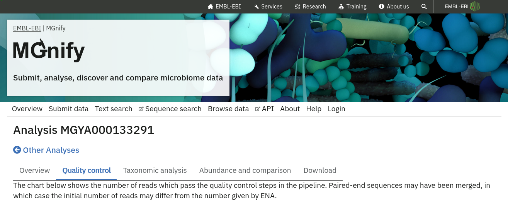{#fig-qc}

Selecting this tab brings up a page containing four graphical representations: a count of reads/contigs remaining pre and post QC, a histogram of minimum, maximum and average sequence length (post QC), distribution of GC content and the first 500 nucleotides (post QC). These are available to download via the ‘Download’ tab found toward the top of any run page (see @fig-downloads below).

::: {#fig-nucleotide-distribution layout-ncol=2 layout-valign="bottom"}

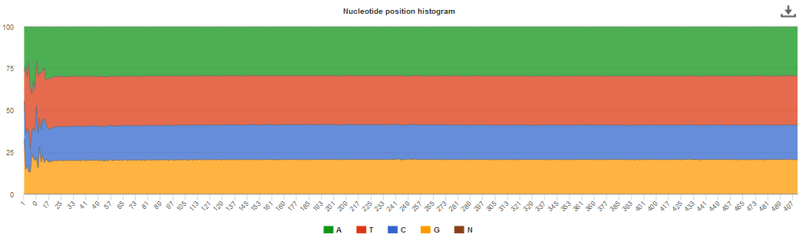

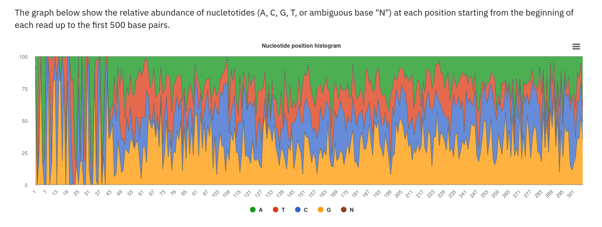

Comparing nucleotide distributions. The typical even nucleotide distribution expected for metagenome, metatranscriptome and assembly datasets (left). Note that the stretch of uneven distribution observed until position 20 are indicative that the sequencing adapters had not been completely removed in the submitted reads. The Amplicon dataset (right) has a typically uneven nucleotide distribution.
:::
    

## Finding functional information about runs on the MGnify website

Functional analysis of runs within projects on the [MGnify website](https://www.ebi.ac.uk/metagenomics/) can be accessed by selecting the ‘Functional Analysis’ tab found toward the top of any run page (see @fig-functional-analysis below). Note that this tab will be greyed for amplicon runs that have no functional results.

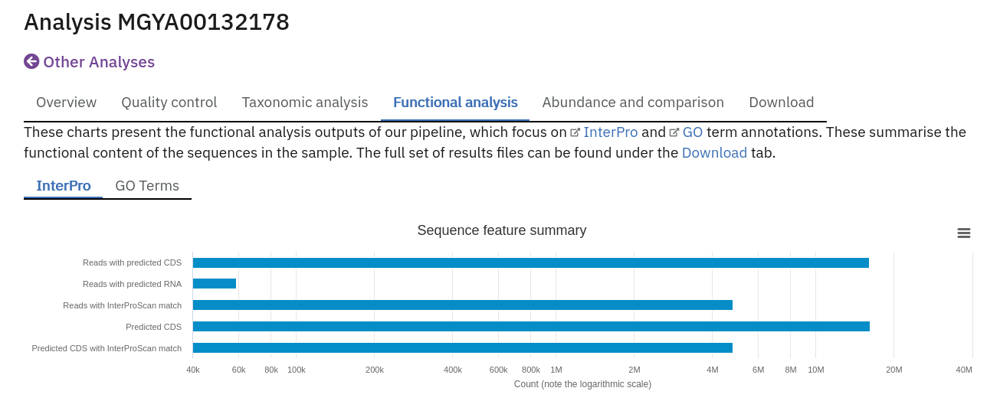{#fig-functional-analysis}

Below this first bar chart, there are 4 tabs with different types of functional annotation:

::: {layout="[[1], [1], [1, 1]]" layout-valign="bottom"}
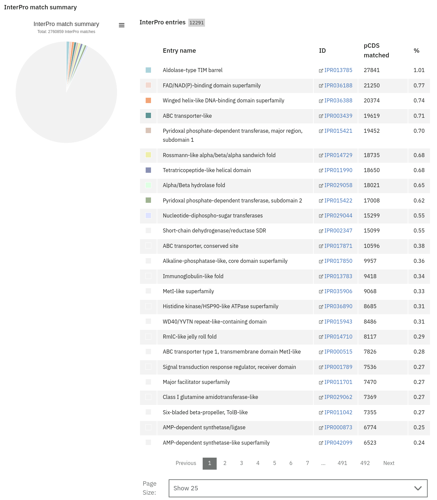

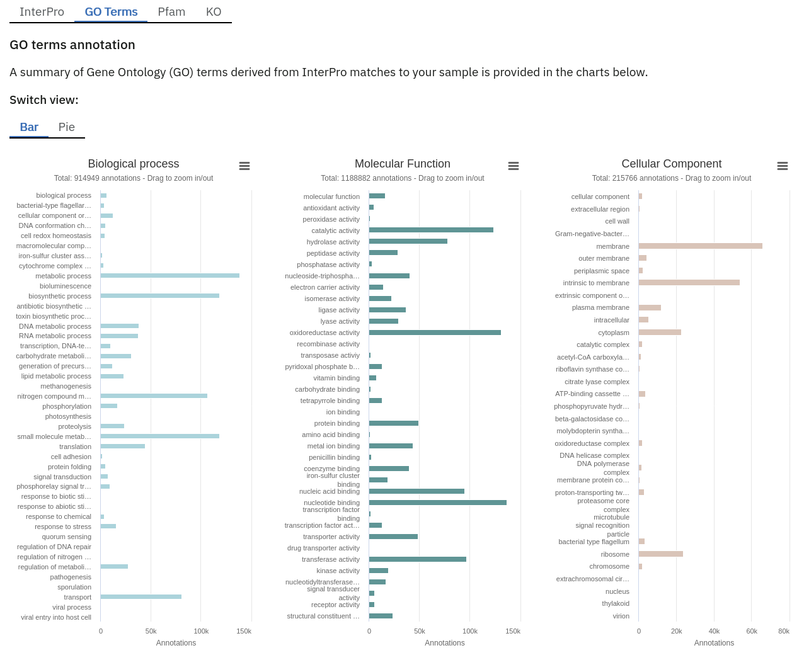

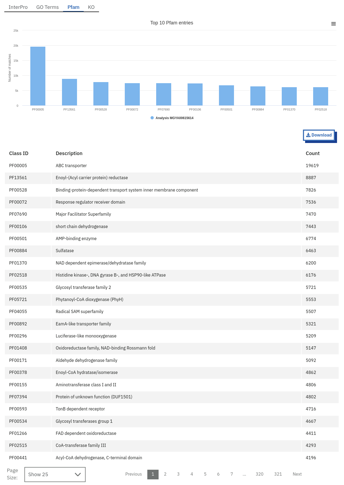

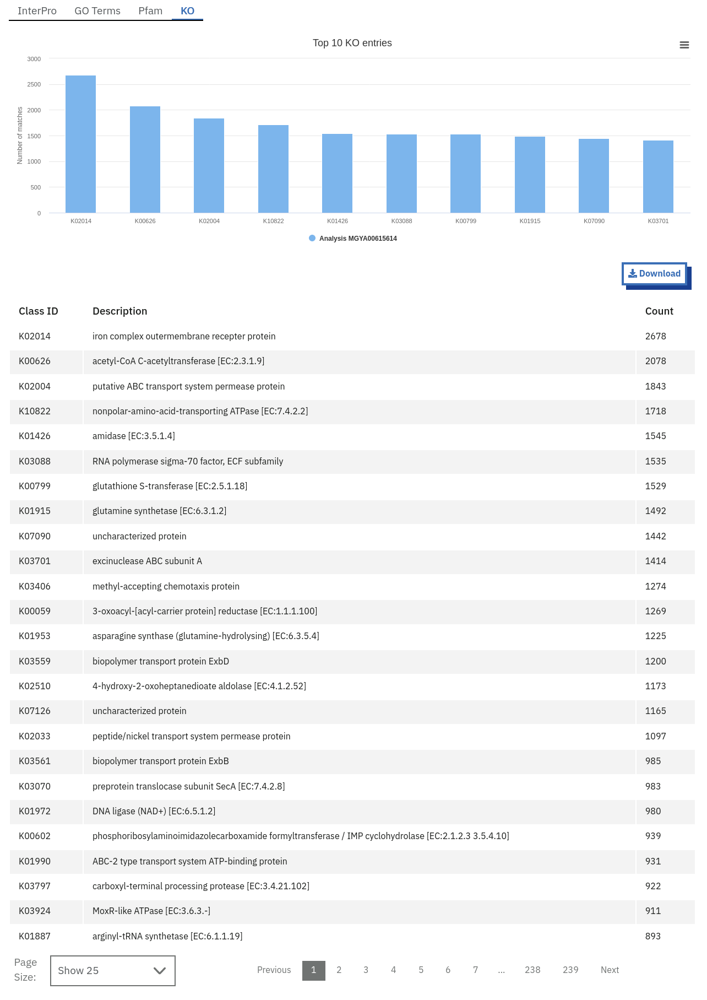

Functional analysis of metagenomics data, as shown on the MGnify website.
:::

## Finding pathways/systems information about runs on the MGnify website

Pathway and system annotations of runs within projects on the [MGnify website](https://www.ebi.ac.uk/metagenomics/) can be accessed by selecting the ‘Pathways/Systems’ tab found toward the top of any run page. Note that this tab will only be accessible for assembly analysis.

There are 3 types of pathway and system annotations:

::: {layout="[[1, 1], [1]]" layout-valign="bottom"}
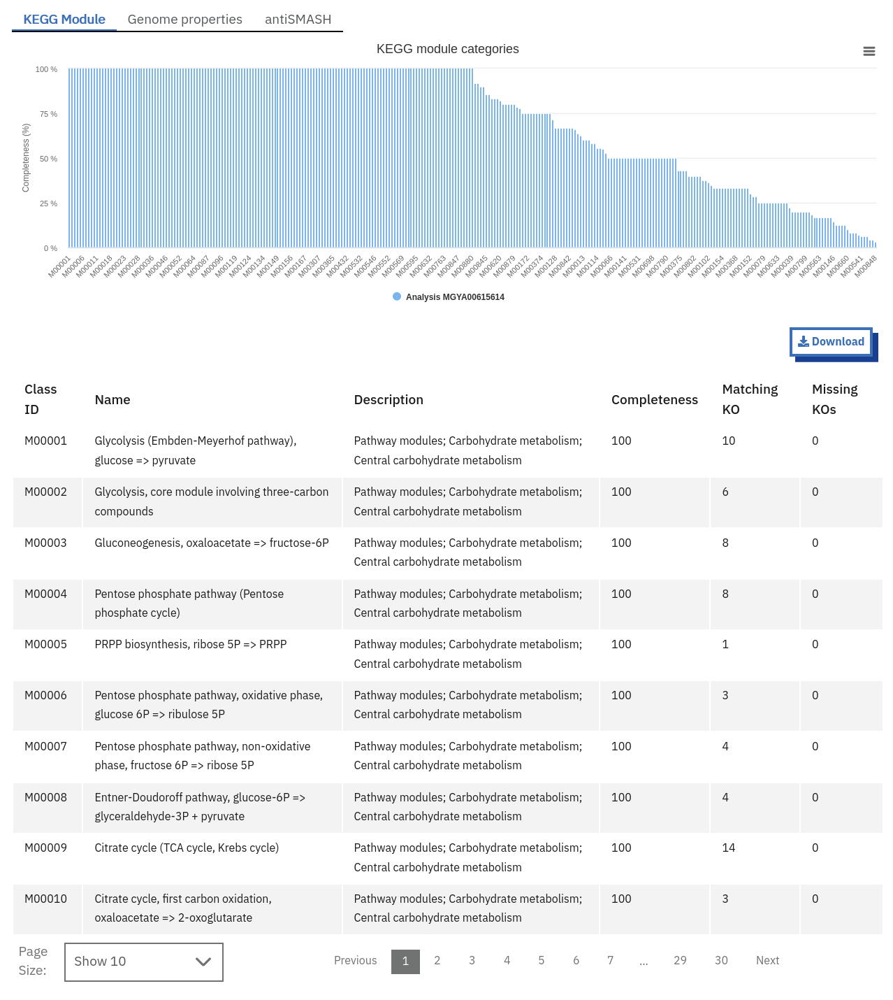

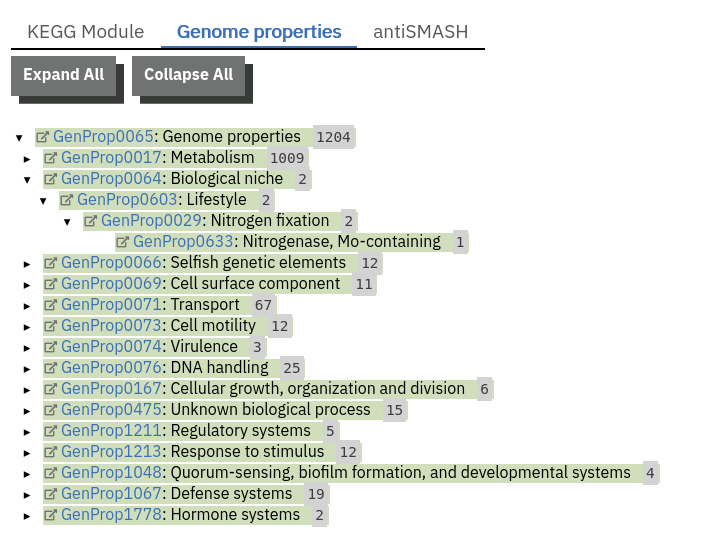

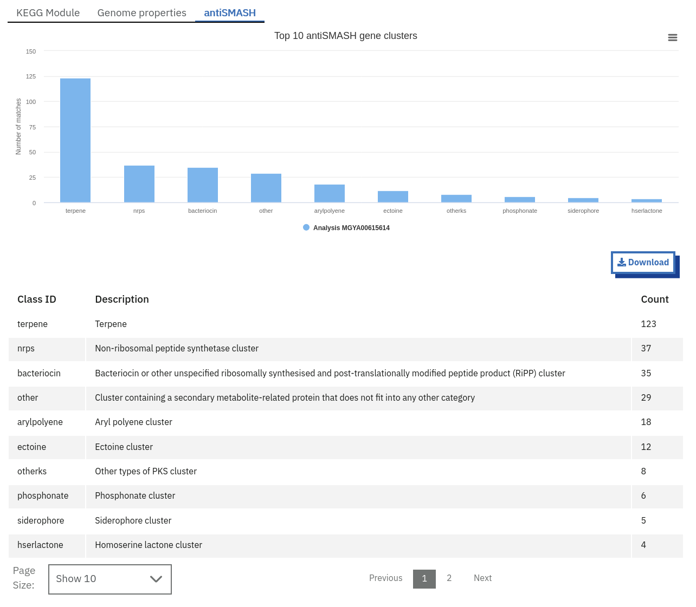

Annotation of potential pathways and high order system classification, as shown on the MGnify website.
:::

## Viewing functional annotation per contig

This feature is available for assembly analysis only and can be found in the tab ‘Contig Viewer’.

::: {layout-nrow=2 layout-ncol=1}

Interactive contig viewer for localised visualisation of functional annotation per contig.
:::

## Finding taxonomic information about runs on the MGnify website

Taxonomic analysis of runs within projects on the [MGnify website](https://www.ebi.ac.uk/metagenomics/) can be accessed by selecting the ‘Taxonomic analysis’ tab found toward the top of any run page (see @fig-taxonomic-analysis below).

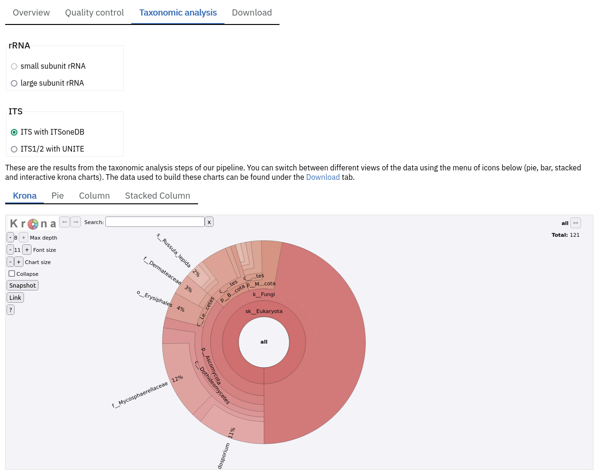{#fig-taxonomic-analysis}
    

The taxonomic analysis results are displayed as Krona plot. This feature allows users to explore the taxonomic results and to zoom in on a particular taxonomic level by double clicking on it. The corresponding distribution charts are displayed on the right hand side of the panel.

Alternative pie-, bar- and stacked-chart representations can be generated by clicking on the ‘Switch view’ icons located above the Krona plot, however data are then presented at the phylum level for clarity.

## Files available to download on the MGnify website

The full data sets used to generate the graphs, along with a host of additional data and intermediate files can be downloaded for further analysis by clicking the ‘Download’ tab, found towards the top of the page.

::: {.callout-note collapse="true" icon="false"}
### Show Downloads tab screenshot
{#fig-downloads}
:::

Some of the files, particularly the sequence files in FASTA format, can be large. To facilitate the download process, these files are compressed with [GZIP](https://en.wikipedia.org/wiki/Gzip) and when too large to be easily transferable, chunked into a manageable size. If it is the case for your runs, please download all chunks, decompress them and concatenate them to reconstitute the full file. Ensure the chunks are concatenated in the order given on the download page, as headers will be in the first chunked file.

### Description of fasta files available to download

* Processed nucleotide reads OR Processed contigs: this file contains all reads/contigs having passed the quality control (QC) step.
* Predicted CDS: this file contains protein sequences that have pCDS.
* Predicted ORF: this file contains nucleotide sequences that have pCDS.

### Description of functional annotation files available to download

* InterPro matches: A tab-delimited file containing 15 columns. They are fully described [here](https://github.com/ebi-pf-team/interproscan/wiki/OutputFormats)
* Pfam annotation: summary of Pfam annotations and their frequencies.
* Complete GO annotation: summary of GO term annotations in 4 columns: GO terms (labelled [GO:XXXXXXX](GO:XXXXXXX)), GO term description, GO category (biological process, molecular function or cellular location) and number of pCDS annotated with a GO term.
* GO slim annotation file: this file is derived from the ‘Complete GO annotation file’ and has the same format.
* DIAMOND annotation: a tab-delimited file containing 16 columns with Uniref IDs and taxonomic annotation of protein sequences.
* KEGG orthologues annotation: summary of KEGG ortholog annotations and their frequencies.

### Description of pathway and system annotation files available to download
* antiSMASH annotation: EMBL flatfile and GenBank formatted files with annotations per contig.
* Genome Properties annotation: summary of genome properties and and their frequency.
* KEGG pathway annotation: summary of KEGG modules, pathway names and completeness.

### Description of taxonomic assignment files available to download

* Reads/Contigs encoding…: All reads predicted to encode for LSU, SSU, ITS or any other non-coding RNAs (ncRNAs). LSU, SSU and ncRNAS are predicted with Infernal. ITS have the predicted LSU and SSU sequences masked.
* MAPseq assignments: this file contains the output from mapseq - a taxonomic assignment where applicable for each input sequence.
* OTUs, counts and taxonomic assignments (TSV): this file contains a taxonomic lineage column followed by the frequency of it’s annotation and the corresponding NCBI taxid (not available for UNITE). This file can be directly imported into [Megan6](http://ab.inf.uni-tuebingen.de/software/megan6/) for visualisation and further analysis.
* OTUs, counts and taxonomic assignments (HDF5/JSON) - two files for each type of rRNA or ITS database. These contain the same taxonomic information as the TSV files in JSON and HDF5 formats. The Biom files are [computer-readable files](http://biom-format.org). The HDF5 (Hierarchical Data Format) format can be imported into analysis and visualisation tools such as Matlab and R. A larger number of commercial and freely available tools, such as MEGAN6, can consume the JavaScript Object Notation (JSON) format.

## Summary files

In addition to the output files for individual runs, described above, MGnify provides a number of summary files available via the ‘Analysis summary’ tab on the project page (@fig-analysis-summary below). They summarize the counts per feature across all runs of a [study](glossary.md#Study) and therefore provide an easy way to identify patterns. The summary files are split between functional (not available for amplicon-only study) and taxonomy sections.

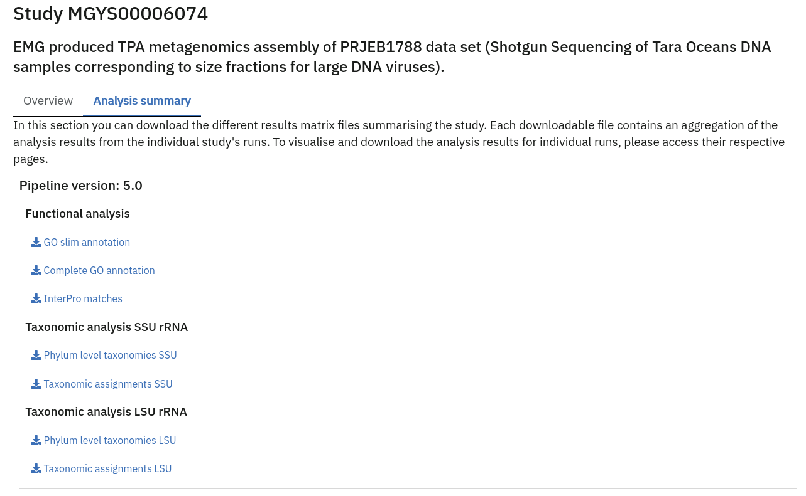{#fig-analysis-summary}

## Data discovery on MGnify portal

MGnify is the largest metagenomic resource of public datasets. In order to help users access the data present in the portal, MGnify offers a powerful search tool and a range of browsing options.

### Text search

The Search tool is underpinned by [EBI search](https://www.ebi.ac.uk/ebisearch/overview.ebi)  and accessible via any MGnify page (@fig-text-search below).

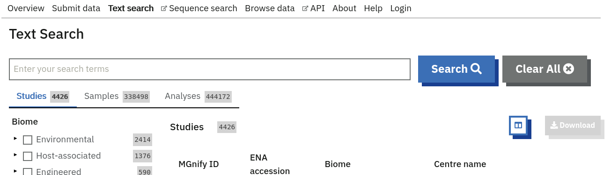{#fig-text-search}

The search page contains 3 tabs allowing users to navigate between studies, samples and analysis search levels. In each tab, the left hand side panel provides a number of facets that can be used to restrict the search space.

* at the study level, the search can be restricted by ‘biome’ and ‘centre name’. Selection of any of the facets will also impact the search at sample and analysis level. Search results can be downloaded as a tab-separated file.
* at the sample level, in addition to ‘biome’, the choice of facets includes ‘temperature’, ‘depth’, ‘experiment type’, ‘sequencing method’, ‘location name’, ‘disease status’ and ‘phenotype’, when provided. Note that these metadata are provided by the data submitter and are not curated.
* at the analysis level, users can restrict their searches according to ‘biome’, ‘temperature’, ‘depth’, ‘pipeline version’, ‘organism’, ‘experiment type’ as well as GO and InterPro terms.

### Browsing options

The MGnify homepage ‘Search by’ and ‘Latest studies’ sections have several browsing options to easily navigate publicly available annotated data:
- Links to all studies, samples, analyses or experiment types will redirect users to the search page, where more filtering criteria is available.
- There is also an option to browse by selected biomes. A subset of biome images with public samples are shown on the homepage. The ‘Browse all biomes’ link will open an expanded list. Upon selection, a table giving the hierarchical lineage according to [GOLD database classification](https://gold.jgi.doe.gov/distribution#Classification)  is provided, with the number of projects associated with each lineage.
- Any links in the latest studies section will redirect the user to the selected public project and all it’s available samples, runs and analysis.

The ‘Browse data’ tab allows users to search by super-studies, studies, samples or publications. Each search option has a text-based or biome filter. ‘Download results’ will return a csv of the search summary.

## Private area

If you have given consent to the MGnify team to analyse your data for which you have requested a pre-publication confidential hold, you can access the analysis results of those pre-published data sets using your private login area. You can access this area by clicking on the ‘Login’ button, which you will find on the top right hand side of any page (see @fig-private-login below).

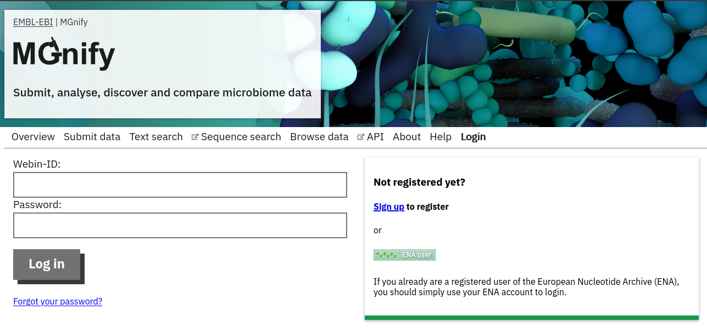{#fig-private-login}

After you have successfully logged into our system, you will have direct access to all your privately (and publicly) submitted projects and samples. You will find a list of your latest submissions (projects and samples) on the home page, but you have also access to all your submitted projects so far on the projects list view (@fig-private-list below). On that page you will find a drop down filter item 'My projects', which allows you to list all your projects.

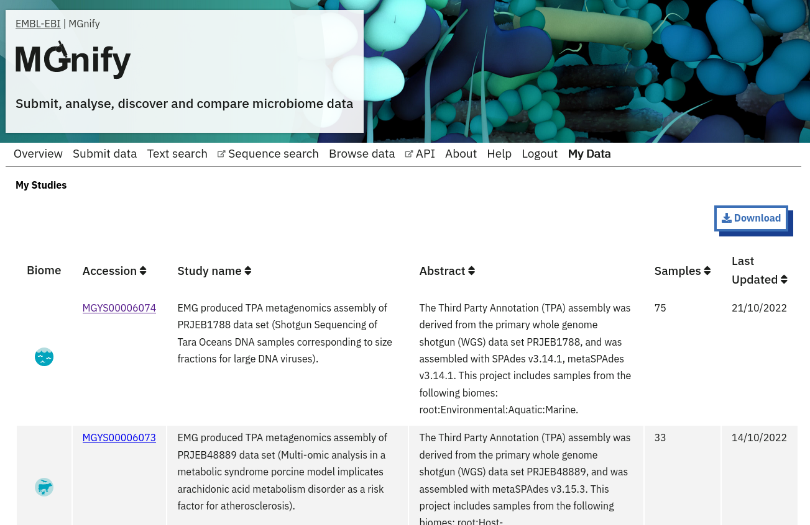{#fig-private-list}
