## Sections of the MGnify website

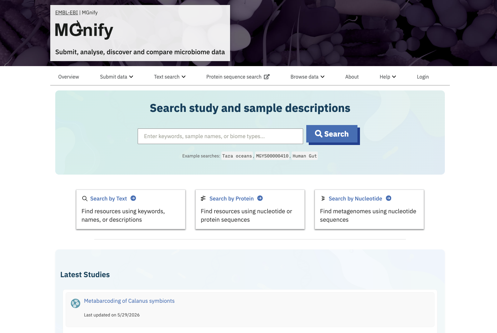

### [Submit or request data](https://www.ebi.ac.uk/metagenomics/submit), and [My Data](https://www.ebi.ac.uk/metagenomics/mydata)

You can submit your own metagenomic data for analysis using our [pipeline](glossary.md#pipeline),
or ask us to analyse an existing public dataset.

If you submit private data, once it is analysed you’ll find it by logging into the [My Data](https://www.ebi.ac.uk/metagenomics/mydata) section.

For more information, see [the dataflow section](dataflow.md).

### [Text Search](https://www.ebi.ac.uk/metagenomics/search)

MGnify’s [Studies](glossary.md#study), [Samples](glossary.md#sample), and [Analyses](glossary.md#analysis-result)
are indexed so that they can be searched for by name, description, accession, [biome](glossary.md#biome) and more.
This is the quickest way to get started finding [metagenomics](glossary.md#metagenomic)-derived data.

### [Browse Data](https://www.ebi.ac.uk/metagenomics/browse)

The [Browse Data](https://www.ebi.ac.uk/metagenomics/browse) section of the MGnify website provides searchable
listings of the core datasets.

See the following section for full details.

## Organisation and access of data on the MGnify website

The [“Browse data”](https://www.ebi.ac.uk/metagenomics/browse) section of the MGnify website provides searchable
listings of the core datasets.

The data types in MGnify are linked to those in the [European Nucleotide Archive](https://www.ebi.ac.uk/ena).
The ENA’s documentation includes a listing of
[ENA data domains](https://ena-docs.readthedocs.io/en/latest/retrieval/general-guide.html#viewing-and-exploring-ena-records).

In MGnify, datasets are listed in tables (which can also be downloaded, or queried programmatically using
[the API](restapi)).
There is a detail page available for most data types, accessed by clicking it in the table
(e.g. on its ID, accession, name, or a view button).

### [Super Studies](https://www.ebi.ac.uk/metagenomics/browse#super-studies)

Super Studies are collections of Studies that together represent the output of major metagenomic research efforts or
consortia. Clicking a Super Study’s title in the table reveals a listing of all of its associated Studies.

### [Studies](https://www.ebi.ac.uk/metagenomics/browse#studies)

Studies within MGnify are directly related to Studies/Projects in ENA.
To appear in MGnify, an ENA Study is submitted for analysis by the MGnify [pipeline](glossary.md#pipeline).

They represent a collection of data generated by a research project, including any Publications produced,
any Samples collected and sequenced, and the MGnify analyses run on them.

MGnify Studies are accessioned with an MGYS number.

### [Samples](https://www.ebi.ac.uk/metagenomics/browse#samples)

Samples within MGnify are pulled directly from ENA.
They represent (the genetic sequencing of) a single real-world specimen from a particular [biome](glossary.md#biome).
Samples have accessions assigned by the source database, e.g. prefixed ERS by ENA.

The sequencing [runs](glossary.md#run), [assemblies](glossary.md#assembly) and [analyses](glossary.md#analysis-result) can be explored
for each sample, by clicking the sample in the Browse Samples list.
More details about the information available are provided throughout this documentation.

### [Publications](https://www.ebi.ac.uk/metagenomics/browse#publications)

Publications within MGnify are linked Europe PubMed Central ([Europe PMC](https://europepmc.org)).
They represent the literature output of metagenomic projects.
In MGnify, Publications are associated with Studies.
In the Publications list, click the PubMed ID (PMID) to visit the Europe PMC page for the publication,
or click “View details” to explore the related MGnify data for it.
This includes the MGnify Studies associated with the Publication, as well as additional Metadata
(see Metadata section below).

### [Genomes](https://www.ebi.ac.uk/metagenomics/browse#genomes)

Genomes within MGnify are metagenomic-assembled genomes ([MAGs](glossary.md#mags)) organised into biome-specific catalogues
(in some cases alongside a small number of isolate genomes).
There is a separate page of [documentation for the Genomes resource](genome-viewer).

### [API](https://www.ebi.ac.uk/metagenomics/api/v2/)
This section also includes the API, which is the basis of programmatic access to MGnify’s database.

For more information, see [the API section](api.md).

## Viewing metadata for MGnify Samples, Studies, Publications

### Sample metadata from ENA

The detail page for a [Sample](glossary.md#sample) in MGnify shows
[metadata sourced from ENA](https://ena-docs.readthedocs.io/en/latest/submit/general-guide/metadata.html).

Biome and Location metadata are visualised, and other user-provided metadata are listed.

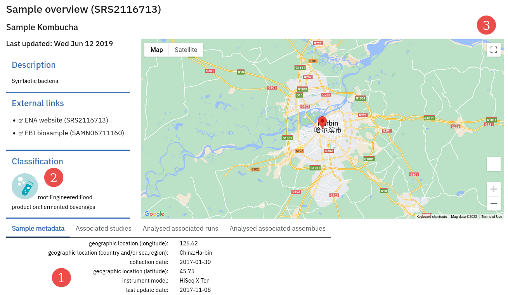
(1) = a list of ENA-provided metadata.
(2) = the Biome is highlighted.
(3) = the sample location is mapped.

### Sample metadata from [BioSamples](https://www.ebi.ac.uk/biosamples/)

The [Sample](glossary.md#sample) detail pages also show a link to an entry in the
[EBI BioSamples](https://www.ebi.ac.uk/biosamples/) database, where further metadata may be found.

### Sample metadata from the Elixir Contextual Data Clearing House

Some [Samples](glossary.md#sample) have additional metadata from [Elixir’s Contextual Data Clearing House](https://elixir-europe.org/internal-projects/commissioned-services/establishment-data-clearinghouse).

These metadata take the form of curations: either adding additional sample metadata beyond that stored in the ENA submission,
or sometimes correcting existing metadata.

Like the Sample metadata from ENA, they’re shown as a list of Key:Value pairs.

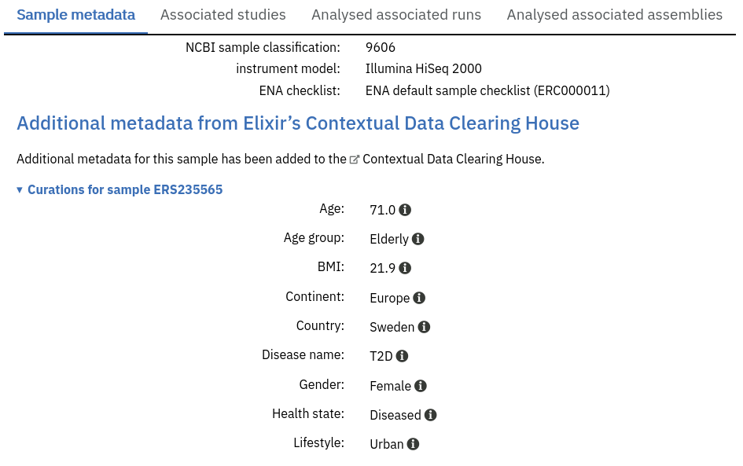
    

### Additional metadata from text-mining on Publications

MGnify present additional metadata that may be relevant to a [Study](glossary.md#study) or [Sample](glossary.md#sample) using automated text-mining on
Publications, provided by [Europe PMC](https://europepmc.org/Annotations).
MGnify fetches any Metagenomics-relevant annotations
(provided by [EMERALD](https://gtr.ukri.org/projects?ref=BB%2FS009043%2F1)).
These annotations can surface additional metadata that was not attached to samples when they were deposited in ENA,
but that was mentioned in the publications describing them.

These can be explored within MGnify on a Publication page, or in the list of Publications on a Study page.

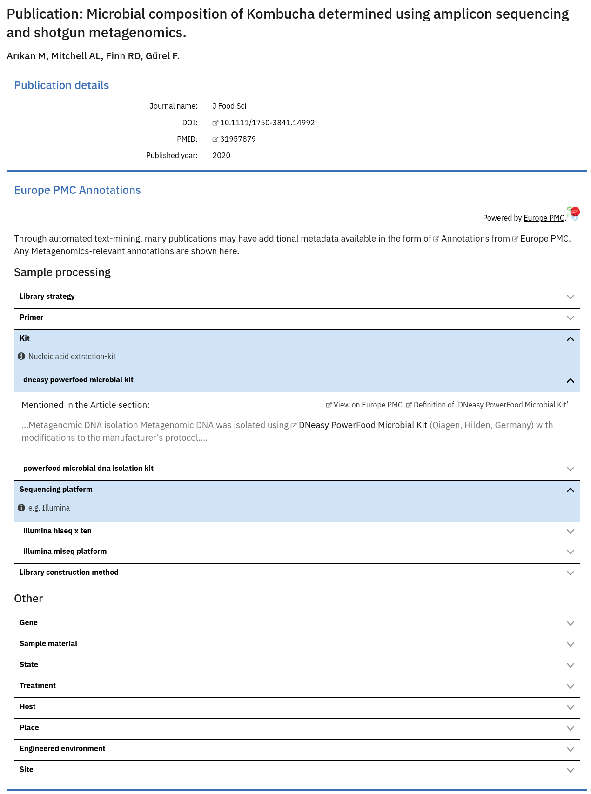{#fig-epmc-annotations .tall-figure fig-align="left"}

It is impossible to automatically and confidently determine which sample(s) a particular publication annotation may
refer to. However, on the [Sample](glossary.md#sample) pages within MGnify the existence of any potential additional metadata from
associated [studies’](glossary.md#study) publications is highlighted beneath the main metadata listing.

Most open-access publications listed on the MGnify website will have some annotations. The release cycle for annotating
newly added publications is every 3 months.

## Content of the ‘Associated runs’ table on project page

This table lists all [samples](glossary.md#sample) and [runs](glossary.md#run) associated with a project as well as the experiment type ([Amplicon](glossary.md#amplicon), [Assembly](glossary.md#assembly), [Metabarcoding](glossary.md#metabarcoding), [Metagenomic](glossary.md#metagenomic) or [Metatranscriptomic](glossary.md#metatranscriptomic)), sequencing instrument model and pipeline version for each individual run.
In addition, the last field displays links to analysis results.

## Viewing a metagenomic analysis (MGYA) on the MGnify website

### Overview
The Overview tab of an analysis explains the [run](glossary.md#run) or [assembly](glossary.md#assembly) that was analysed, 
and the [sample](glossary.md#sample) it was derived from, 
as well as the [pipeline](glossary.md#pipeline) used to analyse it.

### Quality control information

Quality control (QC) analysis of runs within projects on the [MGnify website](https://www.ebi.ac.uk/metagenomics/) can be accessed by selecting the ‘Quality control’ tab found toward the top of any run page (see @fig-qc below).

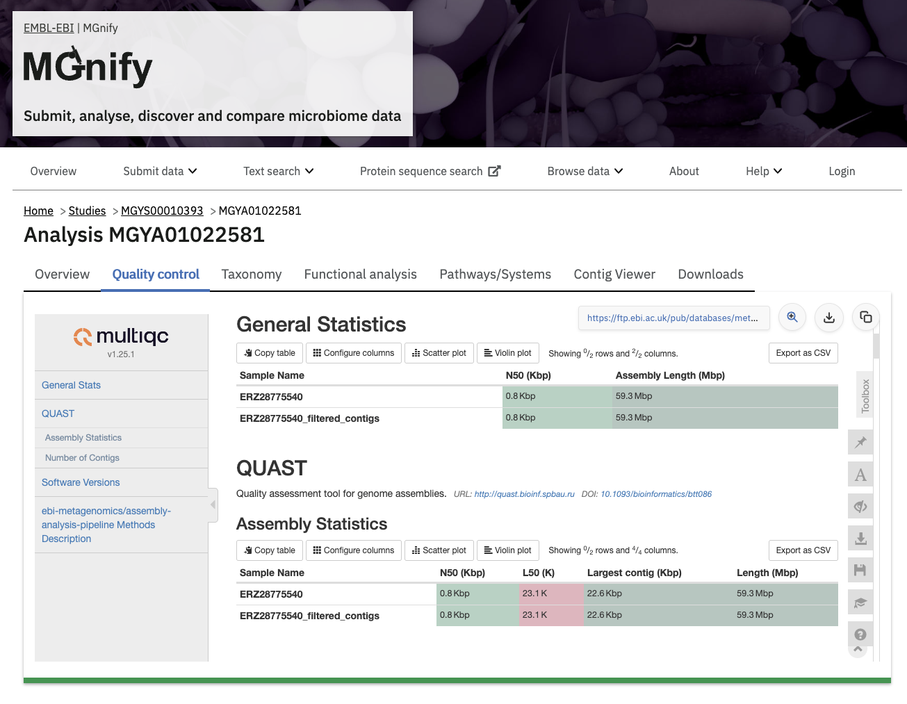{#fig-qc}

The visualisations shown here depend on the pipeline version, for example MGnify's version 6 pipeline present a self-contained [MultiQC](https://seqera.io/multiqc/) report, whereas older versions show a series of individual visualisations.

### Taxonomic profile annotations

Taxonomic analysis of runs within projects on the [MGnify website](https://www.ebi.ac.uk/metagenomics/) can be accessed by selecting the ‘Taxonomic analysis’ tab found toward the top of any run page (see @fig-taxonomic-analysis below).

::: {layout-nrow=1 layout-ncol=2}
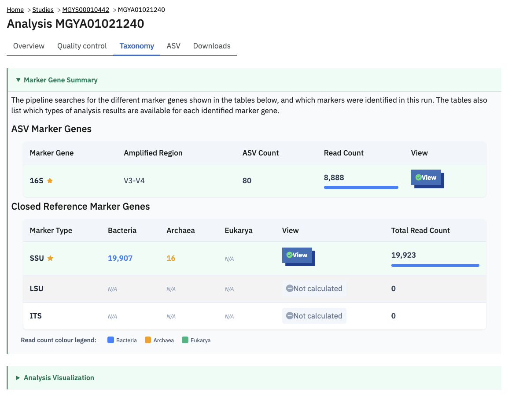{#fig-taxonomic-analysis}

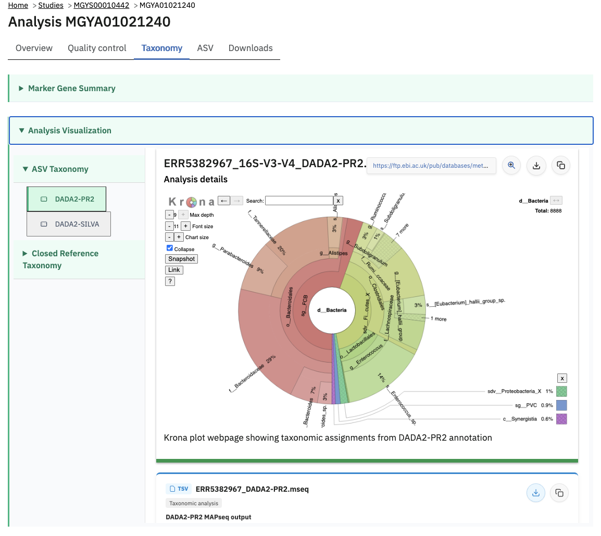{#fig-taxonomic-analysis}
:::
    

The taxonomic analysis results are displayed as Krona plot. This feature allows users to explore the taxonomic results and to zoom in on a particular taxonomic level by double clicking on it. The corresponding distribution charts are displayed on the right hand side of the panel.

### Functional profile annotations

Functional analysis of runs within projects on the [MGnify website](https://www.ebi.ac.uk/metagenomics/) can be accessed by selecting the ‘Functional Analysis’ tab found toward the top of any run page (see @fig-functional-analysis below). Note that this tab not be shown for amplicon runs that have no functional results.

Functional profiles are typically shown as cards representing the counts tables of how many occurrences of a given identifier were found in the dataset.
For example the Functional analysis > InterPro tab of a V6 Assembly Analysis shows a table of InterPro accessions (protein IDs), their description, and a Count column of occurrences.
These files can be downloaded from the [Transfer Services are](ftp.md) using the download button next to the file name.
The website also shows a preview of these tables by uncompressing them in chunks. 
This same data table can be viewed as a chart by pressing the "Switch to chart view" button: the chart type depends on the data, and is usually a bar chart of the most frequently occurring annotation identifiers in the dataset, e.g. the most common IPRxxxxxxx accession found.

{#fig-functional-analysis}

### Finding pathways/systems information about runs on the MGnify website

Pathway and system annotations of runs within projects on the [MGnify website](https://www.ebi.ac.uk/metagenomics/) can be accessed by selecting the ‘Pathways/Systems’ tab found toward the top of any run page. Note that this tab will only be accessible for assembly analysis.
This tab is similar to the Functional profile annotations: showing tabular data and chart views of each.
The Genome Properties data is hierarchical in nature rather than tabular, so its JSON file is viewed as a tree.

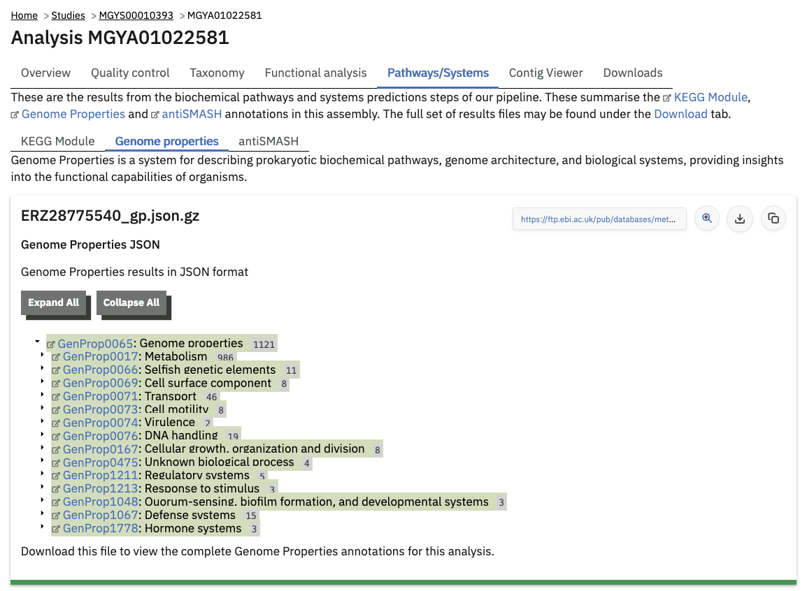

### Viewing functional annotation per contig

#### Assembly analysis GFF file

This feature is available for assembly analysis only and can be found in the tab ‘Contig Viewer’.

The contig viewer shows annotated [metagenome assemblies contigs](glossary.md#assembly), and their annotations (e.g. protein coding sequences).
The assembly contigs are stored as a FASTA file (which is available for download from the Downloads tab).
The annotations are stored as a [GFF file](glossary.md#gff).
The GFF file itself can be previewed in the "Preview GFF" sub-tab.

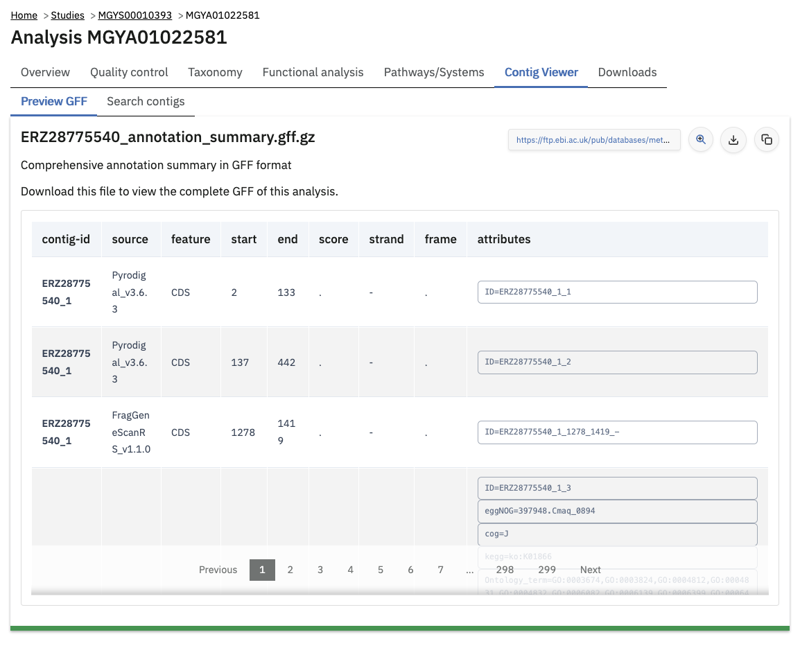

#### Assembly analysis browser & annotation search index

The website also allows this GFF file to be downloaded and indexed for searching within your browser.
Because the entire GFF file can potentially be large (e.g. 100s of MB), it is not automatically downloaded:

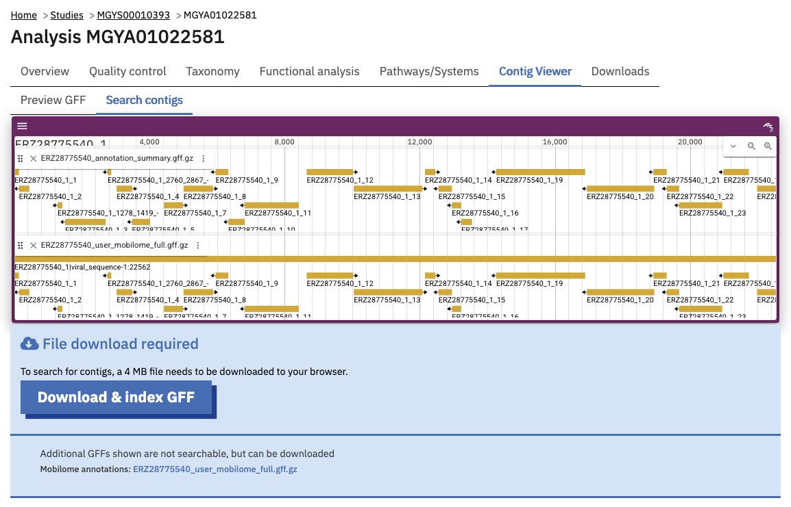

Pressing "Download & index GFF" fetches the large file and, providing your web browser is relatively modern, indexes the annotations for searching.

Once indexed, contigs can be searched for by whether they contain certain annotations, like an InterPro identifier or Pfam family of interest. 
Most of the search facet include auto-complete of available identifiers.

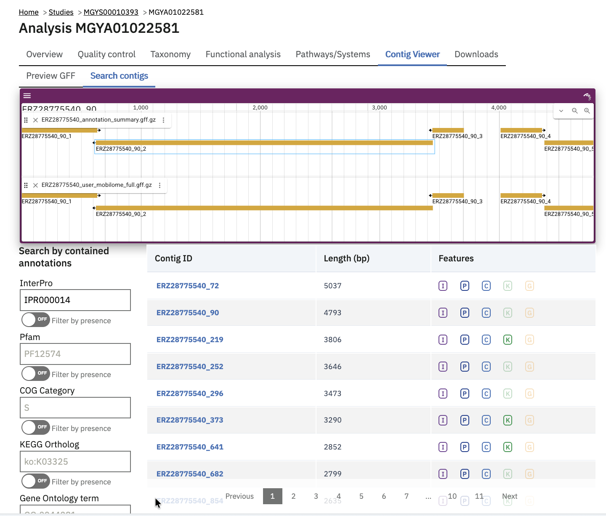

The browser itself (showing genomic tracks above the search table) is powered by [JBrowse](https://jbrowse.org/jb2/).
It is an interactive viewer for the assembly contig sequences and their annotations.
Clicking on a contig in the search results table jumps to that contig in the JBrowse instance.
Clicking on a region in the browser will bring up the feature details panel, including any annotations available for it.

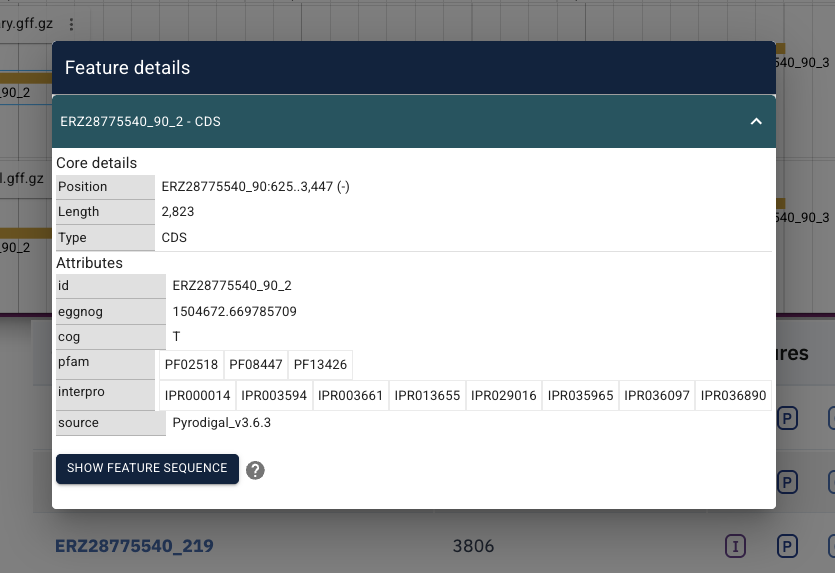

### Files available to download on the MGnify website

The full data sets used to generate the graphs, along with a host of additional data and intermediate files can be downloaded for further analysis by clicking the ‘Downloads’ tab, found towards the top of the page.

{#fig-downloads}

Some of the files, particularly the sequence files in FASTA format, can be large. To facilitate the download process, these files are compressed with [GZIP](https://en.wikipedia.org/wiki/Gzip) and when too large to be easily transferable, chunked into a manageable size.

Each card representing a downloadable result file includes a description of the file.
There are also three buttons above all the files, to help bulk-download some or all of the files from the [Transfer Services file server](ftp.md).
For examples, "Show curl script" gives you a copy-pastable command line script to download all of the files.

## Summary files

In addition to the output files for individual runs, described above, MGnify provides a number of summary files available via the ‘Analysis summary’ tab on the project page (@fig-analysis-summary below). They summarize the counts per feature across all runs of a [study](glossary.md#study) and therefore provide an easy way to identify patterns. The summary files are split between functional (not available for amplicon-only study) and taxonomy sections.

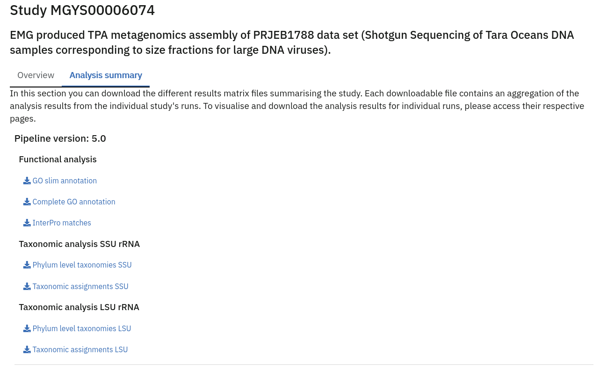{#fig-analysis-summary}

## Data discovery on MGnify portal

MGnify is the largest metagenomic resource of public datasets. In order to help users access the data present in the portal, MGnify offers a powerful search tool and a range of browsing options.

### Text search

The Search tool is underpinned by [EBI search](https://www.ebi.ac.uk/ebisearch/overview.ebi)  and accessible via any MGnify page (@fig-text-search below).

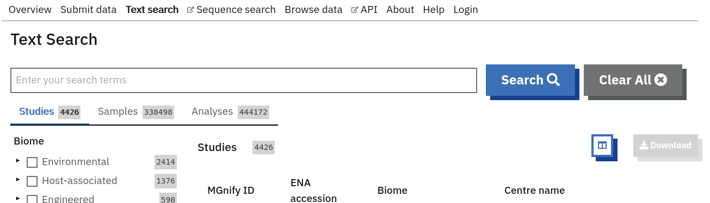{#fig-text-search}

The search page contains 3 tabs allowing users to navigate between studies, samples and analysis search levels. In each tab, the left hand side panel provides a number of facets that can be used to restrict the search space.

* at the study level, the search can be restricted by ‘biome’ and ‘centre name’. Selection of any of the facets will also impact the search at sample and analysis level. Search results can be downloaded as a tab-separated file.
* at the sample level, in addition to ‘biome’, the choice of facets includes ‘temperature’, ‘depth’, ‘experiment type’, ‘sequencing method’, ‘location name’, ‘disease status’ and ‘phenotype’, when provided. Note that these metadata are provided by the data submitter and are not curated.
* at the analysis level, users can restrict their searches according to ‘biome’, ‘temperature’, ‘depth’, ‘pipeline version’, ‘organism’, ‘experiment type’ as well as GO and InterPro terms.

### Browsing options

The MGnify homepage ‘Search by’ and ‘Latest studies’ sections have several browsing options to easily navigate publicly available annotated data:
- Links to all studies, samples, analyses or experiment types will redirect users to the search page, where more filtering criteria is available.
- There is also an option to browse by selected biomes. A subset of biome images with public samples are shown on the homepage. The ‘Browse all biomes’ link will open an expanded list. Upon selection, a table giving the hierarchical lineage according to [GOLD database classification](https://gold.jgi.doe.gov/distribution#Classification)  is provided, with the number of projects associated with each lineage.
- Any links in the latest studies section will redirect the user to the selected public project and all it’s available samples, runs and analysis.

The ‘Browse data’ tab allows users to search by super-studies, studies, samples or publications. Each search option has a text-based or biome filter. ‘Download results’ will return a csv of the search summary.

## Private area

If you have given consent to the MGnify team to analyse your data for which you have requested a pre-publication confidential hold, you can access the analysis results of those pre-published data sets using your private login area. You can access this area by clicking on the ‘Login’ button, which you will find on the top right hand side of any page (see @fig-private-login below).

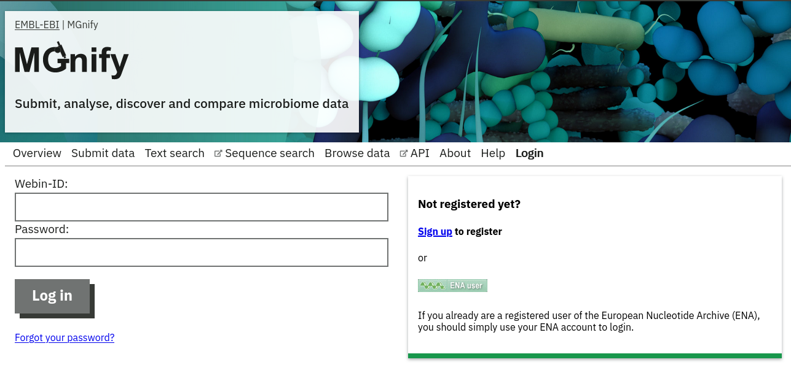{#fig-private-login}

After you have successfully logged into our system, you will have direct access to all your privately (and publicly) submitted projects and samples. You will find a list of your latest submissions (projects and samples) on the home page, but you have also access to all your submitted projects so far on the projects list view (@fig-private-list below). On that page you will find a drop down filter item 'My projects', which allows you to list all your projects.

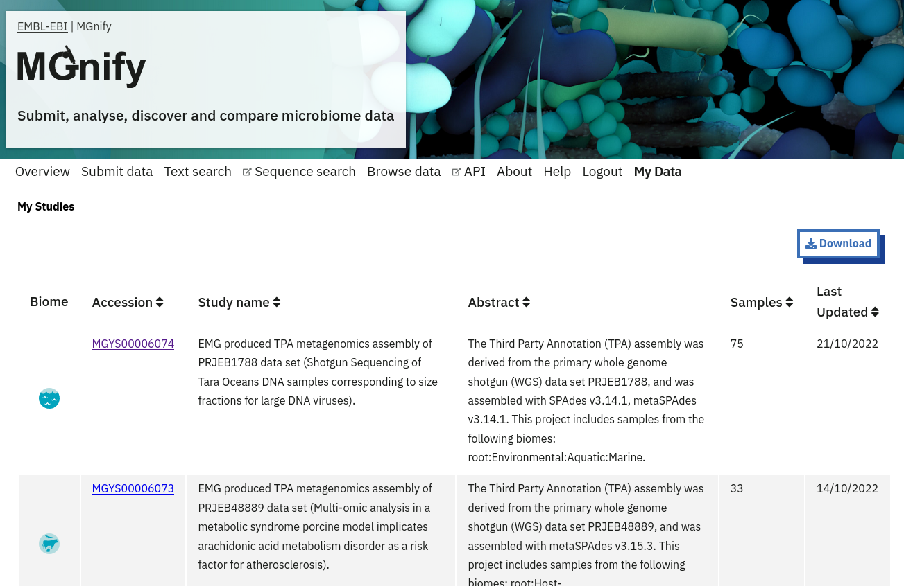{#fig-private-list}
