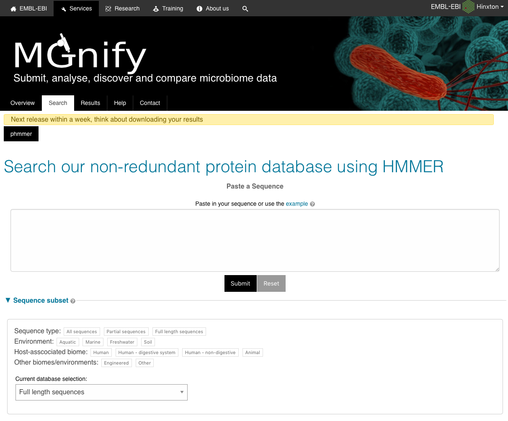
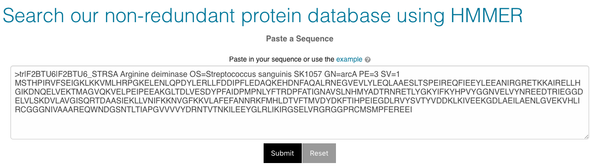
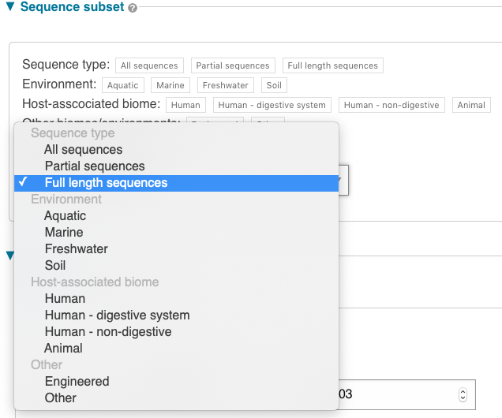
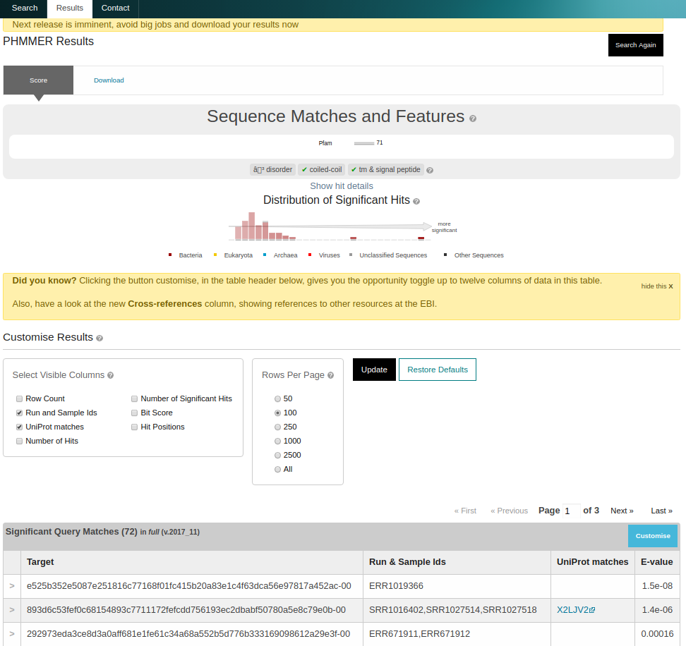
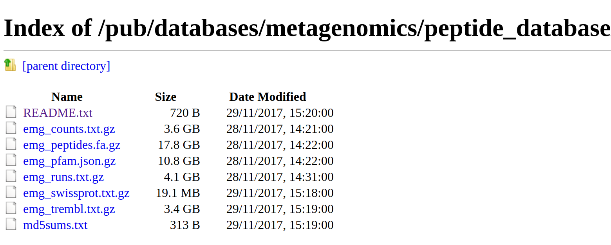

## Landing page

The sequence search (accessed by following the ‘Sequence search’ link from menu bar)
provides a search against a catalogue of predicted peptides.

{#fig-sequence-search-landing}

These sequences comprise a non-redundant set of proteins predicted from contigs that
have been assembled from sequencing runs. The HMMER search
engine has been adapted to provide fast searches against this database.
The results can be linked back to the sample and run from which the peptide was derived
and also to sequences with an exact match in the UniProtKB database.

Owing to the large size of the database we are not able to offer a search against
the full set of proteins. Instead, we have applied a clustering algorithm which groups
sequences into clusters based on similarity. The clusters each have a ‘representative sequence’
and it is these that are offered in the search, though the full set of proteins may be
obtained from our [FTP server](ftp://ftp.ebi.ac.uk/pub/databases/metagenomics/peptide_database).

The search takes a FASTA-formatted amino acid sequence.

{#fig-sequence-search-input}

You can search against all of the sequences in the database (‘All’),
or restrict your search to full length sequences, or partial
sequences only (see Partial and full length peptides).
Alternatively, you may choose to search from a subset of environments or
biomes. Sequences observed in multiple runs may be found in more than one biome. ‘Other’
sequences are those found in none of the other environment or biome categories.

{#fig-sequence-search-db-select}

## Result page

On completion, a list of matching sequences is shown in order of E-value significance.
All sequences in the database have a stable MGYP accession. Additional columns, such
as the mapping to UniProtKB identifiers, can be enabled by clicking ‘Customise’
on the results page and checking the appropriate boxes.

{#fig-sequence-search-result-custom}

## Build process

The database is updated periodically and is created as follows:


* Short reads from runs are assembled into contigs using an assembler, such as metaSPAdes


* Contigs are filtered by length (minimum 500 base pairs)


* Peptides are predicted using the Prodigal gene caller


* Resulting peptides are made non-redundant to produce a set of unique sequences


* Sequences are mapped back to MGnify run and sample accessions and annotated with biome(s)


* Matching sequences in UniProtKB are identified


* Sequences are clustered using MMseqs2/Linclust

<!-- * Domain architectures are identified using the Pfam database -->
Each update (versioned using the release year/month) is cumulative and
uses all predicted peptides available at that time.

## Partial and full length peptides

In common with some other protein coding sequence predictors, [Prodigal](https://github.com/hyattpd/prodigal/wiki/introduction) provides an indication
as to whether a gene is full length or extends beyond the contig. This is recorded as two digits
(one for each end of
the sequence), each of which is either 0 (the gene is
encoded within the contig) or 1 (it extends beyond). Thus a full length
sequence is described as ‘00’ and a partial as ‘11’. The values
‘10’ or ‘01’ are used for the cases where the gene
is truncated only at one end.

```bash
>seq_1 # 3 # 371 # 1 # ID=1_1;partial=10;start_type=Edge;rbs_motif=None;rbs_spacer=None;gc_cont=0.501
SEGCEYLAAYLDKRIASGETINESSAVMTLSQGYLMKGRNKDAGKKFITTPAITKEIREA
QT
>seq_2 # 4738 # 5193 # -1 # ID=1_9;partial=00;start_type=ATG;rbs_motif=None;rbs_spacer=None;gc_cont=0.568
MSAYWYAVIWGGSFGAVLAAAGPRFRKAIPAIRGRMKNSIKWSTSAKAINGISWAGPFAA
QT
>seq_3 # 7546 # 8232 # -1 # ID=1_11;partial=00;start_type=TTG;rbs_motif=GGAG/GAGG;rbs_spacer=5-10bp;gc_cont=0.541
MKKKVLSIQNIACETLGTLEGMFRKDGLEVENVSAQEGGIPIKSSEYSAVVVLGGPMAVY
QT
>seq_4 # 32 # 103 # -1 # ID=37115_1;partial=01;start_type=Edge;rbs_motif=None;rbs_spacer=None;gc_cont=0.542
WILDGIDIDAMIRHPVRQYQIAG
```

## Availability

As well as searches via a web server, we
provide all data for download from our [FTP server](ftp://ftp.ebi.ac.uk/pub/databases/metagenomics/peptide_database).
This includes the sequence database (separate fasta files for the full database and cluster representatives);
run, sample, biome, Swiss-Prot and TrEMBL mappings;
the partial status of the sequences
and counts of the number of times each sequence
was observed in the database as a whole.

{#fig-sequence-ftp}

## Further information

[Full documentation](https://hmmer-web-docs.readthedocs.io/en/latest/)
regarding the HMMER webserver is available. Note that some of the documented
features (such as the taxonomy view) are not relevant to the peptide search
and are therefore disabled. If there are additional features or feedback on this
search service, please get in [contact with us](https://www.ebi.ac.uk/support/metagenomics).
